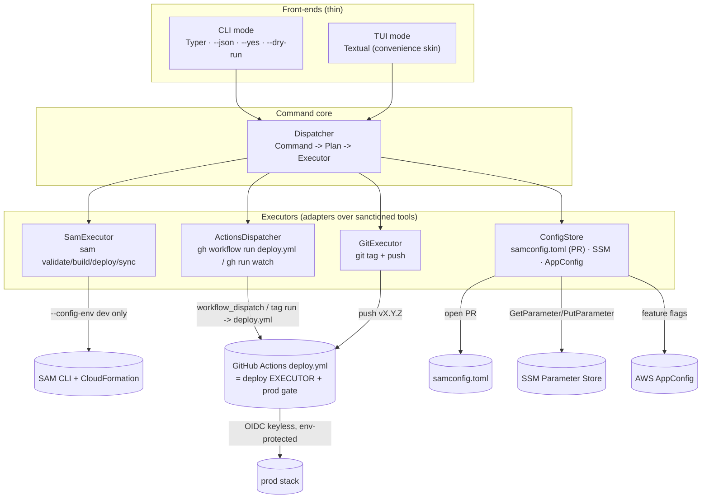

# Design Document: deploy-control-plane

## Overview

The **deploy control plane** is a **thin control plane** over this repo's existing
deployment surface. It reimplements no deploy logic: it translates operator/agent intent
into a typed `Command`, plans it, and **dispatches to sanctioned executors** —
the SAM CLI, GitHub Actions, and `git` — which do the actual work. The wizard
never assembles a CloudFormation parameter set by hand and has **no code path
that runs a production deploy**; production is reached only by triggering a
platform-gated GitHub Actions job.

The tool ships **two thin front-ends over one shared command core**:

- **CLI mode** (agents / automation / CI): a modern Python CLI with `--json`
  machine output, `--yes`, `--dry-run`, fully non-interactive, deterministic
  exit codes. Recommended framework **Typer**; stdlib `argparse` is the
  lighter zero-dependency alternative (flagged for an ADR).
- **TUI mode** (humans): a full-screen terminal UI. Recommended framework
  **Textual**; `questionary + rich` is the lighter prompt-driven alternative
  (flagged for an ADR). This layer is deliberately kept thin — GitHub's own
  `workflow_dispatch` form and the Actions run dashboard are the *canonical*
  human trigger/observe surface, so the TUI is a convenience skin, not the
  system of record.

Both front-ends build the **same typed `Command`** and hand it to the
`Dispatcher`; their behavioural equivalence is a correctness property, not an
aspiration.

Five capabilities are exposed — **config**, **flag**, **bootstrap**, **deploy**,
**release** — each mapped onto an executor rather than onto bespoke Python. The
wizard is packaged as a console entry point in `pyproject.toml`; there is no ops
folder of scripts (respecting the repo anti-pattern). All dev/ops-only
dependencies (Typer/Textual/etc.) stay out of the Lambda layer and `bdo_common`.

## Architecture

The wizard is a **control plane**: front-ends produce a `Command`, the
`Dispatcher` plans it (`Plan`) and routes it to exactly one `Executor`, and the
`Executor` shells out to a sanctioned tool. Config is **data**, read and written
through the `ConfigStore`. Nothing about a deploy's parameter set lives in the
wizard — `samconfig.toml` environments own it, and the wizard only selects
`--config-env`.



**Deploy targeting.** A `Command` carries a `Target`:

- `LOCAL` → **SamExecutor**, permitted for **dev / personal** stacks only
  (`sam deploy --config-env dev`, or `sam sync` for the dev fast-loop).
- `CI` → **ActionsDispatcher**, the path for **shared-env and prod** deploys:
  CI executes them, the wizard only triggers.

**CI is the deploy executor and the platform-enforced gate.** Following the
purpose-scoped-workflow convention (ADR-0038), the CD path lives in a **dedicated
`.github/workflows/deploy.yml`** — *not* an extension of `ci.yml`. `deploy.yml`
triggers on `push: tags: v*` and `workflow_dispatch` (typed inputs: `stage`,
`version`, toggles), runs environment-gated deploy jobs, and uses OIDC keyless
deploy. `ci.yml` remains the authoritative **validation** gate (lint / typecheck /
test / …) and is unchanged by this feature. GitHub **Environments** `dev` and
`prod`, with **required reviewers on `prod`** and **OIDC keyless deploy** (via
`AWS_DEPLOY_ROLE_ARN` + `id-token: write`), enforce the prod gate. Production
deploys are gated by the *platform* (environment protection + OIDC trust), not by
application code — the control plane structurally cannot run a prod `sam deploy`.

**Shared setup, factored once.** The checkout → `setup-python` → `uv sync`
sequence common to `ci.yml` and `deploy.yml` is factored into a **reusable
composite action under `.github/actions/setup/`** consumed by both workflows, so
they cannot drift — the drift mitigation ADR-0038 requires.

### Sequence: dev deploy (LOCAL) vs prod deploy (CI)


## Components and Interfaces

### Front-ends (`cli.py`, `tui.py`)

Collect intent, build a `Command`, render a `Result`. No planning, no
dispatch, no executor calls.

```python
def main(argv: list[str] | None = None) -> int:
    """Typer app. A subcommand runs CLI mode; `--tui` (or no subcommand on a
    tty) launches Textual. Returns the process exit code."""
```

### Dispatcher (`core/dispatch.py`)

The one place a `Command` becomes a `Plan` and is routed to a single executor.
Planning is pure and side-effect-free (safe for `--dry-run` / TUI preview).

```python
class Dispatcher:
    def plan(self, cmd: Command) -> Plan:
        """Resolve the command into an ordered list of executor calls plus the
        human-readable effects. Selects the executor from cmd.target. For a
        prod deploy the only producible plan is 'trigger the protected CI job';
        there is no plan that runs `sam deploy --config-env prod` locally."""

    def execute(self, plan: Plan, *, confirmed: bool) -> Result:
        """Run the plan through its executor. Raises ConfirmationRequired when
        the plan mutates and `confirmed` is False."""
```

### SamExecutor (`core/executors/sam.py`)

Adapter over the SAM CLI for **local, non-prod** work. `samconfig.toml`
environments own the parameter set; the executor only selects `--config-env`
and never composes `--parameter-overrides`.

```python
class SamExecutor(Protocol):
    def validate(self) -> CommandResult: ...              # sam validate --lint
    def build(self) -> CommandResult: ...                 # sam build
    def deploy(self, config_env: str) -> CommandResult:
        """sam deploy --config-env <env>. Refuses config_env == 'prod'."""
    def sync(self, config_env: str) -> CommandResult:     # sam sync (dev fast-loop)
        ...
```

### ActionsDispatcher (`core/executors/actions.py`)

Adapter over the GitHub CLI. **Triggers** a CI run (which does the deploy) and
**surfaces** its status back to the operator/agent. This is the shared-env and
prod deploy path.

```python
class ActionsDispatcher(Protocol):
    def run_workflow(self, *, stage: str, version: str | None,
                     inputs: dict[str, str]) -> RunRef:
        """gh workflow run deploy.yml -f stage=... -f version=... (+ toggle
        inputs). Targets the dedicated CD workflow (ADR-0038). Returns a
        reference to the dispatched run."""
    def watch(self, run: RunRef) -> CommandResult:        # gh run watch
    def view(self, run: RunRef) -> RunStatus: ...         # gh run view / gh api
```

### GitExecutor (`core/executors/git.py`)

Fires the tag-triggered pipeline — the release path.

```python
class GitExecutor(Protocol):
    def release_preconditions(self, version: str) -> list[str]:
        """Blocking issues: dirty tree, not on main, tag already exists."""
    def tag_and_push(self, version: str) -> CommandResult:  # git tag vX.Y.Z && git push
        ...
```

### ConfigStore (`core/executors/config.py`)

Config-as-data across the three sanctioned locations — and no fourth. Deploy-time
config is version-controlled in `samconfig.toml` and changed via a PR the wizard
opens with `gh`; operational config lives in **SSM Parameter Store** (repo-scoped
paths); runtime feature flags live in **AWS AppConfig**.

```python
class ConfigStore(Protocol):
    def read_merged(self, stage: str) -> ConfigView:
        """Merged read of samconfig.toml + SSM + AppConfig for `config show`."""
    def open_config_pr(self, stage: str, changes: list[ConfigDiff]) -> PrRef:
        """Edit a tracked file (e.g. samconfig.toml BdoRegions) on a branch and
        open a PR via gh. Deploy-time config changes flow through review."""
    def put_ssm(self, path: str, value: str) -> ConfigDiff:
        """PutParameter with audit. Rejects any name that is not a repo-scoped
        /bdo-market-insights/<stage>/<category>/<key> path."""
    def set_flag(self, stage: str, flag: str, enabled: bool) -> ConfigDiff:
        """Flip an AWS AppConfig feature flag (no redeploy), surfaced in Lambdas
        through the Powertools feature-flags provider."""
```

### Capability mapping

| Capability | Executor(s) | Behaviour |
|---|---|---|
| **config** | ConfigStore | `config show` renders the merged view (samconfig + SSM + AppConfig). `config set` opens a PR (tracked files) or writes SSM with audit. Also covers deploy-time configuration/parameters (e.g. `BdoRegions`) → changed in `samconfig.toml` via PR. |
| **flag** | ConfigStore | Runtime feature flag → AWS AppConfig, flipped without redeploy and read via the Powertools feature-flags provider (mandatory in this repo). |
| **bootstrap** | SamExecutor + ConfigStore | One-time, clearly labelled: wrap `sam pipeline bootstrap` (standard AWS CI/CD bootstrap — OIDC deploy role + artifact bucket) and configure the GitHub Environments / secrets. |
| **deploy** | SamExecutor (LOCAL) / ActionsDispatcher (CI) | dev/personal → `sam deploy --config-env dev` or `sam sync`. shared/prod → trigger the CI job. A fresh environment reaches target state via a single declarative deploy — the stack self-bootstraps (auto-migrate custom resource, ADR-0025; bootstrap orchestrator auto-run, ADR-0028). No imperative multi-step orchestration. |
| **release** | GitExecutor / ActionsDispatcher | `git tag` push (`deploy.yml` `push: tags: v*`) or `gh workflow run deploy.yml` (manual `workflow_dispatch`, a `run`/`dispatch` alias). `release` is the **sole** initiator of a prod deploy. |

## Data Models

All models are Pydantic v2 (repo standard at every I/O boundary); this also gives
free JSON serialization for `--json`.

```python
class Capability(StrEnum):
    CONFIG = "config"; FLAG = "flag"; BOOTSTRAP = "bootstrap"
    DEPLOY = "deploy"; RELEASE = "release"

class Target(StrEnum):
    LOCAL = "local"   # -> SamExecutor (dev/personal only)
    CI = "ci"         # -> ActionsDispatcher (shared-env + prod)

class Command(BaseModel):
    capability: Capability
    target: Target = Target.LOCAL
    stage: str = "dev"
    version: str | None = None                 # release tag, vX.Y.Z
    args: dict[str, str | bool | list[str]] = {}
    dry_run: bool = False
    assume_yes: bool = False

class PlanStep(BaseModel):
    description: str
    command: str                               # exact line, e.g. "sam deploy --config-env dev"
    executor: Literal["sam", "actions", "git", "config"]

class Plan(BaseModel):
    capability: Capability
    target: Target
    steps: list[PlanStep]
    effects: list[str]                         # human-readable "what will change"
    requires_confirmation: bool

class Result(BaseModel):
    capability: Capability
    ok: bool
    exit_code: int                             # see exit-code contract
    summary: str
    changes: list[ConfigDiff] = []
    run_url: str | None = None                 # CI run reference when target == CI
    raw_output: str | None = None

class ConfigDiff(BaseModel):
    source: Literal["samconfig", "ssm", "appconfig"]
    key: str
    before: str | None
    after: str | None
```

**Exit-code contract:** `0` success · `1` failed · `2` usage/validation error
(before any executor call) · `3` confirmation required.

**Validation rules**

- `stage` ∈ the environments defined in `samconfig.toml` (`dev`, `prod`).
- A prod deploy `Command` may only be produced with `target == CI`; a
  `target == LOCAL` prod deploy is rejected at validation (exit `2`).
- `version` for `release` matches `^v\d+\.\d+\.\d+$` (becomes
  `ApiVersion`, ADR-0037).
- Any SSM name written must be a repo-scoped
  `/bdo-market-insights/<stage>/<category>/<key>` path; a bare `/bdo/...` path is
  rejected. Only SSM key **paths** — never secret values — are passed to
  CloudFormation, which resolves them at deploy (ADR-0024).
- `BdoRegions` is the single active-region toggle and lives only in
  `samconfig.toml` (ADR-0036).

## Error Handling

- Planning is pure; validation failures (unknown stage, malformed version,
  non-repo-scoped SSM path, local prod deploy) are caught before any executor
  call and return exit `2` with the offending field named.
- Executor failures surface the underlying `sam` / `gh` / `git` output verbatim
  and return exit `1`; no Python traceback is emitted.
- A mutating plan invoked without confirmation returns exit `3` and includes the
  `Plan` so the caller can inspect effects and re-invoke with `--yes`.
- For `target == CI` deploys, the wizard reports the dispatched run URL; the
  authoritative pass/fail is the CI run itself (surfaced via `gh run watch`).

## Testing Strategy

- **Unit / plan tests:** assert the `Plan` produced for each capability and
  target (exact commands, effects, confirmation flag) without executing —
  executors are mocked. Front-end equivalence is tested by asserting CLI and
  TUI produce identical serialized `Plan`s for the same intent.
- **Executor tests:** `moto` for AWS-touching `ConfigStore` writes; the SAM /
  gh / git executors are tested against recorded command invocations, not live
  clouds.
- Property-based tests only where there is a clear invariant (see Correctness
  Properties); not for completeness.

## Security

- Prod deploys are gated by GitHub Environment protection (required reviewers)
  and OIDC keyless trust — no static AWS credentials, and no first-party prod
  deploy code path.
- No account-specific hosts are committed: SSM key paths, not values, flow to
  CloudFormation (ADR-0024). Secret-typed / secret-named SSM values are masked
  on `config show`.
- Runtime feature flags live in AppConfig. Note: no NAT (ADR-0006) means in-VPC
  Lambdas need an AppConfig/AppConfigData VPC endpoint to read flags (planned
  ADR c). IAM database authentication is unchanged and never bypassed.

## Correctness Properties

*A property is a characteristic that should hold across all valid executions —
a formal, machine-checkable statement of what the system must do.*

### Property 1: Front-end equivalence

For any operator/agent intent, the `Plan` produced through CLI mode and the
`Plan` produced through TUI mode are byte-for-byte identical when serialized.

### Property 2: No first-party prod deploy

For all commands the wizard can construct, none produces a `Plan` that executes
`sam deploy --config-env prod` locally; a prod deploy is reachable only by
dispatching the environment-protected CI job (structurally enforced by `Target`).

### Property 3: Config-as-data

For every config or flag change, the resulting `Plan` is either a pull request
against a tracked file or an audited SSM/AppConfig write — never a write to a
fourth configuration location.

### Property 4: Dispatch fidelity

For any deploy the control plane triggers via `workflow_dispatch`, `deploy.yml`'s
typed `workflow_dispatch` inputs are a superset of what the control plane sends,
so the GitHub Actions UI and the control plane dispatch the identical `deploy.yml`
run with identical inputs.

### Property 5: Dry-run purity

For any command run with `--dry-run` (or TUI preview), the wizard renders the
`Plan` and performs no file write, PR, AWS API mutation, SSM/AppConfig write,
git mutation, `sam deploy`, or workflow dispatch — all state is left unchanged.

## Planned ADRs

Rationale is captured as ADRs rather than expanded inline (per AGENTS.md):

- **(a)** Wizard as a thin control plane over the SAM CLI + GitHub Actions +
  `git`, packaged as a console entry point in `pyproject.toml` (no `scripts/`
  ops folder — respects the repo anti-pattern).
- **(b)** Prod gating via GitHub Environments (required reviewers) + OIDC keyless
  deploy, enforced by the platform rather than application code.
- **(c)** Runtime feature flags via AWS AppConfig surfaced through Powertools,
  including that no-NAT (ADR-0006) requires an AppConfig/AppConfigData VPC
  endpoint for in-VPC Lambdas.
- **(d)** **ADR-0038 (accepted)** — purpose-scoped GitHub Actions workflows.
  The former "one-workflow deviation" (extend `ci.yml` rather than add
  `deploy.yml`) is now **DECIDED against**: workflows are split by trigger /
  permission scope, with shared setup factored into a reusable composite action
  so they cannot drift. Workflow set: `ci.yml` (validation gate), `deploy.yml`
  (CD — tag / `workflow_dispatch`, OIDC), and (planned) `codeql.yml` and
  `smoke.yml`.
- **(e)** CLI framework (Typer vs stdlib argparse) and TUI framework (Textual vs
  questionary + rich) choices.

## Constraints and Conventions

- Python 3.12 + uv; Pydantic v2 at all boundaries.
- Purpose-scoped workflows (ADR-0038): one authoritative *validation* workflow
  (`ci.yml`); a separate workflow only for a distinct trigger (`push: tags`,
  `workflow_dispatch`, `schedule`) or permission scope (`id-token: write` for
  deploy, `security-events: write` for scanning); shared setup factored into a
  reusable workflow / composite action so workflows cannot drift.
- Exactly **one** root SAM `template.yaml` with nested stacks.
- Repo-scoped SSM naming `/bdo-market-insights/<stage>/<category>/<key>` (never a
  bare `/bdo/...` path); SSM key paths, not secret values, into CloudFormation
  (ADR-0024).
- `BdoRegions` is the single active-region toggle in `samconfig.toml` (ADR-0036);
  `ApiVersion` derives from the release tag (ADR-0037).
- No NAT (ADR-0006); IAM database authentication for Lambdas, never bypassed.
- Dev/ops-only dependencies (Typer/Textual/etc.) stay out of the Lambda layer and
  `bdo_common`.
