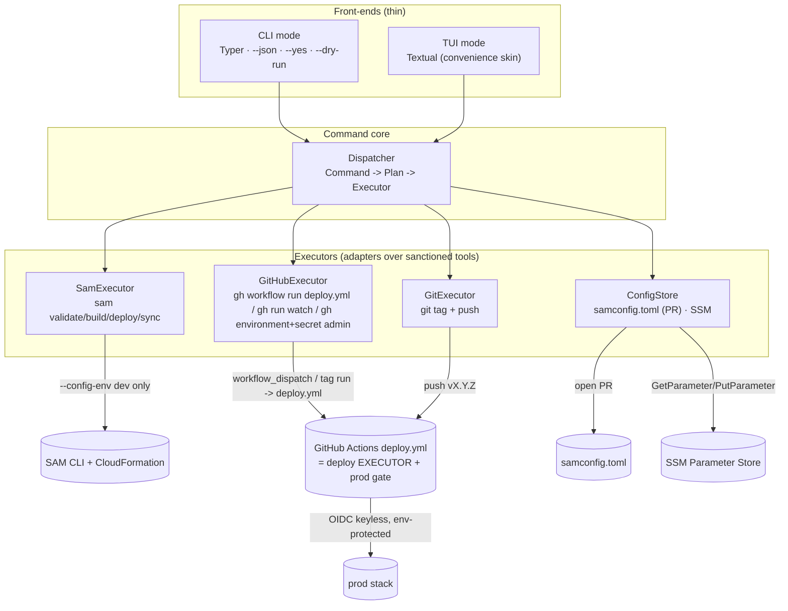
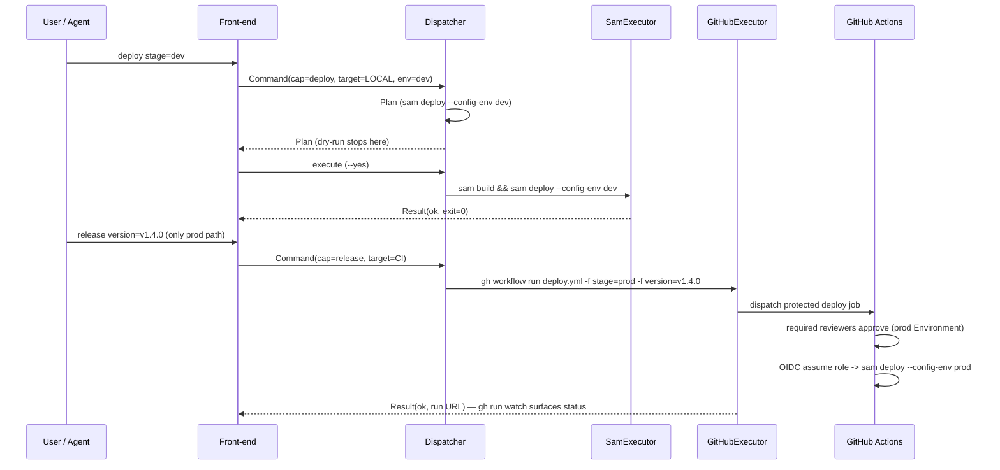

# Design Document: deploy-control-plane

## Overview

The **deploy control plane** is a **thin control plane** over this repo's existing
deployment surface. It reimplements no deploy logic: it translates operator/agent intent
into a typed `Command`, plans it, and **dispatches to sanctioned executors** —
the SAM CLI, GitHub Actions, and `git` — which do the actual work. The wizard
never assembles a CloudFormation parameter set by hand and has **no code path
that runs a production deploy**; production is reached only by triggering a
platform-gated GitHub Actions job.

The tool ships **two thin front-ends over one shared command core**:

- **CLI mode** (agents / automation / CI): a modern Python CLI with `--json`
  machine output, `--yes`, `--dry-run`, fully non-interactive, deterministic
  exit codes. Recommended framework **Typer**; stdlib `argparse` is the
  lighter zero-dependency alternative (flagged for an ADR).
- **TUI mode** (humans): a full-screen terminal UI. Recommended framework
  **Textual**; `questionary + rich` is the lighter prompt-driven alternative
  (flagged for an ADR). This layer is deliberately kept thin — GitHub's own
  `workflow_dispatch` form and the Actions run dashboard are the *canonical*
  human trigger/observe surface, so the TUI is a convenience skin, not the
  system of record.

Both front-ends build the **same typed `Command`** and hand it to the
`Dispatcher`; their behavioural equivalence is a correctness property, not an
aspiration.

Four capabilities are exposed — **config**, **bootstrap**, **deploy**,
**release** — each mapped onto an executor rather than onto bespoke Python. The
wizard is packaged as a console entry point in `pyproject.toml`; there is no ops
folder of scripts (respecting the repo anti-pattern). All dev/ops-only
dependencies (Typer/Textual/etc.) stay out of the Lambda layer and `bdo_common`.
This feature adds no new AWS infrastructure.

**Package placement.** The control plane lives at **`src/tools/bdo_deploy/`**,
deliberately **outside `src/layer/python/`**, so its dev/ops-only dependencies
(Typer, Textual, …) can never be packaged into the `bdo-common` Lambda layer.
Placement is the enforcement mechanism for Requirement 9.4: the layer build
globs `src/layer/python/`, so a package sitting elsewhere in the tree cannot be
picked up by it.

## Architecture

The wizard is a **control plane**: front-ends produce a `Command`, the
`Dispatcher` plans it (`Plan`) and routes it to exactly one `Executor`, and the
`Executor` shells out to a sanctioned tool. Config is **data**, read and written
through the `ConfigStore`. Nothing about a deploy's parameter set lives in the
wizard — `samconfig.toml` environments own it, and the wizard only selects
`--config-env`.



**Deploy targeting.** A `Command` carries a `Target`. `Target` selects **where the
deploy executes** — not which executor the command happens to shell out to — and
it is **only meaningful for the `deploy` capability**:

- `LOCAL` → the deploy runs on the operator's machine via **SamExecutor**,
  permitted for **dev / personal** stacks only (`sam deploy --config-env dev`, or
  `sam sync` for the dev fast-loop).
- `CI` → the deploy runs **in GitHub Actions**; the wizard only triggers it via
  **GitHubExecutor**. This is the path for **shared-env and prod** deploys.

For the other capabilities `Target` is not a routing choice:

- **`release`** always results in the deploy running in CI — whether it gets
  there by a pushed release tag or by a `workflow_dispatch` — so a release
  `Plan` records `target = CI` regardless of how the command was invoked. A
  `release` invoked with the default `target=LOCAL` is *normalised* to
  `target=CI` during planning; it does not plan a local prod deploy.
- **`config`** and **`bootstrap`** do not vary by target at all; their planned
  steps are identical whichever `Target` the `Command` carried.

This is why Property 2 and Requirement 7.5 are satisfied even though a `release`
is *initiated* from a laptop: the invariant is that **no command executes a
production deploy locally**. Pushing a release tag, or dispatching the
environment-protected `deploy.yml`, is the sanctioned production path — the
`git push` / `gh workflow run` happens locally, the **deploy** does not.

**CI is the deploy executor and the platform-enforced gate.** Following the
purpose-scoped-workflow convention (ADR-0038), the CD path lives in a **dedicated
`.github/workflows/deploy.yml`** — *not* an extension of `ci.yml`. `deploy.yml`
triggers on `push: tags: v*` and `workflow_dispatch` (typed inputs `stage` and
`version`), runs environment-gated deploy jobs, and uses OIDC keyless
deploy. `ci.yml` remains the authoritative **validation** gate (lint / typecheck /
test / …) and its validation behaviour is unchanged by this feature, while its
shared setup steps are replaced by the reusable composite action. GitHub
**Environments** `dev` and
`prod`, with **required reviewers on `prod`** and **OIDC keyless deploy** (via
`AWS_DEPLOY_ROLE_ARN` + `id-token: write`), enforce the prod gate. Production
deploys are gated by the *platform* (environment protection + OIDC trust), not by
application code — the control plane structurally cannot run a prod `sam deploy`.

**Shared setup, factored once.** The checkout → `setup-python` → `uv sync`
sequence common to `ci.yml` and `deploy.yml` is factored into a **reusable
composite action under `.github/actions/setup/`** consumed by both workflows, so
they cannot drift — the drift mitigation ADR-0038 requires.

### Sequence: dev deploy (LOCAL) vs prod deploy (CI)



## Components and Interfaces

### Front-ends (`cli.py`, `tui.py`)

Collect intent, build a `Command`, render a `Result`. No planning and no
dispatch; the only executor call a front-end makes is following a dispatched run
after `execute()` has returned (`follow_run()`, below).

```python
def main(argv: list[str] | None = None) -> int:
    """Typer app. A subcommand runs CLI mode; `--tui` (or no subcommand on a
    tty) launches Textual. Returns the process exit code."""
```

**Run-following: one shared helper (`presentation.py`).** Following a dispatched
CI run is presentation, so it lives beside the rest of the shared front-end
rendering vocabulary:

```python
def follow_run(github: GitHubExecutor, result: Result) -> Result:
    """Follow `result.run` to completion (gh run watch / gh run view) and fold
    the run's authoritative pass/fail into the returned Result. No-op when
    result.run is None."""
```

Both front-ends call this one helper, so CLI and TUI cannot grow two different
notions of "did the run pass". Following is **default-on for human output** and
**opt-in under `--json` via a `--watch` flag**: a blocking watch cannot coexist
with `--json`'s "exactly one serialized `Result` is the sole content of stdout"
contract (Requirement 1.2). The run URL is surfaced either way.

### Composition root (`core/assembly.py`)

The one place the concrete adapters are named, so both front-ends inherit the
same wiring rather than each assembling their own.

```python
class ControlPlane(NamedTuple):
    dispatcher: Dispatcher
    github: GitHubExecutor     # exposed for follow_run(); never routed to by a plan

def build_dispatcher(...) -> Dispatcher: ...        # unchanged
def build_control_plane(...) -> ControlPlane: ...   # dispatcher + the GitHub executor
```

`build_control_plane()` sits beside the existing `build_dispatcher()`, which keeps
working unchanged. Exposing the `GitHubExecutor` to the front-ends is what makes
run-following possible **without a plan** — see the `watch` / `view` note below.
Assembling still reaches no tool (no subprocess, no AWS client, no network), so it
remains safe to call before a `--dry-run` is known about.

### Dispatcher (`core/dispatch.py`)

The one place a `Command` becomes a `Plan` and is routed to a single executor.
Planning is pure and side-effect-free (safe for `--dry-run` / TUI preview).

```python
class Dispatcher:
    def plan(self, cmd: Command) -> Plan:
        """Resolve the command into an ordered list of executor calls plus the
        human-readable effects. Selects the executor from cmd.target. For a
        prod deploy the only producible plan is 'trigger the protected CI job';
        there is no plan that runs `sam deploy --config-env prod` locally."""

    def execute(self, plan: Plan, *, confirmed: bool) -> Result:
        """Run the plan through its executor. Raises ConfirmationRequired
        (carrying the plan) when the plan mutates and `confirmed` is False.
        Raises ExecutorUnavailable when the plan needs an executor that was
        not injected — before any step runs."""
```

**Confirmation: raised in the core, returned at the CLI boundary.**
`Dispatcher.execute()` **raises** `ConfirmationRequired`, carrying the `Plan`.
The core raises rather than returning a "refused" `Result` because a raise
**cannot be silently ignored by a caller** — for a safety gate that matters: a
caller that forgets to inspect a returned status would proceed as though the
mutation had been approved, whereas an unhandled exception fails loudly.

The **CLI front-end** is where that becomes the documented contract: it catches
`ConfirmationRequired`, renders a `Result` carrying the refused `Plan`
(`Result.plan`), and exits `3`. Requirement 10.4 describes **CLI_Mode**
behaviour, and it is satisfied at that boundary. TUI_Mode catches the same
exception and turns it into its explicit confirmation step (Requirement 1.3)
rather than an exit code.

### Execution seam: `StepExecutor` (`core/executors/base.py`)

The uniform seam between a planned step and the executor that performs it.

```python
class StepExecutor(Protocol):
    def run_step(self, step: PlanStep) -> CommandResult: ...
```

Every executor below implements `StepExecutor`. `run_step` switches on
`step.op` and reads `step.params`; it **never parses `step.command`**, which
exists only as the display rendering. Each `op` maps onto the executor's own
typed domain method — the ones documented below for `SamExecutor`,
`GitHubExecutor`, `GitExecutor` and `ConfigStore` — so those Protocols remain
each executor's real API. This seam sits in front of them; it does not replace
them.

Because the intent arrives structured, each executor reaches its tool in its own
native way: `sam`, `git` and `gh` steps shell out to those CLIs, while
`ConfigStore` uses boto3 for SSM as already specified. The typed `params` are what
make that possible — a step is not a shell string to be re-interpreted.

**Why both fields.** Routing is decided exactly once, in `plan()`, and the same
`PlanStep` value is consumed both for display and for execution. The previewed
plan therefore cannot drift from what actually runs, which is what keeps
Property 5 (dry-run purity) — and the operator's trust in `--dry-run` — meaningful.

### SamExecutor (`core/executors/sam.py`)

Adapter over the SAM CLI for **local, non-prod** work. `samconfig.toml`
environments own the parameter set; the executor only selects `--config-env`
and never composes `--parameter-overrides`.

```python
class SamExecutor(Protocol):
    def validate(self) -> CommandResult: ...              # sam validate --lint
    def build(self) -> CommandResult: ...                 # sam build
    def deploy(self, config_env: str) -> CommandResult:
        """sam deploy --config-env <env>. Refuses config_env == 'prod'."""
    def sync(self, config_env: str) -> CommandResult:     # sam sync (dev fast-loop)
        ...
```

### GitHubExecutor (`core/executors/github.py`)

The single adapter over the **GitHub CLI**. Its remit is everything the wizard
does through `gh`, in three groups:

1. **Workflow dispatch** — trigger the CD run that does the deploy
   (`gh workflow run deploy.yml`). This is the shared-env and prod deploy path.
2. **Run status** — surface the dispatched run back to the operator/agent
   (`gh run watch` / `gh run view`).
3. **Repository / environment administration** — create or update a GitHub
   Environment, and set an Environment secret. Used only by the one-time
   `bootstrap` capability.

Named `GitHubExecutor` rather than `ActionsDispatcher` because its remit is
broader than Actions, and because "Dispatcher" collided with the core
`Dispatcher` that *routes to* it.

```python
class GitHubExecutor(Protocol):
    # --- workflow dispatch ---
    def run_workflow(self, *, stage: str, version: str | None,
                     inputs: dict[str, str]) -> RunRef:
        """gh workflow run deploy.yml -f stage=... -f version=...
        Targets the dedicated CD workflow (ADR-0038). Returns a
        reference to the dispatched run."""
    # --- run status ---
    def watch(self, run: RunRef) -> CommandResult: ...    # gh run watch
    def view(self, run: RunRef) -> RunStatus: ...         # gh run view / gh api
    # --- repository / environment administration (bootstrap only) ---
    def set_environment(self, *, name: str,
                        reviewers: list[str] | None = None) -> CommandResult:
        """Create or update a GitHub Environment (e.g. `prod` with required
        reviewers). gh api repos/{owner}/{repo}/environments/{name}."""
    def set_environment_secret(self, *, environment: str, name: str,
                               value: str) -> CommandResult:
        """Set an Environment secret (e.g. AWS_DEPLOY_ROLE_ARN).
        Only `name` is ever rendered in a Plan; `value` is passed at
        execution time and never appears in a plan, in --json output, or
        in any tracked file."""
```

**`watch` / `view` are deliberately not reachable from any `Op`, and stay that
way.** A dispatch plans only the trigger; following the run afterwards is
presentation, performed by the front-end via `follow_run()` on `Result.run` once
`execute()` has returned — a direct call on the `GitHubExecutor` the composition
root exposes (`build_control_plane()`), not a planned step. Keeping it out of the
plan is what preserves dry-run purity (Property 5) — a preview must reach no tool
— and plan equivalence (Property 1), since a blocking watch is not part of what a
plan describes.

**Secret values never reach a plan.** For `secret_set` steps only the secret's
**name** is rendered into `PlanStep.command` / `Plan.effects`. The role ARN value
is account-identifying, so it is supplied at execution and never appears in a
plan, in `--json` output, or in any tracked file.

### GitExecutor (`core/executors/git.py`)

Fires the tag-triggered pipeline — the release path.

```python
class GitExecutor(Protocol):
    def release_preconditions(self, version: str) -> list[str]:
        """Blocking issues: dirty tree, not on main, tag already exists."""
    def tag_and_push(self, version: str) -> CommandResult:  # git tag vX.Y.Z && git push
        ...
```

### ConfigStore (`core/executors/config.py`)

Config-as-data across the two sanctioned locations — and no third. Deploy-time
config is version-controlled in `samconfig.toml` and changed via a PR the wizard
opens with `gh`; operational config lives in **SSM Parameter Store** (repo-scoped
paths, audited writes).

```python
class ConfigStore(Protocol):
    def read_merged(self, stage: str) -> ConfigView:
        """Merged read of samconfig.toml + SSM for `config show`."""
    def open_config_pr(self, stage: str, changes: list[ConfigDiff]) -> PrRef:
        """Edit a tracked file (e.g. samconfig.toml BdoRegions) on a branch and
        open a PR via gh. Deploy-time config changes flow through review."""
    def put_ssm(self, path: str, value: str) -> ConfigDiff:
        """PutParameter with audit. Rejects any name that is not a repo-scoped
        /bdo-market-insights/<stage>/<category>/<key> path."""
```

### Capability mapping

| Capability | Executor(s) | Behaviour |
|---|---|---|
| **config** | ConfigStore | `config show` renders the merged view (samconfig + SSM). `config set` opens a PR (tracked files) or writes SSM with audit. Also covers deploy-time configuration/parameters (e.g. `BdoRegions`) → changed in `samconfig.toml` via PR. |
| **bootstrap** | SamExecutor + GitHubExecutor | One-time, clearly labelled: `SamExecutor` wraps `sam pipeline bootstrap` (standard AWS CI/CD bootstrap — OIDC deploy role + artifact bucket); `GitHubExecutor` creates/updates the GitHub Environments (`github.environment_set`) **together with their required reviewers** and sets the Environment secrets (`github.secret_set`). A `prod` bootstrap carrying no required reviewer is refused, so prod cannot be bootstrapped into an unprotected state. GitHub administration is **not** a `ConfigStore` concern — `ConfigStore` stays strictly config-as-data over `samconfig.toml` + SSM. |
| **deploy** | SamExecutor (LOCAL) / GitHubExecutor (CI) | dev/personal → `sam deploy --config-env dev` or `sam sync`. shared/prod → trigger the CI job. A fresh environment reaches target state via a single declarative deploy — the stack self-bootstraps (auto-migrate custom resource, ADR-0025; bootstrap orchestrator auto-run, ADR-0028). No imperative multi-step orchestration. |
| **release** | GitExecutor / GitHubExecutor | `git tag` push (`deploy.yml` `push: tags: v*`) or `gh workflow run deploy.yml` (manual `workflow_dispatch`, a `run`/`dispatch` alias). Production is initiated **only by the sanctioned pipeline triggers** — a pushed release tag, or an authorised `workflow_dispatch` of `deploy.yml` (whether dispatched by the control plane or from the GitHub Actions UI). No LOCAL path initiates a production deploy. |
| **flag** *(planned — deferred, not built in this spec)* | ConfigStore + DynamoDB (planned) | Flip a runtime feature flag without a redeploy. Flag values are stored in a DynamoDB table and read in Lambdas via the Powertools feature-flags provider (a custom `StoreProvider`), or the Powertools parameters `DynamoDBProvider` for plain booleans. Reachable from in-VPC Lambdas through the existing free DynamoDB Gateway endpoint. |

**Deferred: runtime feature flags.** Runtime feature flags are out of scope here;
the row above records the intended shape, not work this spec builds.

- **Command shape (intended):** `flag list` shows the current flags; `flag set
  <name> on|off` flips one.
- **Store:** a DynamoDB table, read in Lambdas via Powertools over the existing
  free DynamoDB Gateway endpoint.
- **Why not AppConfig:** under no-NAT (ADR-0006) it would require a paid
  PrivateLink interface endpoint, so AppConfig is **rejected on cost** — not
  merely postponed.
- **`FLAG` is deliberately kept OUT of the `Capability` enum** until the
  capability is built, so the CLI never advertises a subcommand with no executor
  behind it.
- The work carries its own spec and ADR; no requirement or task in this spec
  covers it.

## Data Models

All models are Pydantic v2 (repo standard at every I/O boundary); this also gives
free JSON serialization for `--json`.

```python
class Capability(StrEnum):
    CONFIG = "config"; BOOTSTRAP = "bootstrap"
    DEPLOY = "deploy"; RELEASE = "release"

class Target(StrEnum):
    """WHERE a deploy executes. Only meaningful for capability == DEPLOY.
    A `release` plan always records CI (the deploy runs in Actions however it
    was triggered); `config` and `bootstrap` do not vary by target."""
    LOCAL = "local"   # deploy runs on this machine -> SamExecutor (dev/personal only)
    CI = "ci"         # deploy runs in GitHub Actions -> GitHubExecutor (shared-env + prod)

class Command(BaseModel):
    capability: Capability
    target: Target = Target.LOCAL
    stage: str = "dev"
    version: str | None = None                 # release tag, vX.Y.Z
    args: dict[str, str | bool | list[str]] = {}
    dry_run: bool = False
    assume_yes: bool = False

class Op(StrEnum):
    """The closed vocabulary of planned operations. Executors switch on this."""
    SAM_BUILD = "sam.build"
    SAM_DEPLOY = "sam.deploy"
    SAM_SYNC = "sam.sync"
    SAM_PIPELINE_BOOTSTRAP = "sam.pipeline_bootstrap"
    GITHUB_RUN_WORKFLOW = "github.run_workflow"
    GITHUB_ENVIRONMENT_SET = "github.environment_set"
    """params: `environment`, and an optional `reviewers` — the list of required
    reviewers to configure on that Environment. Carried in `params` so the
    reviewer list appears in the plan preview."""
    GITHUB_SECRET_SET = "github.secret_set"
    GIT_TAG = "git.tag"
    GIT_PUSH = "git.push"
    CONFIG_SHOW = "config.show"
    SSM_PUT = "ssm.put"
    SAMCONFIG_PR = "samconfig.pr"

class PlanStep(BaseModel):
    description: str
    command: str                    # faithful display rendering (dry-run / TUI preview)
    executor: Literal["sam", "github", "git", "config"]
    op: Op                          # structured intent, from the closed vocabulary above
    params: dict[str, str | bool | list[str]] = Field(default_factory=dict)

class Plan(BaseModel):
    capability: Capability
    target: Target
    steps: list[PlanStep]
    effects: list[str]                         # human-readable "what will change"
    requires_confirmation: bool

class Result(BaseModel):
    capability: Capability
    ok: bool
    exit_code: int                             # see exit-code contract
    summary: str
    changes: list[ConfigDiff] = []
    run_url: str | None = None                 # display-only CI run URL when target == CI
    run: RunRef | None = None
    # The structured reference to the dispatched run, set alongside run_url when
    # target == CI. `follow_run()` needs a RunRef for GitHubExecutor.watch/view;
    # parsing one back out of the URL string would give run identity two sources
    # of truth.
    raw_output: str | None = None
    plan: Plan | None = None
    # Set when a mutating plan was refused for want of confirmation, so the
    # caller can inspect the effects and re-invoke with --yes (exit 3).

class CommandResult(BaseModel):
    ok: bool
    output: str                     # the tool's own output, surfaced verbatim on failure
    run_url: str | None = None      # set when a dispatched CI run is created
    changes: list[ConfigDiff] = Field(default_factory=list)

class ConfigDiff(BaseModel):
    source: Literal["samconfig", "ssm"]
    key: str
    before: str | None
    after: str | None
```

**`PlanStep` carries both intent and rendering.** `command` is the
human-readable rendering of the step — the line shown by `--dry-run` and in the
TUI preview, and nothing more. `op` + `params` are the structured intent the
executor actually acts on. No executor ever parses `command`; a step's routing is
decided once in `plan()` and read from `op`/`params` at execution. `CommandResult`
is the value every executor call returns, and is folded into the front-end
`Result`.

**Why `op` is an enum, not a `str`.** Executors **switch on `op`**. With a closed
`StrEnum` the type checker can verify the switch is exhaustive, so adding an op
without handling it is a **type error at check time**; with a bare `str` the same
omission is a silent fallthrough discovered at execution, mid-deploy. The `gh.*`
names are spelled `github.*` to match the renamed `GitHubExecutor`.

**`ConfigDiff` note.** `ConfigDiff.key` carries a field validator: when
`source == "ssm"` the key must be a repo-scoped
`/bdo-market-insights/<stage>/<category>/<key>` path whose `<stage>` segment is an
environment defined in `samconfig.toml`. The validator sits on the model so the
rule holds for every diff — planned, previewed, or returned — not only at the
`put_ssm()` call site.

**Exit-code contract:** `0` success · `1` failed · `2` usage/validation error
(before any executor call) · `3` confirmation required.

**Validation rules**

- `stage` ∈ the environments defined in `samconfig.toml` (`dev`, `prod`).
- A prod deploy `Command` may only be produced with `target == CI`; a
  `target == LOCAL` prod deploy is rejected at validation (exit `2`).
- `version` for `release` matches `^v\d+\.\d+\.\d+$` (becomes
  `ApiVersion`, ADR-0037).
- Any SSM name written must be a repo-scoped
  `/bdo-market-insights/<stage>/<category>/<key>` path; a bare `/bdo/...` path is
  rejected. The `<stage>` segment must be **one of the environments defined in
  `samconfig.toml`** (`dev`, `prod`) — not merely any non-empty string, which
  would let a typo (`/bdo-market-insights/prd/...`) create a parameter nothing
  ever reads. Only SSM key **paths** — never secret values — are passed to
  CloudFormation, which resolves them at deploy (ADR-0024).
- `BdoRegions` is the single active-region toggle and lives only in
  `samconfig.toml` (ADR-0036).
- A `release` `Command` is normalised to `target = CI` during planning; `config`
  and `bootstrap` plans ignore `target` entirely (see *Deploy targeting*).
- A `bootstrap` `Command` whose `stage` is `prod` must carry **at least one
  required reviewer**; otherwise it is rejected at validation (exit `2`) before
  any executor call, so no unprotected prod Environment can be created. Non-prod
  stages may bootstrap without reviewers.
- **Plan previews never render operational values.** `PlanStep.command` and
  `Plan.effects` mask secret-shaped and operational values — SecureString-backed
  values, keys whose name contains `secret`/`password`/`token`/`key`
  (case-insensitive), and the Environment-secret values of
  `github.secret_set`. Only names, paths, and stage/version identifiers are
  rendered. Consequently `--dry-run` and `--json` **cannot** print such a value:
  it is absent from the model they serialize, not merely omitted by the
  renderer.
- **"Planning is pure" is precise, not absolute.** `plan()`'s only I/O is the
  **cached read of `samconfig.toml`** performed when a `Command` is validated (to
  resolve the set of defined environments). It performs no network call, no AWS
  API call, no subprocess, and no write of any kind. The read is cached per
  process, so repeated planning is deterministic and byte-identical (Property 1).

## Error Handling

- Planning is pure; validation failures (unknown stage, malformed version,
  non-repo-scoped SSM path, local prod deploy) are caught before any executor
  call and return exit `2` with the offending field named.
- Executor failures surface the underlying `sam` / `gh` / `git` output verbatim
  and return exit `1`; no Python traceback is emitted.
- **`ConfirmationRequired`** — `Dispatcher.execute()` **raises** it, carrying the
  `Plan`; a raise cannot be silently ignored by a caller, which is what a safety
  gate needs. The **CLI front-end** catches it, renders a `Result` whose `plan`
  field carries that `Plan` (so the caller can inspect the effects and re-invoke
  with `--yes`), and exits `3` — satisfying Requirement 10.4 at the CLI_Mode
  boundary it describes. No mutation has occurred. TUI_Mode catches the same
  exception and renders its confirmation step instead.
- **`ExecutorUnavailable`** — if a `Plan` contains a step whose `executor` was not
  injected into the `Dispatcher`, the plan fails **by executor name before any
  step runs**, and returns exit `1`. Failing up-front rather than mid-plan means a
  misconfigured wiring can never leave a plan half-applied.
- For `target == CI` deploys, the wizard reports the dispatched run URL and the
  front-end follows `Result.run` (via `follow_run()` → `gh run watch` /
  `gh run view`) after `execute()` has returned — default-on for human output,
  opt-in under `--json` via `--watch`; the CI run itself remains the
  authoritative pass/fail.

## Testing Strategy

- **Unit / plan tests:** assert the `Plan` produced for each capability and
  target (exact commands, effects, confirmation flag) without executing —
  executors are mocked. Front-end equivalence is tested by asserting CLI and
  TUI produce identical serialized `Plan`s for the same intent.
- **Executor tests:** `moto` for AWS-touching `ConfigStore` writes; the SAM /
  gh / git executors are tested against recorded command invocations, not live
  clouds.
- Property-based tests only where there is a clear invariant (see Correctness
  Properties); not for completeness.

## Security

- Prod deploys are gated by GitHub Environment protection (required reviewers)
  and OIDC keyless trust — no static AWS credentials, and no first-party prod
  deploy code path.
- No account-specific hosts are committed: SSM key paths, not values, flow to
  CloudFormation (ADR-0024). Secret-typed / secret-named SSM values are masked
  on `config show`, and plan previews mask secret-shaped and operational values
  so `--dry-run` / `--json` cannot print them.
- The OIDC deploy role ARN set as an Environment secret during `bootstrap` is
  account-identifying: only the secret's **name** is ever rendered in a plan; the
  value is passed at execution and never appears in a plan, in `--json` output,
  or in any tracked file.
- No NAT (ADR-0006) remains in force; this feature adds no new AWS
  infrastructure. IAM database authentication is unchanged and never bypassed.

## Correctness Properties

*A property is a characteristic that should hold across all valid executions —
a formal, machine-checkable statement of what the system must do.*

### Property 1: Front-end equivalence

For any operator/agent intent, the `Plan` produced through CLI mode and the
`Plan` produced through TUI mode are byte-for-byte identical when serialized.

**Validates: Requirements 1.5**

### Property 2: No first-party prod deploy

For all commands the wizard can construct, none produces a `Plan` that executes
`sam deploy --config-env prod` locally; a prod deploy is reachable only by
dispatching the environment-protected CI job (structurally enforced by `Target`).
Issuing a sanctioned trigger locally — pushing a release tag, or dispatching
`deploy.yml` — does not violate this: the trigger runs locally, the deploy does
not.

**Validates: Requirements 6.1, 6.2, 7.5**

### Property 3: Config-as-data

For every config change, the resulting `Plan` is either a pull request against a
tracked file or an audited SSM write — never a write to a third configuration
location.

**Validates: Requirements 3.3, 3.4, 3.6**

### Property 4: Dispatch fidelity

For any deploy the control plane triggers via `workflow_dispatch`, `deploy.yml`'s
typed `workflow_dispatch` inputs are a superset of what the control plane sends,
so the GitHub Actions UI and the control plane dispatch the identical `deploy.yml`
run with identical inputs.

**Validates: Requirements 8.3**

### Property 5: Dry-run purity

For any command run with `--dry-run` (or TUI preview), the wizard renders the
`Plan` and performs no file write, PR, AWS API mutation, SSM write, git mutation,
`sam deploy`, or workflow dispatch — all state is left unchanged.

**Validates: Requirements 10.5**

## Planned ADRs

Rationale is captured as ADRs rather than expanded inline (per AGENTS.md):

- **(a)** Wizard as a thin control plane over the SAM CLI + GitHub Actions +
  `git`, packaged as a console entry point in `pyproject.toml` (no `scripts/`
  ops folder — respects the repo anti-pattern).
- **(b)** Prod gating via GitHub Environments (required reviewers) + OIDC keyless
  deploy, enforced by the platform rather than application code.
- **(c)** **ADR-0038 (accepted)** — purpose-scoped GitHub Actions workflows.
  The former "one-workflow deviation" (extend `ci.yml` rather than add
  `deploy.yml`) is now **DECIDED against**: workflows are split by trigger /
  permission scope, with shared setup factored into a reusable composite action
  so they cannot drift. Workflow set: `ci.yml` (validation gate) and `deploy.yml`
  (CD — tag / `workflow_dispatch`, OIDC).
- **(d)** CLI framework (Typer vs stdlib argparse) and TUI framework (Textual vs
  questionary + rich) choices.

## Constraints and Conventions

- Python 3.12 + uv; Pydantic v2 at all boundaries.
- Purpose-scoped workflows (ADR-0038): one authoritative *validation* workflow
  (`ci.yml`); a separate workflow only for a distinct trigger (`push: tags`,
  `workflow_dispatch`, `schedule`) or permission scope (`id-token: write` for
  deploy, `security-events: write` for scanning); shared setup factored into a
  reusable workflow / composite action so workflows cannot drift.
- Exactly **one** root SAM `template.yaml` with nested stacks.
- Repo-scoped SSM naming `/bdo-market-insights/<stage>/<category>/<key>` (never a
  bare `/bdo/...` path); SSM key paths, not secret values, into CloudFormation
  (ADR-0024).
- `BdoRegions` is the single active-region toggle in `samconfig.toml` (ADR-0036);
  `ApiVersion` derives from the release tag (ADR-0037).
- No NAT (ADR-0006); IAM database authentication for Lambdas, never bypassed.
- Dev/ops-only dependencies (Typer/Textual/etc.) stay out of the Lambda layer and
  `bdo_common`. Enforced by placement: the package lives at
  **`src/tools/bdo_deploy/`**, outside `src/layer/python/`, so the layer build
  cannot pick it up.
