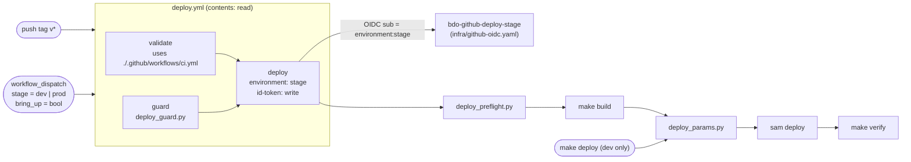

# Deploy workflow — Design

> Proposes ADR-0039 (deploy workflow gated on the reusable CI workflow, with
> per-stage OIDC roles). The ADR is a task in Phase 5. This design fixes the
> shape. The ADR holds the long rationale.

## Overview

### Current state

- **Two parameter builders.** `make deploy` uses `DEPLOY_PARAMS` in the
  `Makefile`. The CI job uses an inline string. The CI string omits
  `AutoBootstrap`. Both omit `BedrockModelId`, `BedrockFoundationModelId`,
  `CatalogSyncSchedule`, and `LogRetentionInDays`.
- **Parameter defaults on update.** On a stack UPDATE, SAM CLI sets
  `UsePreviousValue` for each parameter that is not passed. Thus an omitted
  parameter keeps its old value. On CREATE it gets the template default.
  Comments in the `Makefile` and `ci.yml` say that it gets the default.
- **Script exit status.** `BDO_REGIONS = $(shell …)` discards the exit status
  of the script. An empty value is then passed to `sam deploy`.
- **Prod trigger.** A tag push deploys prod. No approval step exists.
- **Manual deploys.** A redeploy or rollback needs a new tag. Dev has no CI path.
- **Setup steps.** Each of the nine jobs repeats checkout, Python, uv, and
  `uv sync`. ADR-0038 requires one shared setup.
- **Token scope.** `ci.yml` has no workflow-level `permissions`.
- **Deploy role.** The OIDC provider and the `bdo-github-deploy` role are made
  by CLI steps in `docs/runbook.md`. No template defines them. The trust
  accepts `repo:<owner>/<repo>:ref:refs/tags/v*`.
- **Post-deploy check.** ADR-0029 runs `make verify` in the local
  `make deploy` only.

The design keeps `ci.yml` as the Validation workflow and adds `deploy.yml`. One
script builds the parameter set for both paths. Per-stage roles are defined in
a standalone IaC template. The GitHub settings are recorded in a runbook
procedure.

### Goals

1. One complete parameter set from one script, with a fail-closed exit.
2. Every deploy runs the full CI suite on the same commit first.
3. Prod needs a release tag on `main` and the owner's approval.
4. Redeploy, rollback, dev deploys, and bring-up through `workflow_dispatch`.
5. Least privilege: `contents: read` by default, `id-token: write` on one job,
   one role for each stage.

### Non-goals

- No CLI or TUI tool. The `deploy-control-plane` spec is superseded.
- No dev-to-prod promotion. Dev is short-lived.

## Architecture



The `prod` Environment adds a required reviewer and a `v*`-tags-only deployment
policy. The `deploy` job's `concurrency` group `deploy-<stage>` runs one deploy
at a time for each stage. The `pull_request` path does not change: branch
protection still requires the `ci.yml` checks.

## Components and Interfaces

### Composite action `.github/actions/setup/action.yml` (Phase 1)

Inputs: `sam` (string, default `'false'`) and `sam-version` (string, fixed
default). Steps: `actions/setup-python` (`python-version: '3.12'`),
`astral-sh/setup-uv`, `aws-actions/setup-sam` with
`version: ${{ inputs.sam-version }}` only when `inputs.sam == 'true'`, then
`uv sync` (`shell: bash`). Each job runs `actions/checkout` first, because a
local action needs the workspace. Keep the same major versions as today.

Today `aws-actions/setup-sam` has no `version`, so it installs the latest SAM
CLI. New `cfn-lint` rules can then fail `sam validate --lint` on an old tag. Set
the `sam-version` default to the version in the `sam --version` log line of the
last `main` CI run before Phase 1. It must be at least `1.160.0` (tech.md). Thus
Phase 1 does not change behavior. The action file is read at the dispatched
ref, so a later run of a tag uses the SAM CLI of that tag. Dependabot does not
update this input. Raise it by hand in a normal change.

Pin every third-party action to a full commit SHA with a `# vX.Y.Z` comment.
Add `.github/dependabot.yml` for `github-actions` (weekly; directories `/` and
`/.github/actions/setup`). The cost is a small stream of update PRs. The gain is
that a moved upstream tag cannot change a job that holds `id-token: write`.

### Validation workflow `ci.yml`

- Phase 1: add top-level `permissions: contents: read` and
  `defaults: {run: {shell: bash}}`. Replace the setup steps in each job with
  `uses: ./.github/actions/setup` (with `sam: 'true'` in `validate` and
  `deploy`).
- Phase 2: the existing `deploy` job calls `deploy_params.py` (see below).
- Phase 4: triggers are `push: branches: [main]`, `pull_request:
  branches: [main]`, and `workflow_call`. Remove `tags` and the `deploy` job.

When `deploy.yml` calls `ci.yml`, `actions/checkout` checks out `github.sha` of
the caller event. Thus validation runs on the exact commit that deploys.

### Deploy workflow `deploy.yml` (Phase 4)

```yaml
on:
  push: {tags: ['v*']}
  workflow_dispatch:
    inputs:
      stage:    {required: true, type: choice, options: [dev, prod]}
      bring_up: {required: false, type: boolean, default: false}
permissions: {contents: read}
defaults: {run: {shell: bash}}
jobs:
  validate: {uses: ./.github/workflows/ci.yml}
  guard:
    outputs:
      stage: ${{ steps.guard.outputs.stage }}
      bring_up: ${{ steps.guard.outputs.bring_up }}
    # steps: checkout, setup, then the script step with id: guard
  deploy:
    needs: [validate, guard]
    environment: ${{ needs.guard.outputs.stage }}
    permissions: {id-token: write, contents: read}
    concurrency:
      group: deploy-${{ needs.guard.outputs.stage }}
      cancel-in-progress: false
    timeout-minutes: 90
```

The `concurrency` key is on the `deploy` job. Thus a run that waits at the
approval gate does not stop the `validate` job of a newer run.

**`guard`** runs `actions/checkout` with `fetch-depth: 0`, then the setup action.
Then the step with `id: guard` runs:

```sh
uv run python scripts/deploy_guard.py --event "$EVENT" --input-stage "$IN_STAGE" \
  --input-bring-up "$IN_BRING_UP" --ref "$GITHUB_REF" --sha "$GITHUB_SHA" >> "$GITHUB_OUTPUT"
```

`EVENT`, `IN_STAGE`, and `IN_BRING_UP` are set in `env` from
`github.event_name`, `inputs.stage`, and `inputs.bring_up`. The script gets no
input through `${{ }}` in the `run` text. `deploy` reads the stage and the
bring-up flag only from `needs.guard.outputs`.

**`deploy`** steps, in order. `STAGE` and `BRING_UP` come from the guard outputs
through `env`.

1. `actions/checkout`, then `./.github/actions/setup` with `sam: 'true'`.
2. `aws-actions/configure-aws-credentials` with
   `role-to-assume: ${{ vars.AWS_DEPLOY_ROLE_ARN }}`, `aws-region: us-east-1`,
   and `role-duration-seconds: 7200`. The variable is Environment-scoped, so
   each stage gets its own role. The action asks for 3600 seconds by default.
   A bring-up can take longer than one hour, and the job timeout is 90 minutes.
   Thus the session is 7200 seconds, and each role allows it.
3. `uv run python scripts/deploy_preflight.py --stage "$STAGE"`. When
   `BRING_UP` is `true`, add `--bring-up`. Use two steps with `if:`.
4. `make build` (`sam build` plus the verify-layer guard).
5. Bring-up only (`if: needs.guard.outputs.bring_up == 'true'`):
   `params="$(… deploy_params.py --stage "$STAGE" --version "$GITHUB_REF_NAME" --set AutoMigrate=false)"`,
   then `sam deploy --config-env "$STAGE" --no-confirm-changeset
   --parameter-overrides "$params"`. This is the stack CREATE.
   `AutoBootstrap=true` starts the data bootstrap (ADR-0028).
6. Bring-up only: `uv run python scripts/db_bootstrap.py --stage "$STAGE"
   --region us-east-1`. It applies migrations `0001`–`0003` and makes the DB
   roles (ADR-0025).
7. `params="$(… deploy_params.py --stage "$STAGE" --version "$GITHUB_REF_NAME")"`,
   then `sam deploy --config-env "$STAGE" --no-confirm-changeset
   --no-fail-on-empty-changeset --parameter-overrides "$params"`. In bring-up,
   this UPDATE adds `SchemaMigration` and applies `0004` and later.
8. `make verify STAGE="$STAGE"` (ADR-0029).

With `shell: bash`, Actions runs `bash -eo pipefail`. A failed `params=$(…)`
assignment stops the step before `sam deploy`. `--no-fail-on-empty-changeset`
lets a redeploy of the same tag pass.

Bring-up uses the same order as the local three-command sequence in
`db_bootstrap.py`. Both stages accept `bring_up`. Prod bring-up is still gated
by the tag, the ancestry check, and the approval. `db_bootstrap.py` reads the
master secret in the runner and passes it in the invocation payload. It prints
no credential.

Rollback is `workflow_dispatch` with `stage=prod` from an older release tag. It
reverts code and configuration only. Migrations are forward-only under
expand/contract (ADR-0025), so the schema stays at the newer version. The older
code must work with that schema, which expand/contract already requires.

**Migration limit.** `deploy_params.py` computes `MigrationsFingerprint` from the
checked-out tag. A tag with other migration files gives another fingerprint.
CloudFormation then sends an `Update` to `SchemaMigration` (`infra/etl.yaml`).
The migrator runs `upgrade head` with the old scripts. The database holds a
newer revision, so Alembic raises `Can't locate revision`. The stack returns to
`UPDATE_ROLLBACK_COMPLETE`, and the rollback does not occur. Thus a dispatch
rollback is allowed only to a tag with the same `migrations/versions` content as
the live release. Before the dispatch, run:

```sh
live="$(aws cloudformation describe-stacks --stack-name bdo-market-prod \
  --query "Stacks[0].Parameters[?ParameterKey=='ApiVersion'].ParameterValue" --output text)"
git diff --quiet "<target-tag>" "$live" -- migrations/versions
```

`ApiVersion` holds the tag name of the live release. If `git diff` exits
non-zero, do not dispatch. Use the forward fix (below). This rule adds no code.
It agrees with expand/contract: a fix for a bad release is a new release.

**Validate on an old tag.** Every deploy runs the full suite on the dispatched
commit. Some jobs read inputs that change after a release. `pip-audit` reads the
live advisory database. A new advisory for a locked dependency can thus fail
`validate` on an old tag. The fixed `sam-version` removes the SAM CLI cause.
For any remaining cause, `deploy` does not run. Use the forward fix. There is no
path that skips `validate`.

**Rollback floor.** `workflow_dispatch` runs the workflow file at the
dispatched ref. A tag that has no `deploy.yml` thus cannot be dispatched. The
release tags that exist today have no `deploy.yml`. The oldest valid rollback
target is the first release tag that contains `deploy.yml`. The target must
also pass the migration check above. Below that floor, for a target with other
migrations, or when `validate` fails for a cause outside the tag, use the
forward fix:

1. Revert the bad change on `main`.
2. Push a new patch tag.
3. Approve the prod deploy.

Until the operator removes the legacy subject and deletes the repository
secret, a push of an older tag again runs that tag's `ci.yml` deploy job. That
job runs the full suite, then deploys prod through the legacy subject with no
approval. After the transition, this path fails closed.

Do not use this path. From Phase 3, the runbook "Rollback" section says: "Do
not push an old tag again. Use the forward fix below the floor." The tag
ruleset lets admins delete and create `v*` tags, so the rule is procedural
during the transition. ADR-0039 records the approval bypass as a
transition-only risk.

### `scripts/deploy_guard.py` (Phase 4)

```
uv run python scripts/deploy_guard.py --event <push|workflow_dispatch> --input-stage <dev|prod|''>
    --input-bring-up <true|false|''> --ref <ref> --sha <sha> [--main-ref origin/main]
```

Standard library only. Rules:

1. `push`: the stage is `prod` and `bring_up` is `false`. The inputs are ignored.
2. `workflow_dispatch`: the stage is `--input-stage`. `bring_up` is
   `--input-bring-up`.
3. When the stage is `prod`, the ref must match `^refs/tags/v[0-9]`. Else exit 1
   with `::error::prod deploys need a release tag (refs/tags/v<digit>*); got ref <ref>`.
4. When the stage is `prod`, `git merge-base --is-ancestor <sha> <main-ref>` must
   return 0. Else exit 1 with
   `::error::commit <sha> (<ref>) is not an ancestor of <main-ref>`.
5. For `dev`, the script runs no ref check and no git command.
6. On success it prints `stage=<stage>` and `bring_up=<true|false>` on two lines.

`--main-ref` exists for the unit tests only. The workflow uses the default.

**Output streams.** The step sends `stdout` to `$GITHUB_OUTPUT`. Thus write each
`::error::` line and each usage message to `stderr`. The runner reads workflow
commands from `stderr`, so the message shows in the job log. Write only the two
lines of rule 6 to `stdout`, and only on success. On failure, `stdout` is empty.
Thus `$GITHUB_OUTPUT` never gets a line without `=`.

### `scripts/deploy_params.py` (Phase 2)

```
uv run python scripts/deploy_params.py --stage <dev|prod> --version <version> [--set Key=Value ...]
```

It prints one line to stdout: `Key=Value` tokens, space-separated, sorted by key.
A value that contains whitespace is written as `Key="value"`. Sources:

| Keys | Source |
|------|--------|
| `Stage`, `BdoRegions`, `UseRdsProxy`, `AutoMigrate`, `AutoBootstrap`, `BedrockModelId`, `BedrockFoundationModelId`, `CatalogSyncSchedule`, `LogRetentionInDays` | `[<stage>.deploy.parameters].parameter_overrides` in `samconfig.toml` |
| `ApiVersion` | `--version` |
| `MigrationsFingerprint` | computed (below) |
| `EnableDemoKey`, `ApiDomainName`, `IconDomainName`, `HostedZoneId` | SSM key paths from `SSM_KEYS` (below) |

`--set` overrides one static key. Only `UseRdsProxy`, `AutoMigrate`, and
`AutoBootstrap` are allowed. The `Makefile` passes `--set` only when the operator
sets `USE_RDS_PROXY`, `AUTO_MIGRATE`, or `AUTO_BOOTSTRAP`. CI passes
`--set AutoMigrate=false` only in bring-up step 5.

The module exposes `SSM_KEYS: dict[str, str]`, for example
`ApiDomainName -> /bdo-market-insights/{stage}/domain/api-domain-name`. The
preflight script imports it, so the key list has one home.

**Fingerprint.** The script replaces the `Makefile` shell pipeline with Python
that gives the same output. For each `*.py` file under `migrations/versions`
(recursive), it makes the line `<sha256>  migrations/versions/<rel>\n`. It sorts
the lines by code point, takes the SHA-256 of the joined text, and keeps the
first 32 hex characters. A unit test runs the old pipeline on a fixture and
compares. GNU `sort` under a non-C locale can order the lines differently. The
fingerprint then changes one time, and the migrator runs `alembic upgrade head`
as a no-op. This is safe.

**Reuse.** Move the `parameter_overrides` parsing out of
`samconfig_regions.py` into a function `overrides_for_stage(stage) ->
dict[str, str]` in the same module. `regions_for_stage` and `deploy_params.py`
both use it. `validate_regions.py` does not change. For the array form,
`overrides_for_stage` removes one pair of enclosing `"` from each value. The
string form keeps its `shlex.split` path.

**Key-set invariant.** A unit test loads `template.yaml` with
`cfnlint.decode.cfn_yaml` and asserts that the emitted keys equal the
`Parameters` keys. The test runs in `validate`, which gates every deploy. Thus a
new template parameter cannot reach a deploy without a value. The script itself
stays standard-library only and does not read the template.

**Makefile.** Remove `BDO_REGIONS`, `MIGRATIONS_FINGERPRINT`, `DEPLOY_PARAMS`,
and the `?=` defaults for the three toggles. Remove the `make deploy STAGE=prod …`
example from the comment. The Phase 4 recipe is:

```make
deploy:
	@[ "$(STAGE)" != "prod" ] || { echo "error: prod deploys only through deploy.yml (gh workflow run deploy.yml -f stage=prod --ref <tag>)" >&2; exit 1; }
	$(MAKE) build
	params="$$(uv run python scripts/deploy_params.py --stage $(STAGE) --version '$(API_VERSION)' $(DEPLOY_SETS))" && \
	sam deploy --config-env $(STAGE) --parameter-overrides "$$params"
ifneq ($(VERIFY),false)
	$(MAKE) verify STAGE=$(STAGE) AWS_REGION=$(AWS_REGION)
endif
```

Phase 2 uses the same recipe without the first line and with `deploy: build`.
The prod line starts in Phase 4, when `deploy.yml` exists. `DEPLOY_SETS` uses
`$(if …)` to add each `--set`. Do not use `$(shell …)` for the parameter set.
Thus `make deploy STAGE=dev AUTO_MIGRATE=false VERIFY=false` still works for the
local dev bring-up fallback. Correct the "revert to template defaults" comments
in these files:

- `Makefile`
- `.github/workflows/ci.yml`
- `scripts/samconfig_regions.py` (module docstring)
- `docs/runbook.md`

### `scripts/deploy_preflight.py` (Phase 4)

`uv run python scripts/deploy_preflight.py --stage <dev|prod> [--bring-up]`. It
uses boto3 with the job credentials. It reads `stack_name` and `region` from
`[<stage>.deploy.parameters]` in `samconfig.toml`. It runs all checks and reports
all failures at once.

1. `cloudformation.describe_stacks(StackName=…)`.
   - A `ClientError` with code `ValidationError` and the text `does not exist`
     means that the stack is absent. Any other error is the "other AWS error"
     row in "Error Handling".
   - Without `--bring-up`, the stack must exist. The allowed statuses are
     `CREATE_COMPLETE`, `UPDATE_COMPLETE`, `UPDATE_ROLLBACK_COMPLETE`,
     `IMPORT_COMPLETE`, and `IMPORT_ROLLBACK_COMPLETE`.
   - With `--bring-up`, the stack must be absent or in `REVIEW_IN_PROGRESS`.
     A declined or cancelled first changeset leaves that status. The SAM CLI
     treats it as a new stack, so the preflight does the same.
   - Without `--bring-up`, `REVIEW_IN_PROGRESS` fails, and the message names
     `bring_up=true`.
2. `ssm.get_parameters(Names=[SSM_KEYS paths for the stage])`, in both modes.
   Each name in `InvalidParameters` is a missing key.
3. With `--bring-up` only: `logs.describe_log_groups(logGroupNamePrefix=
   "/aws/lambda/bdo-<stage>-")`, paginated. Each group found blocks the CREATE.
4. With `--bring-up` only: `s3.list_buckets()`. Each bucket whose name starts
   with `bdo-<stage>-cdn-` blocks the `CdnStack` CREATE. On prod, the delivery
   bucket is `Retain`. On dev, `DeliveryBucketJanitor` deletes it, so the check
   finds a bucket only after a failed teardown.

Only the Deploy workflow calls it. The local dev fallback does not.

### Per-stage roles `infra/github-oidc.yaml` (Phase 3)

The template is plain CloudFormation with no SAM transform, like
`infra/break-glass.yaml`. The root template does not nest it, for two reasons.
A role inside the stack it deploys is circular. Also, `make destroy` on dev
would delete the dev role. Deploy it once for each account from a workstation
with administrator credentials:

```
make deploy-ci-roles GITHUB_REPOSITORY=<owner>/<repo> LEGACY_TAG_SUBJECT=true
```

The target runs this command:

```
aws cloudformation deploy --region $(AWS_REGION) \
  --stack-name bdo-github-deploy-roles \
  --template-file infra/github-oidc.yaml \
  --capabilities CAPABILITY_NAMED_IAM \
  --no-fail-on-empty-changeset \
  --parameter-overrides GitHubRepository=$(GITHUB_REPOSITORY) \
    AllowLegacyTagSubject=$(LEGACY_TAG_SUBJECT)
```

`AWS_REGION` uses the `Makefile` default `us-east-1`, so the roles stack stays
in one region. `--no-fail-on-empty-changeset` lets a repeated run with the same
values pass. The target fails before the AWS call if `GITHUB_REPOSITORY` is
empty, or if `LEGACY_TAG_SUBJECT` is not `true` or `false`.

| Parameter | Rule |
|-----------|------|
| `GitHubRepository` | required; `AllowedPattern: ^[A-Za-z0-9-]+/[A-Za-z0-9._-]+$` |
| `AllowLegacyTagSubject` | `'true'`/`'false'`, default `'false'` |

Resources:

- `GitHubOidcProvider` (`AWS::IAM::OIDCProvider`, URL
  `https://token.actions.githubusercontent.com`, client ID
  `sts.amazonaws.com`). It has `DeletionPolicy: Retain` and
  `UpdateReplacePolicy: Retain`, so a stack delete does not break CI. The role
  trust builds the provider ARN from `${AWS::Partition}` and `${AWS::AccountId}`.
- `DevDeployRole` (`bdo-github-deploy-dev`) and `ProdDeployRole`
  (`bdo-github-deploy-prod`). Trust: `sts:AssumeRoleWithWebIdentity`,
  `aud = sts.amazonaws.com`, and `sub` = `repo:${GitHubRepository}:environment:<stage>`.
  When `AllowLegacyTagSubject` is `'true'`, the prod `sub` condition is a
  `StringLike` list. The list adds `repo:${GitHubRepository}:ref:refs/tags/v*`.
- Both roles: `MaxSessionDuration: 7200` (see `deploy` step 2).
- Permissions on both roles are the same as the current runbook role:
  `PowerUserAccess`, plus the inline `bdo-*` IAM and `iam:PassRole` policy.
- Both roles: an explicit `Deny` on `iam:*` for
  `arn:${AWS::Partition}:iam::${AWS::AccountId}:role/bdo-github-deploy*`, and
  on `cloudformation:*` for
  `arn:${AWS::Partition}:cloudformation:*:${AWS::AccountId}:stack/bdo-github-deploy-roles/*`.
  The role pattern has no hyphen before `*`. Thus it also covers the CLI-made
  `bdo-github-deploy` role until that role is deleted.
- Dev role only: an explicit `Deny` on `*` for each pattern below. `<p>` is
  `${AWS::Partition}` and `<a>` is `${AWS::AccountId}`.
- Dev role only: a separate `Deny` with `Action: rds:*`, `Resource: *`, and
  `Condition: StringLike: aws:ResourceTag/Name: bdo-prod-*`. The prod DB
  instance has a CloudFormation-generated identifier, so no ARN pattern matches
  it. Its `Name` tag is `bdo-prod-postgres` (`infra/data.yaml`).

**OIDC provider in the current account.** The runbook CLI steps made the
provider, so the first stack CREATE fails with "already exists". Options:

- (A) Import the provider with a CloudFormation `IMPORT` change set. An import
  cannot create the roles in the same operation, so this needs a second
  template variant and two operations.
- (B) Keep the provider outside IaC and record an exception.
- (C) Delete the CLI-made provider, then run `make deploy-ci-roles` at once.
  The stack makes a new provider with the same ARN. The legacy role trust
  refers to that ARN, so it works again when the stack is complete.

Choose **C**. It keeps every resource in IaC (AGENTS.md) and needs one
template. No deploy may run between the delete and the stack completion. The
runbook gives the command, and the delete needs explicit approval. A new
account needs no extra step.

**Dev role Deny patterns**

| Service | Resource ARN |
|---------|--------------|
| CloudFormation | `arn:<p>:cloudformation:*:<a>:stack/bdo-market-prod*/*` |
| Lambda | `arn:<p>:lambda:*:<a>:function:bdo-prod-*` |
| DynamoDB | `arn:<p>:dynamodb:*:<a>:table/bdo-prod-*` |
| Step Functions | `arn:<p>:states:*:<a>:stateMachine:bdo-prod-*`, `arn:<p>:states:*:<a>:execution:bdo-prod-*` |
| SSM | `arn:<p>:ssm:*:<a>:parameter/bdo-market-insights/prod/*` |
| IAM | `arn:<p>:iam::<a>:role/bdo-prod-*`, `arn:<p>:iam::<a>:role/bdo-market-prod*` |
| S3 | `arn:<p>:s3:::bdo-prod-*`, `arn:<p>:s3:::bdo-prod-*/*`, `arn:<p>:s3:::*/bdo-market-insights/prod/*` |
| CloudWatch Logs | `arn:<p>:logs:*:<a>:log-group:/aws/lambda/bdo-prod-*` |
| EventBridge | `arn:<p>:events:*:<a>:rule/bdo-prod-*`, `arn:<p>:events:*:<a>:rule/bdo-market-prod*` |
| Lambda layer | `arn:<p>:lambda:*:<a>:layer:bdo-prod-*`, `arn:<p>:lambda:*:<a>:layer:bdo-prod-*:*` |
| SNS | `arn:<p>:sns:*:<a>:bdo-prod-*` |
| SQS | `arn:<p>:sqs:*:<a>:bdo-prod-*` |
| CloudWatch | `arn:<p>:cloudwatch:*:<a>:alarm:bdo-prod-*`, `arn:<p>:cloudwatch::<a>:dashboard/bdo-prod` |

The EventBridge rows cover the prod ETL and insights schedules
(`bdo-prod-etl-<region>`, `bdo-prod-insights-daily-<region>`, and
`bdo-prod-insights-weekly-<region>`). The second EventBridge pattern covers the
SAM `Type: Schedule` rules `WeeklyCatalogSync` (`infra/catalog.yaml`) and
`DailyRetentionSweep` (`infra/etl.yaml`). These rules have no `Name`, so
CloudFormation makes names that start with the nested stack name
`bdo-market-prod`. These patterns cannot block dev, because
dev names use `bdo-dev-*`, `bdo-market-dev*`, the dashboard `bdo-dev`, and the
`bdo-market-insights/dev/` prefix.

**Remaining risk.** The `Deny` list does not give full isolation:

- The dev role can create a `bdo-*` role, attach any managed policy, and assume
  or pass it. That role is not under the dev `Deny`.
- The prod RDS master secret has an RDS-generated name, so no name pattern
  covers it.
- Resources with no `bdo-prod-` name or tag are not covered. Examples are the
  API Gateway REST API and the CloudFront distribution.
- The dev subject accepts each workflow on each branch, because the `dev`
  Environment has no reviewer and no ref policy. Push access to the repository
  thus gives the dev role, and through the `bdo-*` role path, prod-level access.
  Give push access only to admins.

ADR-0039 records these paths. Separate AWS accounts remove them, and that
change is out of scope.

**OIDC subject.** The Environment subject trusts each workflow file that runs a
job with `environment: prod` on a `v*` tag. Such a workflow does not need
`validate` or `guard`. The tag ruleset and the required reviewer reduce this
risk. A custom subject with `job_workflow_ref` changes the `sub` of all
workflows in the repo, and so breaks the legacy subject during the transition.
ADR-0039 records the risk and the custom subject as a later option.

**Transition.** First delete the CLI-made provider (option C above). The Phase 3
deploy uses `LEGACY_TAG_SUBJECT=true`. Then set the
repository secret `AWS_DEPLOY_ROLE_ARN` to the new prod role. The old `ci.yml`
deploy job thus tests the new role's permissions before Phase 4 changes the
subject. After the first Environment-gated prod deploy succeeds, redeploy with
`LEGACY_TAG_SUBJECT=false`. Then delete the repository secret and the CLI-made
`bdo-github-deploy` role. Deleting the role needs explicit approval.

While the transition is open, a re-pushed old tag deploys prod with no approval
(see "Rollback floor"). Keep the transition short. Do not push an old tag again
until the legacy subject is removed.

### GitHub settings (Phase 3, runbook only)

These settings are outside the repo. Record them as a runbook section with
`gh api` commands and `<owner>/<repo>` placeholders. Do not commit a script for
them:

1. Check: `gh api repos/<owner>/<repo>/actions/oidc/customization/sub`. The
   value of `use_default` must be `true`. Else stop, because the trust `sub`
   patterns do not match.
2. `PUT repos/<owner>/<repo>/environments/dev`. No reviewer, no ref policy.
3. `PUT repos/<owner>/<repo>/environments/prod` with `reviewers` (the owner's
   user id), `prevent_self_review: false`, and `deployment_branch_policy:
   {protected_branches: false, custom_branch_policies: true}`.
4. `POST …/environments/prod/deployment-branch-policies` with `name: v*`,
   `type: tag`.
5. `gh variable set AWS_DEPLOY_ROLE_ARN --env <stage> --body <role-arn>` for each
   stage.
6. `POST repos/<owner>/<repo>/rulesets`: `target: tag`, include `refs/tags/v*`,
   rules `creation`, `update`, and `deletion`, and
   `bypass_actors: [{actor_id: 5, actor_type: RepositoryRole, bypass_mode: always}]`
   (5 is the built-in admin role).
7. Check: `gh api repos/<owner>/<repo>/environments/prod --jq .protection_rules`.
8. Check: `gh api repos/<owner>/<repo>/rulesets --jq '.[] | select(.target=="tag") | .name'`.
   Make sure that the tag ruleset from step 6 is in the output.

Apply these settings before `deploy.yml` exists on `main`. GitHub creates a
missing Environment with no protection the first time a job references it. The
missing variable then makes `configure-aws-credentials` fail, so the failure is
closed. But the order still matters.

### Dev lifecycle

**Create.** Dispatch `deploy.yml` with `stage=dev` and `bring_up=true`. Facts
from ADR-0025, ADR-0028, and the runbook:

- With `AutoMigrate=true`, `SchemaMigration` runs as `lambda_migrator`. On a new
  database that role does not exist yet, so a one-phase CREATE fails. Thus
  step 5 sets `AutoMigrate=false`.
- `db_bootstrap.py` makes the roles between the two phases.
- The four SSM keys must exist first (`make seed-config STAGE=dev`). Otherwise
  CloudFormation rejects the SSM parameter types. The preflight checks them.
- `AutoBootstrap` (ADR-0028) is not a blocker. It starts on CREATE and returns at
  once. `make verify` waits for its execution (ADR-0029).

The local sequence `make deploy STAGE=dev AUTO_MIGRATE=false VERIFY=false`,
`make db-bootstrap STAGE=dev`, `make deploy STAGE=dev` stays as a dev-only
fallback in the runbook.

**Teardown.** Options: (A) a `workflow_dispatch` `action: destroy` limited to dev.
(B) a `make destroy` target. Choose **B**. AGENTS.md requires approval each time
for AWS deletes, and a local command keeps a human at the keyboard. No CI path
can then delete any stack, so CI cannot delete prod. The recipe:

1. Fail unless `STAGE` is `dev`.
2. Fail unless `CONFIRM` is `bdo-market-dev`.
3. If the stack `bdo-market-dev-break-glass` exists, print
   `make break-glass-down STAGE=dev` and exit 1. Its instance holds an ENI in a
   dev subnet, which can block the `NetworkStack` delete.
4. Find the dev DB instance ID through its `Name` tag `bdo-dev-postgres`.
5. Run `sam delete --stack-name bdo-market-dev --region $(AWS_REGION) --no-prompts`.
   The stack name is a literal. The target never derives it from `STAGE`.
6. List the `bdo-market-dev*` stacks that are not `DELETE_COMPLETE`. If any
   remain, print them, name "Remove orphaned nested stacks", and exit 1.
7. Delete each log group with the literal prefix `/aws/lambda/bdo-dev-`. List the
   prefix again. If any group remains, print it and exit 1.
8. If step 4 found an ID, print the snapshot IDs from
   `aws rds describe-db-snapshots --db-instance-identifier <id>`. The runbook
   gives the `aws rds delete-db-snapshot` command. The snapshots cost money
   until deleted.

`make destroy` keeps the four dev SSM keys, so the next dev bring-up uses them
again. The per-stage `s3_prefix` in `samconfig.toml` keeps the dev artifact
delete away from prod objects.

### Optional helpers (Phase 6)

- `make release VERSION=vX.Y.Z`. The target checks that `VERSION` matches
  `^v[0-9]+\.[0-9]+\.[0-9]+$`. Then it runs `git fetch origin main`. It fails if
  `git status --porcelain` is not empty or `HEAD` is not `origin/main`. Then it
  runs `git tag -a` and `git push origin <VERSION>`.
- `make deploy-ci STAGE=dev` runs `gh workflow run deploy.yml -f stage=dev
  --ref <current branch>`, then `gh run watch` on the new run.

### Files touched

```
.github/actions/setup/action.yml     # new composite action (P1)
.github/dependabot.yml               # new, github-actions ecosystem (P1)
.github/workflows/ci.yml             # permissions, shell, setup action, pins (P1); params script (P2); workflow_call, drop tags + deploy job (P4)
.github/workflows/deploy.yml         # new (P4)
scripts/deploy_params.py             # new (P2)
scripts/samconfig_regions.py         # + overrides_for_stage (P2)
scripts/deploy_guard.py              # new (P4)
scripts/deploy_preflight.py          # new (P4)
samconfig.toml                       # full static set per env, TOML array form (P2)
Makefile                             # deploy via script (P2); deploy-ci-roles (P3); prod guard (P4); destroy, release, deploy-ci (P6)
infra/github-oidc.yaml               # new, standalone (P3)
tests/unit/test_deploy_params.py, test_deploy_guard.py, test_deploy_preflight.py, test_workflows.py, test_github_oidc_template.py
docs/runbook.md, docs/adr/0039-*.md, docs/adr/0038-*.md, docs/adr/0029-*.md, docs/adr/0025-*.md, README.md
.kiro/steering/structure.md, .kiro/specs/deploy-control-plane/*.md   # P5
```

## Data Models

`samconfig.toml` holds the full static set for each stage in the TOML array
form. `samconfig_regions.py` already parses this form. Use the dev form below,
and the same form for prod with `Stage=prod`:

```toml
[dev.deploy.parameters]
parameter_overrides = [
  "Stage=dev",
  "BdoRegions=tw",
  "UseRdsProxy=false",
  "AutoMigrate=true",
  "AutoBootstrap=true",
  "BedrockModelId=us.amazon.nova-lite-v1:0",
  "BedrockFoundationModelId=amazon.nova-lite-v1:0",
  'CatalogSyncSchedule="cron(0 8 ? * THU *)"',
  "LogRetentionInDays=30",
]
```

SAM CLI parses each array entry with its own `Key=Value` grammar. An unquoted
value stops at the first space. Thus `CatalogSyncSchedule` must use the quoted
form in a TOML literal string. A direct `sam deploy --config-env <stage>` (the
break-glass path) then reads the same values as the script.

Before `deploy_params.py` becomes the only builder, compare these values with
the live stack parameters (`aws cloudformation describe-stacks --query
'Stacks[0].Parameters'`) for each existing stage. Set any live value that
differs into `samconfig.toml`. Then the first explicit full set changes nothing.

Example script output (one line, wrapped here):

```
ApiDomainName=/bdo-market-insights/dev/domain/api-domain-name ApiVersion=v1.2.3
AutoBootstrap=true AutoMigrate=true BdoRegions=tw … CatalogSyncSchedule="cron(0 8 ? * THU *)" …
```

## Input validation

| Input | Rule | On failure |
|-------|------|------------|
| `workflow_dispatch` `stage` | required; choice `dev`/`prod` | GitHub rejects the dispatch |
| `workflow_dispatch` `bring_up` | optional boolean; default `false` | GitHub rejects a value that is not boolean |
| `deploy_guard.py` `--event` | `push` or `workflow_dispatch` | exit 2, usage message |
| `deploy_guard.py` `--input-stage`, `--input-bring-up` | for `workflow_dispatch`: `dev`/`prod` and `true`/`false`; ignored for `push` | exit 2, names the argument |
| `deploy_guard.py` `--ref`, `--sha` | required; `--sha` is 40 hex characters | exit 2 |
| `--stage` (params, preflight) | required; `dev` or `prod` | exit 2, usage message |
| `--version` | required; `^[A-Za-z0-9._/@+-]{1,128}$` (Req 4.2) | exit 2; empty stdout. Spaces would split the parameter set. A dev dispatch from a branch whose name does not match the pattern fails in step 5 or 7, before `sam deploy` (Req 4.10). The message names the ref. Rename the branch. |
| `--set Key=Value` | optional, repeatable; key in the allowlist; value `true` or `false` | exit 2, names the key |
| samconfig static keys | all nine present; `Stage` equals `--stage`; no unknown key; no key that the script computes | exit 1, names the key |
| samconfig values | an array entry is `Key=Value` or `Key="value"`; `overrides_for_stage` removes one pair of enclosing `"`; a value with whitespace must use the quoted form; no other `"` and no newline | exit 1, names the key |
| `migrations/versions` | exists and has at least one `*.py` | exit 1 |
| `GitHubRepository` | `AllowedPattern` above | CloudFormation rejects the deploy |
| `make deploy` `STAGE` | not `prod` | exit 1 before `make build`; names `deploy.yml` |
| `make destroy` `STAGE`, `CONFIRM` | `dev`, `bdo-market-dev` | exit 1, deletes nothing |
| `make release` `VERSION` | `^v[0-9]+\.[0-9]+\.[0-9]+$` | exit 1, no tag |

## Invariant ownership

| Invariant | Owner | Reason |
|-----------|-------|--------|
| No deploy without `validate` | `deploy.yml` `needs`, held by `test_workflows.py` | Only the workflow graph can order jobs. The test stops an edit that removes the edge. |
| No local prod deploy | `make deploy` prod line | The guard blocks the documented local command. An operator with administrator credentials can still run `sam deploy` directly. ADR-0039 records this as the break-glass path. |
| Prod only from a release tag | `prod` Environment policy and tag ruleset (GitHub); `deploy_guard.py` | A branch edit of `deploy.yml` cannot bypass platform settings. The guard gives a clear early message. |
| Prod commit is on `main` | `deploy_guard.py`, held by `test_deploy_guard.py` | The platform cannot check ancestry. |
| Prod credentials only through the `prod` Environment | prod role trust `sub` (AWS) | AWS checks it outside GitHub. |
| Complete parameter set | `deploy_params.py` and its key-set test | One builder, checked against the template on every deploy. |
| Dev role `Deny` on prod names | IAM `Deny` on the dev role, held by `test_github_oidc_template.py` | An explicit deny wins over `PowerUserAccess`. The limits are in "Remaining risk". |
| Bring-up only on an absent stack | `deploy_preflight.py --bring-up` | A second CREATE on a live stack fails after `make build` with a CloudFormation error that does not name the cause. |
| Rollback keeps `MigrationsFingerprint` | runbook "Rollback" check (`git diff --quiet … -- migrations/versions`) | The workflow cannot know the target of a rollback from the inputs. The check needs no code. A missed check fails closed at `SchemaMigration`. |
| Destroy never targets prod | `make destroy` literal guard; no workflow path | Two independent controls. |

## Error Handling

| Operation | Failure | Kind | Caller gets | Log |
|-----------|---------|------|-------------|-----|
| `deploy_guard.py` | bad argument | fatal | exit 2; empty stdout; job fails; `deploy` skipped | stderr (usage message) |
| `deploy_guard.py` | ref not a release tag; commit not on `main` | fatal | exit 1; empty stdout; job fails; `deploy` skipped | `::error::` with ref or SHA, on stderr |
| `deploy_params.py` | bad argument | fatal | exit 2; stderr message; empty stdout | stderr |
| `deploy_params.py` | samconfig, values, or migrations problem | fatal | exit 1; stderr names the key or path; empty stdout | stderr |
| `make deploy` / CI step | script exit non-zero | fatal | recipe or step stops before `sam deploy` | the script's stderr |
| `make deploy` | `STAGE=prod` | fatal | exit 1 before `make build` | stderr names `deploy.yml` |
| `configure-aws-credentials` | variable missing; trust rejects `sub` | fatal | job fails | action error; runbook troubleshooting row |
| `deploy_preflight.py` | stack missing, no `--bring-up` | fatal | exit 1: "stack <name> does not exist; dispatch with bring_up=true" | `::error::` |
| `deploy_preflight.py` | stack exists, `--bring-up` | fatal | exit 1: "stack <name> exists; dispatch without bring_up". For `ROLLBACK_COMPLETE`, it names "Recreating a stack from scratch". | `::error::` |
| `deploy_preflight.py` | status not allowed, no `--bring-up` | fatal | exit 1 names the status; `ROLLBACK_COMPLETE` names "Recreating a stack from scratch"; `*_IN_PROGRESS` says another deploy runs | `::error::` |
| `deploy_preflight.py` | SSM keys missing | fatal | exit 1 lists all names and `make seed-config STAGE=<stage>` | `::error::` |
| `deploy_preflight.py` | log groups found, `--bring-up` | fatal | exit 1 lists the groups and names "Recreating a stack from scratch" | `::error::` |
| `deploy_preflight.py` | `bdo-<stage>-cdn-` bucket found, `--bring-up` | fatal | exit 1 names the bucket and "Recreating a stack from scratch" step 2 | `::error::` |
| `deploy_preflight.py` | `REVIEW_IN_PROGRESS`, no `--bring-up` | fatal | exit 1: the stack was never created; dispatch with `bring_up=true` | `::error::` |
| `make deploy-ci-roles` | CLI-made provider still exists | fatal | CloudFormation CREATE fails with "already exists"; delete the provider (runbook), then run again | stack events |
| Any AWS call in `deploy` | session expires (`ExpiredToken`) | fatal | job fails; CloudFormation continues; check the stack status before a new dispatch | action output. The 7200-second session makes this unlikely inside the 90-minute timeout. |
| `deploy_preflight.py` | other AWS error (for example `AccessDenied`) | fatal | exit 1 with the error code | `::error::`. boto3 standard retries handle throttling. |
| `make build` | layer missing dependencies | fatal | job fails | verify-layer message |
| Bring-up step 5 | CREATE fails | fatal | job fails; stack is `ROLLBACK_COMPLETE`; the next preflight names "Recreating a stack from scratch" | stack events in the log |
| Bring-up step 6 or 7 | DB bootstrap or UPDATE fails | recoverable | job fails; stack exists with `AutoMigrate=false`; run `make db-bootstrap STAGE=<stage>`, then dispatch without `bring_up` | script output; migrator log group |
| `sam deploy` (normal) | changeset or stack failure | recoverable by CloudFormation rollback | job fails; stack returns to the last good state | stack events in the log |
| `sam deploy` (normal) | migration fails | recoverable | job fails; `UPDATE_ROLLBACK_COMPLETE`; fix and dispatch again | migrator log group |
| `sam deploy` (rollback) | migrator fails with `Can't locate revision` (target has other migrations) | fatal | job fails; `UPDATE_ROLLBACK_COMPLETE`; the live release still serves; use the forward fix | migrator log group |
| `validate` (redeploy or rollback) | a job fails for a cause outside the tag (for example a new `pip-audit` advisory) | fatal | `deploy` does not run; use the forward fix: revert on `main`, fix the cause, push a new patch tag | the failed job log |
| `make verify` | a check fails | fatal for the job; stack stays deployed | job fails; the operator decides on rollback | `verify.py` output |
| `make destroy` | stacks or log groups remain | fatal | exit 1 lists them | stdout |
| Approval | reviewer rejects, or no approval | not an error | `deploy` does not run | run history |
| Concurrency | a third run queues for the same stage | expected | GitHub cancels the older pending run; dispatch again if needed | run history |

## Testing Strategy

- **Unit (`pytest`, no AWS):**
  - `test_deploy_params.py`: the emitted keys equal the `template.yaml`
    `Parameters` keys for dev and prod. The fingerprint equals the old shell
    pipeline on a fixture directory. Each validation row exits non-zero with
    empty stdout. `--set` accepts only allowed keys with `true` or `false`. A
    value with whitespace is quoted. A `--version` with a legal git branch
    character outside the pattern (for example `feat#1`) exits 2, and the
    message names the value. Each `samconfig.toml` array entry for both stages
    matches `^[A-Za-z0-9]+=("[^"\n]*"|[^\s"]+)$`. Thus SAM CLI and the script
    read the same values.
  - `test_deploy_guard.py`: a temporary git repo with `main` and a side branch.
    A tag push on `main` passes. A tag push on the side commit fails and names
    the SHA. A prod dispatch from `refs/heads/x` fails and names the ref.
    `refs/tags/vfoo` fails. A dev dispatch from any ref passes with no git call.
    A push ignores the inputs and prints `bring_up=false`. Each failure case
    has an empty `stdout` and a `stderr` that names the ref or the SHA.
  - `test_deploy_preflight.py` (`moto`): stack missing; bad status; SSM missing;
    success; bring-up with the stack absent passes; bring-up with the stack
    present fails; bring-up with a leftover `/aws/lambda/bdo-dev-` log group
    fails; bring-up with a leftover `bdo-prod-cdn-` bucket fails for prod.
    A stack in `REVIEW_IN_PROGRESS` passes in bring-up mode and fails in normal
    mode with a message that names `bring_up=true`. Use a stubbed client for
    the status cases that `moto` cannot make.
  - `test_workflows.py` (PyYAML; the `on` key loads as `True`):
    - `deploy.yml`: `deploy.needs` holds `validate` and `guard`. `validate.uses`
      is `./.github/workflows/ci.yml`. `deploy.environment` refers to
      `needs.guard.outputs.stage`. Top-level permissions are `contents: read`.
      Only `deploy` has `id-token: write`. The `deploy` job concurrency group
      starts with `deploy-`, and `cancel-in-progress` is false. The input
      `bring_up` is a boolean with default `false`. `guard.outputs` maps
      `stage` and `bring_up` from `steps.guard.outputs`.
    - `deploy.yml` step sequence: the preflight step comes before `make build`.
      `make build` comes before each `sam deploy`. The last `sam deploy` comes
      before `make verify`. The two bring-up steps have
      `if: needs.guard.outputs.bring_up == 'true'`. The bring-up `sam deploy`
      step passes `--set AutoMigrate=false`. The normal `sam deploy` step
      (step 7) passes `--no-fail-on-empty-changeset` (Req 4.4). No step has
      `sam delete` or `delete-stack`.
    - `deploy.yml` session: `role-duration-seconds` is at least
      `timeout-minutes × 60`.
    - `ci.yml`: it has `workflow_call` and no `tags` trigger. It has no job with
      `id-token`.
    - Both workflows: `defaults.run.shell` is `bash`.
    - All workflows and the composite action: no direct `setup-python` or
      `setup-uv` in a workflow. Every non-local `uses:` ends in `@<40-hex>`.
    - Composite action: the `sam-version` default matches
      `^[0-9]+\.[0-9]+\.[0-9]+$` and is at least `1.160.0`. The
      `aws-actions/setup-sam` step passes it as `version`.
  - `test_github_oidc_template.py` (`cfn_yaml`): each trust `sub` is the
    Environment subject. The legacy subject is only under the
    `AllowLegacyTagSubject` condition. Both roles have the role and roles-stack
    `Deny`, with the pattern `role/bdo-github-deploy*`. Both roles have
    `MaxSessionDuration: 7200`. The dev `Deny` resources equal the "Dev role
    Deny patterns" table. The dev role has the `rds:*` tag `Deny`. The provider
    has no condition and has `DeletionPolicy: Retain`.
- **Static:** `sam validate --lint`, `cfn-lint infra/github-oidc.yaml`, and
  `actionlint` if available.
- **Integration (manual, Phase 4):** dispatch dev (with `bring_up=true` if dev
  does not exist). Then push a patch tag. Confirm that it waits at the approval
  gate, and approve it. Then dispatch `stage=prod` from a branch, and confirm
  that `guard` fails. Last, close the transition. Steps are in tasks.md.

## ADRs (proposed — authored in Phase 5)

- **ADR-0039 — Deploy workflow gated on the reusable CI workflow, with per-stage
  OIDC roles.** It records these decisions:
  - `deploy.yml` runs `validate` (`workflow_call`), then `guard`, then `deploy`.
  - The `prod` Environment gate allows self-approval.
  - `workflow_dispatch` serves redeploy, rollback, dev, and bring-up.
  - `deploy_params.py` is the one builder. The ADR gives the
    `UsePreviousValue` rationale.
  - `make deploy` blocks prod.
  - Per-stage roles and the OIDC provider are in a standalone template. The
    ADR gives the dual-subject transition and the provider replacement.
  - Plain CloudFormation is acceptable for `infra/github-oidc.yaml`. ADR-0027
    gives the same reason for `break-glass.yaml`.
  - Rollback is code-only. The rollback floor is the first tag with
    `deploy.yml`. A rollback target must have the same `migrations/versions`
    content as the live release. Else use the forward fix.
  - The SAM CLI version is fixed in the composite action. `validate` has no
    bypass, so a later failure on an old tag needs the forward fix.
  - The session is 7200 seconds.
  - Dev teardown is `make destroy` (option B).
  - Actions are pinned to SHAs, and Dependabot updates them.

  It records these remaining risks:
  - the `bdo-*` role path;
  - the prod master secret;
  - resources with no `bdo-prod-` name or tag;
  - the Environment subject without `job_workflow_ref`;
  - the dev subject accepts each workflow on each branch, so push access gives
    the dev role (give push access only to admins);
  - during the transition only, a re-pushed old tag deploys prod through the
    legacy subject with no approval (the runbook forbids it);
  - direct `sam deploy` with administrator credentials stays possible as the
    break-glass path.

  It records these rejected alternatives:
  - a deploy job inside `ci.yml`;
  - the `deploy-control-plane` CLI/TUI;
  - a CI destroy path;
  - bring-up as local steps only;
  - a provider import, or a provider outside IaC.
- **ADR-0038 amendment note.** `deploy.yml` now exists per ADR-0039. The
  "deploy control plane can dispatch" sentence no longer applies.
- **ADR-0029 amendment note.** CI now runs `make verify` after each deploy.
- **ADR-0025 amendment note.** The DB bootstrap can also run in a Deploy
  workflow job. The master credential is then read in the runner and passed in
  the invocation payload, as on a workstation. A dev bring-up reads only the dev
  master secret. The dev role is not blocked from the prod secret (ADR-0039).
