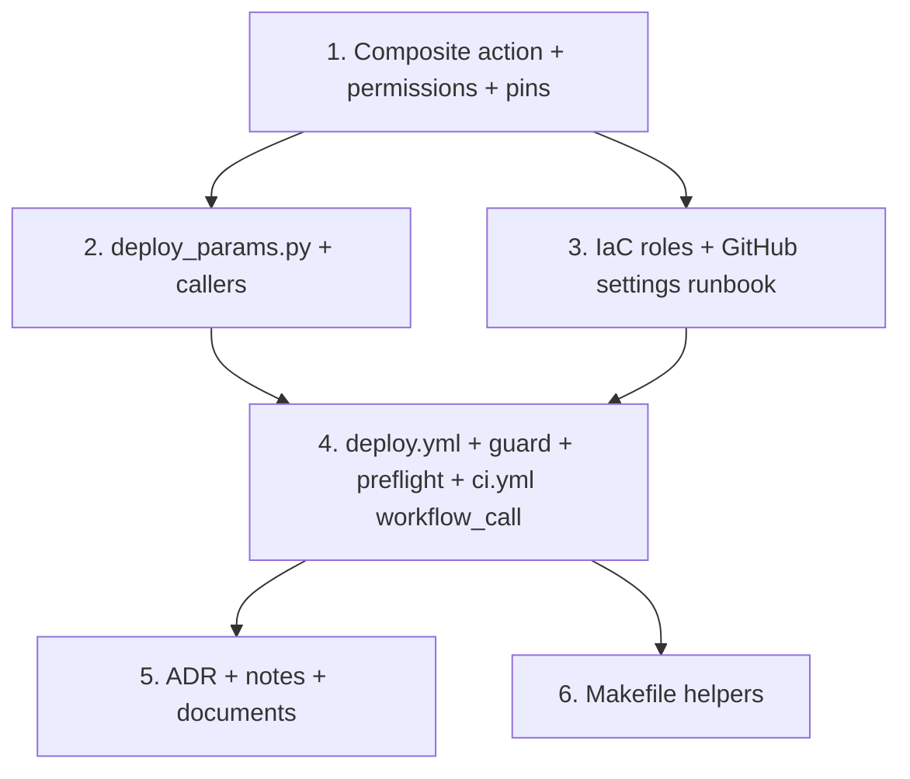

# Implementation Plan

## Overview

Convert the deploy-workflow design into six phases. Each phase is independent
and leaves releases working. Phases 1 and 2 do not change deploy behavior.
Phase 3 adds roles and settings next to the current path. Phase 4 moves the
deploy. Phase 6 is optional except task 6.1.

**Standard checks.** Run these for each task, and in CI:

```sh
uv run ruff check .
uv run ruff format --check .
uv run mypy src/ tests/
uv run pytest -m "not integration"
sam validate --lint
actionlint            # if available
```

## Tasks

### Phase 1 — Shared setup and least privilege (refactor)

- [ ] 1. Put the setup into a composite action
  - [ ] 1.1 Add `.github/actions/setup/action.yml` with inputs `sam` (default
    `'false'`) and `sam-version`. Steps: `actions/setup-python` (3.12),
    `astral-sh/setup-uv`, `aws-actions/setup-sam` with
    `version: ${{ inputs.sam-version }}` when `sam == 'true'`, then `uv sync`.
    Set the `sam-version` default to the SAM CLI version in the last `main` CI
    run log (at least `1.160.0`). Keep the current major versions.
    - _Requirements: 7.1_
  - [ ] 1.2 In `ci.yml`, replace the setup steps of each job with
    `actions/checkout` plus `./.github/actions/setup`. Use `sam: 'true'` in the
    `validate` job and the `deploy` job. Add top-level
    `permissions: contents: read` and `defaults: {run: {shell: bash}}`. Keep the
    `deploy` job permissions as they are.
    - _Requirements: 5.1, 7.2, 7.5_
  - [ ] 1.3 Pin each third-party action to a full commit SHA with a
    `# vX.Y.Z` comment. Add `.github/dependabot.yml` for `github-actions`
    (weekly; directories `/` and `/.github/actions/setup`).
    - _Requirements: 7.3, 7.4_
  - [ ] 1.4 Add `tests/unit/test_workflows.py` with the `ci.yml` checks that
    hold now: top-level `contents: read`, `defaults.run.shell: bash`, no direct
    `setup-python` or `setup-uv`, SHA pins in all workflows and the
    composite action, and the fixed `sam-version` default passed to
    `aws-actions/setup-sam`.
    - _Requirements: 5.1, 7.1, 7.2, 7.3, 7.5_
  - Verify: standard checks. The `pull_request` CI run shows the same job set as
    before, and all jobs pass.

### Phase 2 — One parameter builder (no behavior change)

- [ ] 2. Add `scripts/deploy_params.py` and change both callers to use it
  - [ ] 2.1 Add `overrides_for_stage(stage)` to `scripts/samconfig_regions.py`.
    Make `regions_for_stage` use it. For the array form, remove one pair of
    enclosing `"` from each value. Keep the current tests green.
    - _Requirements: 1.3_
  - [ ] 2.2 Write `samconfig.toml` `parameter_overrides` for `dev` and `prod` in
    the TOML array form with the nine static keys (design "Data Models").
    Write `CatalogSyncSchedule` as the literal string
    `'CatalogSyncSchedule="cron(0 8 ? * THU *)"'` in both stages.
    - _Requirements: 1.3_
  - [ ] 2.3 Add `scripts/deploy_params.py`: arguments, sources, `--set`
    allowlist with `true`/`false` values, `SSM_KEYS`, the fingerprint, output
    quoting, and the exit codes in the design "Input validation" table.
    - _Requirements: 1.1, 1.3, 1.4, 1.5, 4.10_
  - [ ] 2.4 Add `tests/unit/test_deploy_params.py`. Assert that the emitted keys
    equal the `template.yaml` `Parameters` keys for both stages. Assert that the
    fingerprint equals the old shell pipeline on a fixture. Assert a non-zero
    exit and empty stdout for each validation row.
    Include a `--version` case with a legal branch character outside the
    pattern (for example `feat#1`). Assert that each `samconfig.toml` array
    entry in both stages matches `^[A-Za-z0-9]+=("[^"\n]*"|[^\s"]+)$`.
    - _Requirements: 1.2, 1.3, 1.4, 1.5, 4.10_
  - [ ] 2.5 Change the `Makefile` `deploy` recipe to the Phase 2 form in the
    design: `deploy: build`, the script call with `DEPLOY_SETS`, `sam deploy`,
    and the `ifneq ($(VERIFY),false)` `make verify` block. Remove
    `BDO_REGIONS`, `MIGRATIONS_FINGERPRINT`, `DEPLOY_PARAMS`, and the three
    toggle defaults. Correct the "revert to template defaults" comments in the
    `Makefile`, `ci.yml`, the `scripts/samconfig_regions.py` docstring, and
    `docs/runbook.md`.
    - _Requirements: 1.4, 1.6_
  - [ ] 2.6 Change the `ci.yml` `deploy` job to
    `params="$(uv run python scripts/deploy_params.py --stage prod --version "$GITHUB_REF_NAME")"`.
    Remove the inline fingerprint, regions read, and parameter string.
    - _Requirements: 1.4, 1.6_
  - Verify: standard checks. For each live stage, compare the script output with
    `aws cloudformation describe-stacks --stack-name bdo-market-<stage> --query 'Stacks[0].Parameters'`.
    Put any live value that differs into `samconfig.toml`. If dev exists, run
    `make deploy STAGE=dev`. Confirm that the changeset has no parameter
    changes except `ApiVersion` and, one time only, `MigrationsFingerprint`
    (design "Fingerprint"). If dev does not exist, do this check on the
    next dev bring-up. Run
    `uv run python scripts/deploy_params.py --stage qa --version x; echo $?` and
    confirm exit 2 with empty stdout.

### Phase 3 — Per-stage roles and GitHub settings

- [ ] 3. Define the Deploy roles in IaC and record the GitHub settings
  - [ ] 3.1 Add `infra/github-oidc.yaml` (standalone, not nested):
    - parameters `GitHubRepository` and `AllowLegacyTagSubject`;
    - the provider, with `DeletionPolicy: Retain` and no condition;
    - `bdo-github-deploy-dev` and `bdo-github-deploy-prod` with the Environment
      subject trust, the legacy prod subject under its condition,
      `MaxSessionDuration: 7200`, and today's permissions;
    - the `role/bdo-github-deploy*` and roles-stack `Deny` on both roles;
    - the "Dev role Deny patterns" table as a `Deny` on the dev role, in full
      ARN form, and the `rds:*` tag `Deny`.
    - _Requirements: 5.3, 5.5, 5.6, 5.7, 5.8, 5.9_
  - [ ] 3.2 Add `make deploy-ci-roles GITHUB_REPOSITORY=<owner>/<repo>
    LEGACY_TAG_SUBJECT=<true|false>`. Use the full command in the design, with
    `--region $(AWS_REGION)`, `--no-fail-on-empty-changeset`, and
    `--parameter-overrides`. It fails before the
    AWS call when `GITHUB_REPOSITORY` is empty or `LEGACY_TAG_SUBJECT` is not
    `true` or `false`.
    - _Requirements: 5.3, 5.5_
  - [ ] 3.3 Add `tests/unit/test_github_oidc_template.py` with the trust,
    session, provider, and `Deny` checks in the design.
    - _Requirements: 5.3, 5.5, 5.6, 5.7, 5.8, 5.9_
  - [ ] 3.4 In `docs/runbook.md`, replace "CI/CD deploy role (GitHub OIDC)
    bootstrap" with two sections. "Deploy roles (IaC)" covers the CLI-made
    provider delete, `make deploy-ci-roles`, and the transition steps.
    "GitHub Environments and
    tag ruleset" covers the eight `gh api` steps in the design, with
    placeholders. Do not commit a script for the GitHub settings. In the
    "Rollback" section, add: "Do not push an old tag again. Use the forward fix
    below the floor." This rule starts with the legacy subject on the new role.
    - _Requirements: 3.5, 3.6, 4.7, 5.4, 9.2_
  - Verify: standard checks and `cfn-lint infra/github-oidc.yaml`. With
    `infra/github-oidc.yaml` on `main`, run the OIDC subject check. Make sure
    that no deploy runs. Delete the CLI-made provider, with explicit approval.
    Then run `make deploy-ci-roles … LEGACY_TAG_SUBJECT=true` at once. Set the
    repository secret
    `AWS_DEPLOY_ROLE_ARN` to the prod role. Apply the GitHub settings, and check
    them with `gh api repos/<owner>/<repo>/environments/prod --jq .protection_rules`
    and `gh api repos/<owner>/<repo>/rulesets --jq '.[] | select(.target=="tag") | .name'`.
    Run `aws events list-rules --name-prefix bdo-market-prod` and
    `aws events list-rules --name-prefix bdo-prod-`. Confirm that each prod rule
    name matches one of the two EventBridge `Deny` patterns.
    The next tag release through the old `ci.yml` job must pass on the new role.

### Phase 4 — Deploy workflow

The Phase 3 settings must be applied in AWS and GitHub before `deploy.yml`
exists on `main`. Merge tasks 4.3, 4.4, and 4.5 to `main` in one merge. Do not
push a `v*` tag while Phase 4 is open. The only exception is the patch tag in
Verify step 2, after that merge.

- [ ] 4. Move the deploy into `deploy.yml`
  - [ ] 4.1 Add `scripts/deploy_guard.py` and `tests/unit/test_deploy_guard.py`
    with the temporary git repo cases in the design. Write the `::error::`
    lines and usage messages to `stderr`, and the outputs to `stdout` only on
    success. Assert an empty `stdout` and a `stderr` that names the ref or SHA
    in each failure case.
    - _Requirements: 3.2, 3.3, 3.7_
  - [ ] 4.2 Add `scripts/deploy_preflight.py` and
    `tests/unit/test_deploy_preflight.py` (`moto`):
    - normal mode: stack missing, bad status, `REVIEW_IN_PROGRESS`, SSM keys
      missing, success;
    - `--bring-up` mode: stack absent, `REVIEW_IN_PROGRESS`, stack present,
      leftover log groups, leftover `bdo-<stage>-cdn-` bucket.
    - _Requirements: 6.1, 6.2, 6.3, 6.5, 6.6, 6.10_
  - [ ] 4.3 Add `.github/workflows/deploy.yml`: triggers with the `stage` and
    `bring_up` inputs, workflow-level permissions and shell, and the `validate`,
    `guard`, and `deploy` jobs. Put `concurrency` on `deploy`. Add the eight
    `deploy` steps in the design, with the bring-up steps under `if:`. Map the
    `guard` outputs from the step with `id: guard`. Set
    `role-duration-seconds: 7200`.
    - _Requirements: 2.2, 2.3, 3.1, 3.2, 3.3, 3.4, 4.1, 4.2, 4.3, 4.4, 5.1, 5.2, 5.4, 5.8, 6.4, 6.9, 7.5, 8.1, 8.2, 8.3_
  - [ ] 4.4 In `ci.yml`, add `workflow_call`. Remove the `tags` trigger and the
    `deploy` job.
    - _Requirements: 2.1_
  - [ ] 4.5 Add the prod line as the first line of the `Makefile` `deploy`
    recipe, and change `deploy: build` to `$(MAKE) build` after it (design
    "Makefile"). Remove the `make deploy STAGE=prod …` example from the comment.
    - _Requirements: 2.5_
  - [ ] 4.6 Extend `tests/unit/test_workflows.py` with the `deploy.yml` checks
    and the new `ci.yml` checks in the design. Include the step sequence, the
    bring-up `if:` and `--set AutoMigrate=false`, `--no-fail-on-empty-changeset`
    on the normal `sam deploy` step, no delete step, and the session length.
    - _Requirements: 2.1, 2.4, 4.1, 4.4, 5.1, 5.2, 5.8, 6.4, 6.9, 7.5, 8.1, 8.2, 8.3, 8.4_
  - Verify: standard checks. Run `make deploy STAGE=prod` and confirm exit 1
    with no AWS call. With `deploy.yml` on `main`, run these steps in order:
    1. Dispatch dev: `gh workflow run deploy.yml -f stage=dev --ref main`. Add
       `-f bring_up=true` if dev does not exist. Confirm that `validate`,
       `guard`, `deploy`, and `make verify` pass.
    2. Push a patch tag on `main`. Confirm that `deploy` waits at the `prod`
       approval gate. Approve, and confirm that the deploy and `make verify`
       pass.
    3. Dispatch `stage=prod` from a branch. Confirm that `guard` fails and names
       the ref.
  - [ ] 4.7 Close the transition. Do this after Verify step 2 passes. Run
    `make deploy-ci-roles … LEGACY_TAG_SUBJECT=false`. Delete the repository
    secret `AWS_DEPLOY_ROLE_ARN`. Delete the CLI-made `bdo-github-deploy` role,
    with explicit approval.
    - _Requirements: 5.5, 4.7_
    - Verify: run these read-only checks. Do not push a tag.

      ```sh
      aws iam get-role --role-name bdo-github-deploy-prod \
        --query 'Role.AssumeRolePolicyDocument.Statement[].Condition'
      # Expected: the sub condition has only repo:<owner>/<repo>:environment:prod
      gh secret list --repo <owner>/<repo>
      # Expected: no AWS_DEPLOY_ROLE_ARN
      aws iam get-role --role-name bdo-github-deploy
      # Expected: NoSuchEntity
      ```

### Phase 5 — Records and documents

- [ ] 5. Write the ADR, the notes, and the documents
  - [ ] 5.1 Author `docs/adr/0039-deploy-workflow-per-stage-oidc-roles.md`
    (Nygard format) with the content in the design "ADRs" section.
    - _Requirements: 9.1_
  - [ ] 5.2 Add amendment notes to ADR-0038, ADR-0029, and ADR-0025.
    - _Requirements: 9.1_
  - [ ] 5.3 Add a "Status: Superseded by deploy-workflow" note at the top of
    each file in `.kiro/specs/deploy-control-plane/`. Do not change the rest.
    - _Requirements: 9.4_
  - [ ] 5.4 Update these sections of `docs/runbook.md`:
    - Quick reference.
    - "Prod deployment (CI/CD)": the tag, the approval, and the `deploy.yml`
      monitor commands. Add "Redeploy: `gh workflow run deploy.yml -f stage=prod
      --ref <live-tag>`, then approve. The changeset can be empty (Req 4.4)."
    - "Rollback": dispatch from an older tag. State that rollback is
      code-only. State the rollback floor: the first release tag that contains
      `deploy.yml`. Below the floor, give the forward fix: revert on `main`,
      push a new patch tag, and approve. Keep the rule "Do not push an old tag
      again" (task 3.4). During the transition, such a push deploys prod
      through the legacy subject with no approval. After the transition, it
      fails closed.
      Add the migration check from the design "Migration limit": read the live
      `ApiVersion`, then run `git diff --quiet <target-tag> <live-tag> --
      migrations/versions`. If it exits non-zero, use the forward fix. Add the
      rule: if `validate` fails for a cause outside the tag (for example a new
      `pip-audit` advisory), use the forward fix. Do not skip `validate`.
    - A new section "Dev deployment (CI)".
    - "First-time bring-up": dispatch with `bring_up=true`. Keep the local
      sequence as a dev-only fallback.
    - "Recreating a stack from scratch" step 3: prod uses `bring_up=true`.
    - Troubleshooting: rows for the role variable, the preflight messages, and
      `ExpiredToken`.
    - The decision flow.
    - _Requirements: 4.4, 4.5, 4.6, 4.7, 4.8, 4.9, 6.4, 9.3_
  - [ ] 5.5 Update `README.md` (deploy line, workflow badge if needed). In
    `.kiro/steering/structure.md`, update the `.github/` and `scripts/` entries.
    Add `infra/github-oidc.yaml  # per-stage deploy roles; standalone, not in root template`.
    Change the note that names `break-glass.yaml` as the only template that is
    not nested.
    - _Requirements: 9.3_
  - Verify: standard checks. Confirm that each runbook link target exists.

### Phase 6 — Makefile helpers

- [ ] 6. Add the dev teardown and the operator helpers
  - [ ] 6.1 Add `make destroy STAGE=dev CONFIRM=bdo-market-dev` with the eight
    steps in the design. Step 3 stops when `bdo-market-dev-break-glass` exists
    and names `make break-glass-down STAGE=dev`. In `docs/runbook.md`, replace
    the "Delete dev" quick-reference row and the "Delete a whole stack"
    "Steps — dev" block with `make destroy STAGE=dev CONFIRM=bdo-market-dev`.
    Add the `aws rds delete-db-snapshot` command next to it.
    - _Requirements: 6.7, 6.8, 6.9, 6.11, 9.3_
  - [ ]* 6.2 Add `make release VERSION=vX.Y.Z` with the checks in the design.
    - _Requirements: 10.1_
  - [ ]* 6.3 Add `make deploy-ci STAGE=dev`.
    - _Requirements: 10.2_
  - Verify: standard checks. Run `make destroy STAGE=prod CONFIRM=bdo-market-prod`
    and `make destroy STAGE=dev CONFIRM=x`. Confirm that each exits 1 and makes
    no AWS call. On a live dev, run `make destroy STAGE=dev CONFIRM=bdo-market-dev`
    with explicit approval. Confirm that no `/aws/lambda/bdo-dev-` log group
    remains and that a `bring_up=true` dispatch then passes. Run
    `make release VERSION=v0.0.0` on a dirty tree, and confirm that it exits 1
    with no tag.

## Task Dependency Graph



## Notes

- Tasks marked `*` are optional. Task 6.1 is required.
- If `deploy.yml` is on `main` before the Phase 3 settings are applied, the
  first run makes an unprotected `prod` Environment.
- Phase 2 changes the parameter source only. The values must match the live
  stacks, so the first explicit full set changes nothing.
