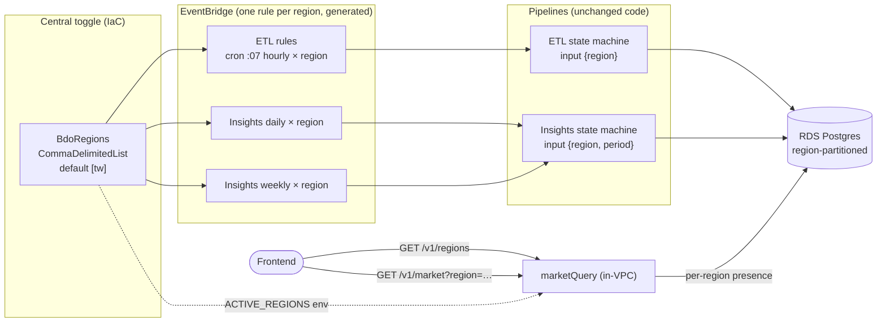

# Multi-region readiness — Design

> Design-first spec. This document drives the Requirements then Tasks phases.
> It proposes ADR-0036 (region-list central toggle) and ADR-0037
> (`/v1/regions` discovery endpoint) — referenced here, authored separately
> under `docs/adr/`.

## Overview

### Scope framing (what is already true)

Most of the data plane is **already region-ready**; this feature does not
rebuild it. Grounding facts, confirmed against the code:

- **Schema is region-partitioned.** `region` is the leading column of the
  composite primary keys of `item_sid`, `market_snapshot`, `market_daily`
  (`migrations/versions/0001_initial.py`) and `market_summary`
  (`0004_market_summary.py`). The read indexes are `(region, item_id, …)` /
  `(region, period, summary_date)`. No schema change is needed.
- **The read API is already region-aware.** `market_query/app.py` exposes a
  `region` query param on `/v1/market/items/{id}/snapshots`, `/daily`,
  `/analysis` and on `/v1/insights`, backed by a 13-value enum
  (`tw, na, eu, sea, mena, kr, ru, jp, th, sa, console_eu, console_na,
  console_asia`), default `tw`, `400` on an unknown value. It is already in the
  generated `infra/openapi.yaml`. Regions with no data return empty, not error.
- **The ETL is already region-parameterised in code.** `retrieve_items`,
  `fetch_data`, `clean_data`, `store_data`, `rollup_daily` all thread `region`
  from the execution input; `ArshaClient(region=…)` fetches per region.
- **Tracking is global by design** and stays that way. `Item.tracked` is one
  boolean; `bdo_common/dynamo.py` uses a single sparse `tracked-index` GSI
  (marker `t=1`); `retrieve_items` reads that one global set for whatever
  `region` the schedule passes.

The **only** single-region pin is the **trigger layer**: `infra/etl.yaml` and
`infra/insights.yaml` each define exactly one inline EventBridge schedule whose
input is `{"region": "${BdoRegion}"}`, bound to the single scalar CloudFormation
parameter `BdoRegion` (default `tw`, threaded from `template.yaml`). The README
already documents that another region "activates by adding one EventBridge rule
— no code or schema change"; today that rule is a manual edit. This feature
makes that activation **declarative and central**, and adds a truthful
**data-availability discovery** endpoint for the frontend.

### Goals

1. Replace the scalar `BdoRegion` trigger toggle with a **region list** that
   generates **one schedule per region across every pipeline** — hourly ETL
   (`etl.yaml`) and daily + weekly insights (`insights.yaml`) — with no manual
   per-region steps. Adding a region to the list and deploying activates all
   pipelines for it.
2. Add `GET /v1/regions` so the frontend can discover **active regions and
   per-region data presence** instead of guessing.
3. **Readiness-first:** the mechanism must be provable without turning on any
   new region (default stays `[tw]`), and within the **≤ ~US$15/month** cost
   cap. Activating a real second region is an explicit, gated final step.

### Non-goals

- No change to tracking (stays global), to `/v1/items` (stays region-agnostic —
  item identity is global), to the DynamoDB model, or to the RDS schema.
- Not required for "done": actually ingesting a second region's data.

---

## Architecture

### System context

Only the **trigger layer** changes shape; compute, data stores, and the read
API are unchanged. The central `BdoRegions` list fans EventBridge out to one
schedule per region per pipeline; each schedule starts an independent execution
carrying its own `region`.



### Data flow (unchanged pipelines, per region)

Each region gets an **independent** execution, so per-region behaviour already
works:

- **Rollup independence.** `retrieve_items` computes `is_day_first_run` from the
  execution's own `snapshot_at` hour, and `rollup_daily` is keyed by `region`
  (`DailyRepo.rollup_day(conn, region=…, trade_date=…)`). N regions ⇒ N
  independent day-first branches, each rolling up its own region. Confirmed — no
  change needed.
- **Retention independence.** `purge_old_snapshots` runs on its own daily
  schedule and deletes by age across all regions; it is region-agnostic and
  needs no per-region fan-out.

---

## Components and Interfaces

### Component changes

| Component | Change | Kind |
|-----------|--------|------|
| `template.yaml` | `BdoRegion` scalar → `BdoRegions` list (the one toggle); primary region derived as element 0 for the scalar consumers below | IaC |
| `infra/etl.yaml` | One hourly ETL schedule **per region** generated from the list (was one inline schedule) | IaC |
| `infra/insights.yaml` | One daily + one weekly schedule **per region** from the same list | IaC |
| `marketQuery` (`market_query/app.py`) | New `GET /v1/regions` route + response models; reads `ACTIVE_REGIONS` env | Code |
| `bdo_common` repositories | New `RegionRepo.region_availability(conn)` (read-only aggregate) | Code |
| `infra/openapi.yaml` | Regenerated to include `/v1/regions` (drift-checked in CI) | Generated |
| `api.yaml`, `cdn.yaml`, `icons.yaml` | Unchanged shape — keep receiving a **scalar** primary region (see below) | IaC |

#### Primary region vs. the region list

Several consumers legitimately need **one** region, not the list, and are out
of the trigger layer:

- `itemRegistry` `POST /v1/items` validates an id against a single
  `settings.region` (`BDO_REGION` env → `config.get_settings().region`).
- `iconSync` / `cdn` build the Pearl Abyss icon path from a single `BDO_REGION`.

To keep **one** central toggle, the **primary region is element 0 of
`BdoRegions`** (`Fn::Select [0, !Ref BdoRegions]`). With the default `[tw]` the
primary is `tw`, so the scalar `BDO_REGION` env and every existing consumer
behave exactly as today. Item identity is global, so validating a `POST` against
the primary region is sufficient (the item is then polled in every active
region by the global tracked set).

### Data-availability discovery: `GET /v1/regions`

**Endpoint choice — top-level `/v1/regions`, not `/v1/market/regions`.**
Region availability is a cross-cutting discovery resource, not a sub-resource of
a single item's market time series. `marketQuery` already owns top-level routes
beyond `/v1/market/*` (it serves `/v1/insights`), so hosting `/v1/regions` there
keeps the **single in-VPC RDS reader** as the owner and adds **no new VPC
Lambda**. `itemRegistry` runs outside the VPC and cannot read RDS, so it cannot
answer a data-presence question — `marketQuery` is the correct owner.

The endpoint answers the frontend's real question — *"what can I show for region
X?"* — by combining two truths:

- **Configured-active**: is the region in the deployed `BdoRegions` list
  (surfaced to the Lambda via the `ACTIVE_REGIONS` env var)?
- **Has data**: does RDS actually hold market/insights rows for it, and how
  fresh (latest snapshot / latest daily / has a summary)?

A region can be configured-active with no data yet (just activated), or have
historical data but be no longer configured-active. Reporting both is the
truthful answer; the existing region-aware endpoints already return empty for a
region with no data.

### IaC: region list → N schedules

#### Parameter shape

`template.yaml`:

```yaml
Parameters:
  BdoRegions:
    Type: CommaDelimitedList
    Default: tw            # readiness-first: nothing new turns on
    # Element 0 is the "primary" region for the scalar env-var consumers
    # (itemRegistry POST validation, icon path). Each entry must be one of the
    # marketQuery region enum values; validated in CI (see Testing).
```

`BdoRegion` (scalar) is removed as an input and **derived** where a single
region is still required:

```yaml
# passed to api.yaml / cdn.yaml / icons.yaml unchanged, as a scalar:
BdoRegion: !Select [0, !Ref BdoRegions]

# passed to etl.yaml / insights.yaml as the full list. Nested-stack list params
# cross the boundary as a comma-joined string:
BdoRegions: !Join [',', !Ref BdoRegions]   # child re-declares CommaDelimitedList
```

`samconfig.toml` keeps a one-line toggle, e.g.
`parameter_overrides = "Stage=dev BdoRegions=tw UseRdsProxy=false"`; a second
region is `BdoRegions=tw,na`.

#### Generating N schedules — mechanism choice

SAM/CloudFormation cannot loop a `AWS::Serverless::StateMachine` `Events` block
over a list. Options considered:

| Option | Verdict |
|--------|---------|
| Hand-write one schedule block per region | Rejected — not declarative from a list; defeats the "add a name, deploy" goal. |
| Custom CloudFormation macro (Lambda) | Rejected — heavyweight; a new deploy-time Lambda to own and secure for a simple fan-out. |
| **`Fn::ForEach` via the `AWS::LanguageExtensions` transform** | **Recommended** — native intrinsic looping over a list parameter, no extra runtime, pure IaC on `main`. |

**Recommendation: `Fn::ForEach`.** Add `AWS::LanguageExtensions` to the
template's `Transform` list (alongside `AWS::Serverless-2016-10-31`) and
generate one `AWS::Events::Rule` per region targeting the existing state
machine. Keeping the state machine a single resource and generating **rules**
(rather than looping SAM `Events`) isolates the change to the trigger layer.

`infra/etl.yaml` (sketch — hourly ETL, one rule per region):

```yaml
Transform:
  - AWS::LanguageExtensions
  - AWS::Serverless-2016-10-31

Parameters:
  BdoRegions:
    Type: CommaDelimitedList
    Default: tw

Resources:
  # State machine stays a single resource (its inline Events schedule is removed).
  'Fn::ForEach::EtlSchedules':
    - RegionName
    - !Ref BdoRegions
    - 'EtlSchedule${RegionName}':          # logical id per region
        Type: AWS::Events::Rule
        Properties:
          Name: !Sub 'bdo-${Stage}-etl-${RegionName}'
          # Same top-of-window minute for every region (see concurrency note).
          ScheduleExpression: 'cron(7 * * * ? *)'
          State: ENABLED
          Targets:
            - Id: !Sub 'etl-${RegionName}'
              Arn: !Ref EtlStateMachine
              RoleArn: !GetAtt EtlScheduleRole.Arn
              Input: !Sub '{"region": "${RegionName}"}'
```

`infra/insights.yaml` applies the same pattern twice — one `Fn::ForEach` for the
daily rule (`cron(0 1 * * ? *)`, input `{"region":"…","period":"daily"}`) and
one for the weekly rule (`cron(15 1 ? * MON *)`, `"period":"weekly"`). A single
shared EventBridge→StartExecution IAM role per stack (scoped to that stack's
state-machine ARN) backs all the generated rules.

> Note: the current SAM `Schedule` event auto-creates the rule + role; replacing
> it with explicit `AWS::Events::Rule` + role is deliberate so the set can be
> generated from the list. Behaviour (cron, input) is preserved per region.

#### Concurrency & cost of N parallel executions

- All N region rules for a pipeline fire on the **same** cron minute, so up to N
  executions start together. Step Functions Standard concurrency limits are far
  above any plausible N here; the Map state's `MaxConcurrency: 5` bounds Lambda
  fan-out **per execution**, so peak concurrent ETL Lambdas ≈ `N × 5` — for a
  handful of regions this is well under the account's default 1000 concurrency.
- **arsha contention:** firing every region at `:07` multiplies upstream load at
  one instant. The resilient fetch (below) already tolerates partial upstream
  failure. If contention becomes an issue, a per-region minute offset is the
  mitigation; `Fn::ForEach` does not expose a numeric index for a computed
  offset, so a staggered cron would need an explicit per-region minute map.
  Deferred — not needed at the target region count. Documented so it is a
  conscious choice, not an oversight.

### Endpoint contract: `GET /v1/regions`

Added to `market_query/app.py` (in-VPC, reads RDS via IAM auth; uses the
existing `_reading()` rollback context). No path/query params required; an
optional `region` filter narrows to one row. The response models
(`RegionAvailability`, `RegionsResponse`) and the read-only
`RegionRepo.region_availability` aggregate are defined under Data Models.

```jsonc
// GET /v1/regions
{
  "count": 2,
  "regions": [
    { "region": "tw", "active": true,  "item_count": 312,
      "latest_snapshot_at": "2025-01-01T12:00:00Z",
      "latest_daily_date": "2024-12-31", "has_insights": true },
    { "region": "na", "active": true,  "item_count": 0,
      "latest_snapshot_at": null, "latest_daily_date": null,
      "has_insights": false }          // configured-active, no data ingested yet
  ]
}
```

`active` is computed from the `ACTIVE_REGIONS` env var (comma-joined
`BdoRegions`, injected in `etl.yaml`/`api.yaml` Globals-style env for the
`marketQuery` function). The row set is the **union** of configured-active
regions and regions with any RDS data, so both "activated but empty" and "has
history but deactivated" are visible. An unknown `region` filter returns `400`,
matching the existing enum validation contract.

The handler merges `region_availability` with the `ACTIVE_REGIONS` set to
produce `RegionsResponse`. Because the tables are region-partitioned with
`(region, …)` leading indexes, the `GROUP BY region` aggregates are cheap.

### Files touched

```
template.yaml                         # BdoRegion scalar -> BdoRegions list; derive primary via Fn::Select
infra/etl.yaml                        # + AWS::LanguageExtensions; Fn::ForEach hourly rules; shared schedule role
infra/insights.yaml                   # + AWS::LanguageExtensions; Fn::ForEach daily+weekly rules; shared role
infra/api.yaml                        # marketQuery: + ACTIVE_REGIONS env var (still receives scalar BdoRegion=primary)
src/functions/market_query/app.py     # + get_regions route + RegionAvailability/RegionsResponse models
src/layer/python/bdo_common/repositories.py   # + RegionRepo.region_availability
infra/openapi.yaml                    # regenerated (scripts/export_openapi.py); CI drift check
docs/adr/0036-*.md, docs/adr/0037-*.md        # authored in a later phase (see ADRs)
```

No change to `dynamo.py`, the migrations, `item_registry/app.py`, or the ETL
function handlers.

### Cross-region item availability

The **global** tracked set is polled in **every** active region, but arsha /
the Imperva-protected upstream may not carry (or may block) some items in some
regions. This is already handled and needs **nothing new** in the data path:

- `fetch_data` uses `ArshaClient.fetch_raw_resilient` (adaptive bisect):
  individually blocked items are **dropped** and returned as `failed_ids`, the
  rest of the batch is stored. A dropped item simply has **no snapshot** for
  that hour in that region — exactly the "not available here" signal, and
  `/v1/regions` / the region-aware endpoints reflect it as absent data.
- The count of drops is emitted as the `MarketItemsSkipped` metric; sustained
  drops trip the existing skip alarm, and total upstream failure (nothing
  fetched) fails the stage loud via `ExecutionsFailed`.

**Optional observability enhancement (recommended, low-cost):** the
`MarketItemsSkipped` metric is not currently dimensioned by region. Adding a
`region` dimension would let per-region skip rates be distinguished on the
dashboard once multiple regions are active. Small, additive; can be scoped into
Tasks or deferred.

### Cost model (hard cap ≤ ~US$15/month)

The RDS instance is the fixed budget anchor and already runs regardless of
region count; **per-region incremental** cost is what matters. Estimates use
round assumptions (state as assumptions, not measured):

Assume a tracked set of ~300 items, ~3 sids average (~900 series/region), batch
size 50 ⇒ ~18 batches ⇒ ~ (1 + 18×3 + 1) ≈ **56 state transitions/ETL run**.

| Driver | Per added region / month | Basis |
|--------|--------------------------|-------|
| ETL Step Functions transitions | ~$1.0 | 720 runs × ~56 transitions ≈ 40k; Standard ~$0.025/1k after the 4k free tier |
| ETL Lambda compute + requests | < $0.30 | ~40k invocations, 256 MB, short duration; largely inside free tier |
| arsha calls | $0 (no AWS cost) | 24/day × ~18 batches ≈ 7.8k/mo; within client rate limits |
| RDS row growth (storage) | ~$0.03 | ~900 series × 24 × 90-day retention ≈ 1.9M rows ≈ ~0.2 GB at gp3 rates; **capped by the 90-day purge** |
| Insights Step Functions + Lambda | < $0.10 | (30 daily + ~4 weekly) runs × ~5 transitions |
| Insights Bedrock (Nova Lite) | < $0.15 | ~34 Converse calls; small digest prompt, deterministic figures never sent |
| **Per-region total** | **≈ $1–2 / month** | dominated by ETL Step Functions transitions |

**Headroom.** With the RDS instance and shared platform as the fixed base, each
added region is ≈ $1–2/month. Activating a **handful** of regions (e.g. 2–4)
stays comfortably inside the ≤ ~US$15/month cap; the 90-day retention bounds
RDS storage growth so it never compounds. The default `[tw]` adds **zero** new
cost. Actual numbers should be reconciled against Cost Explorer after a real
region is activated (see runbook deliverable).

### Runbook: activate one region + verify

A new procedure (added to `docs/runbook.md`, "Region activation" — this design
specifies it; authored during Tasks):

1. Add the region to the list and deploy: `make deploy STAGE=prod` with
   `BdoRegions=tw,na` (declarative — CloudFormation creates the per-region
   rules; no manual EventBridge edits).
2. Confirm the generated rules exist and are `ENABLED`
   (`bdo-<stage>-etl-na`, `bdo-<stage>-insights-daily-na`, `…-weekly-na`).
3. Wait for the next `:07` ETL window; confirm one execution ran for the region
   and check `MarketItemsSkipped` for that run.
4. Verify data landed: `GET /v1/regions` shows `na` with `active: true` and a
   non-null `latest_snapshot_at`; `GET /v1/market/items/{id}/snapshots?region=na`
   returns rows.
5. After ~24 h confirm the day-first `rollup_daily` produced `market_daily`
   rows; after the daily insights window confirm `has_insights: true`.
6. Reconcile incremental spend against the estimate in §5.

Rollback: remove the region from `BdoRegions` and redeploy — the per-region
rules are deleted; historical rows remain (still queryable, `active:false` in
`/v1/regions`) until the 90-day purge ages them out.

---

## Data Models

### Response models (`RegionAvailability` / `RegionsResponse`)

Response models (Powertools/pydantic, so they land in `infra/openapi.yaml`):

```python
class RegionAvailability(BaseModel):
    region: str                       # enum member
    active: bool                      # in the deployed BdoRegions list
    item_count: int                   # distinct item_ids with any snapshot
    latest_snapshot_at: datetime | None
    latest_daily_date: date | None
    has_insights: bool                # any market_summary row exists

class RegionsResponse(BaseModel):
    regions: list[RegionAvailability]  # union of configured + data-bearing
    count: int
```

### Repository aggregate (`RegionRepo.region_availability` / `RegionPresence`)

New read-only aggregate in `bdo_common.repositories` (co-located with
`SnapshotRepo`/`DailyRepo`), keeping SQL out of the handler:

```python
class RegionRepo:
    @staticmethod
    def region_availability(conn) -> dict[str, RegionPresence]:
        """Per-region presence across snapshot/daily/summary, keyed by region.

        One pass per table, merged in Python (regions are few):
          market_snapshot -> COUNT(DISTINCT item_id), MAX(snapshot_at)
          market_daily    -> MAX(trade_date)
          market_summary  -> bool(any row)
        Read-only; the caller's _reading() context rolls back.
        """
```

---

## Correctness properties

- **P1 (readiness / default-off):** deploying with the default `BdoRegions=tw`
  produces exactly the schedules that exist today (one hourly ETL, one daily +
  one weekly insights, all `region=tw`) and no others. ⇒ zero new cost.
- **P2 (fan-out):** for a list of N distinct regions, the template generates
  exactly N hourly ETL rules, N daily insights rules, and N weekly insights
  rules, each with `Input` region equal to its list entry.
- **P3 (activation is declarative):** adding a region to `BdoRegions` and
  deploying activates all three pipelines for it with no manual step; removing
  it deletes only that region's rules.
- **P4 (primary invariance):** with element 0 = `tw`, every scalar
  `BDO_REGION` consumer (itemRegistry POST validation, icon path) is byte-for-
  byte unchanged from the pre-feature behaviour.
- **P5 (discovery truthfulness):** `GET /v1/regions` reports `active=true` iff
  the region is in the deployed list, and non-null freshness fields iff RDS
  holds the corresponding rows; a region with data but not in the list still
  appears with `active=false`.
- **P6 (unknown region contract):** `GET /v1/regions?region=<not-in-enum>`
  returns `400`, consistent with the existing market endpoints.
- **P7 (rollup independence):** each region's ETL execution rolls up only its
  own region's previous UTC day.

## Error handling

- **Bad region in the list at deploy:** entries are validated against the
  enum in CI before deploy (see Testing); an unknown value fails the build
  rather than creating a rule that feeds an out-of-enum `region` downstream.
- **`/v1/regions` DB unavailable:** same failure mode as the other in-VPC read
  routes (surfaces as a 5xx counted by the API SLO alarm); no partial/stale
  cache is invented.
- **Per-region upstream blocks:** handled by the resilient fetch (§4); never
  fails a whole region's run for individually blocked items.

## Testing strategy

- **Unit:** `RegionRepo.region_availability` merge logic (data-bearing vs.
  configured-active union); `get_regions` handler mapping incl. the `400` path;
  `active` derivation from `ACTIVE_REGIONS`.
- **IaC:** `cfn-lint` over the `Fn::ForEach`-expanded templates; a test that
  the expansion yields N rules for a sample multi-region list and exactly the
  baseline set for `[tw]` (P1/P2). A CI check that every `BdoRegions` entry is a
  member of the marketQuery region enum.
- **Contract:** `scripts/export_openapi.py` regenerates `infra/openapi.yaml`
  with `/v1/regions`; the existing CI drift check guards it.
- **Property-based** (repo convention): P2 over random distinct-region lists —
  generated rule count and per-rule input region match the list exactly.

## ADRs (proposed — authored in a later phase)

Following the existing sequence (highest is `0035`):

- **ADR-0036 — Region-list central toggle.** Records replacing the scalar
  `BdoRegion` with a `BdoRegions` list and generating per-region schedules via
  `Fn::ForEach` (`AWS::LanguageExtensions`) across `etl.yaml` and
  `insights.yaml`; primary region = element 0 for scalar consumers; default
  `[tw]` (readiness-first). Alternatives (hand-written blocks, custom macro)
  and the same-minute concurrency trade-off captured.
- **ADR-0037 — `/v1/regions` data-availability discovery endpoint.** Records
  hosting region discovery on the in-VPC `marketQuery` (owner of the only RDS
  read path and of `/v1/insights`) as a top-level resource, reporting
  configured-active ∪ data-bearing regions with per-region freshness.
