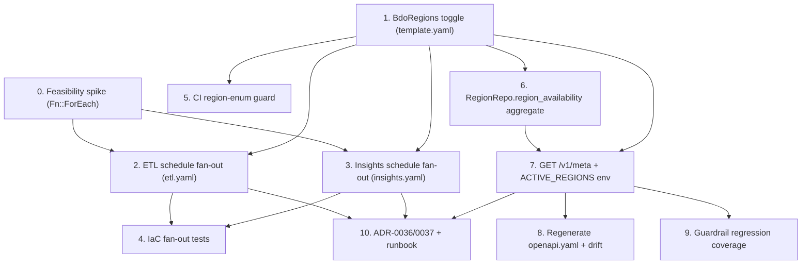

# Implementation Plan

## Overview

Convert the multi-region-readiness design into incremental coding/IaC/test
changes. Each task builds on the previous ones and ends by wiring the change
into the stack or test suite. Region activation itself is out of scope (readiness
only, per Req 6 / runbook). Tasks touch code, IaC templates, generated artifacts,
tests, ADRs, and docs only.

## Tasks

- [ ] 0. Feasibility spike — `Fn::ForEach` over a `CommaDelimitedList`
  - On a throwaway/spike branch, prototype and validate that `Fn::ForEach` via
    `AWS::LanguageExtensions`, layered over the existing
    `AWS::Serverless-2016-10-31` transform, iterating a `CommaDelimitedList`
    parameter inside a nested template, expands correctly AND is expanded by
    `cfn-lint` / `sam validate --lint` (so the Task 4.2 "expanded template"
    assertion is feasible) — using a `[tw,na]` sample.
  - DO NOT merge the spike; capture the outcome and the chosen transform
    ordering in ADR-0036.
  - _Requirements: 2.1, 2.2_

- [x] 1. Introduce the central `BdoRegions` toggle in `template.yaml`
  - Replace the scalar `BdoRegion` parameter with a `BdoRegions`
    `CommaDelimitedList` parameter (default `tw`) as the single active-region
    toggle.
  - Derive the primary region as element 0 via `!Select [0, !Ref BdoRegions]`
    and thread it, unchanged as a scalar, into the `api`, `cdn`, and `icons`
    nested stacks (so `itemRegistry` `POST /v1/items` validation and the
    icon-path builder keep receiving one scalar region).
  - Pass the region list to the `etl`, `insights`, and `api` nested stacks by
    `!Join [',', !Ref BdoRegions]`; each child re-declares a `BdoRegions`
    `CommaDelimitedList` parameter. `ApiStack` thus receives BOTH the scalar
    primary (for unchanged consumers) AND the joined active-region list (so
    `marketQuery` can source `ACTIVE_REGIONS` for `/v1/meta`).
  - Make `samconfig.toml` the single authoritative source of the toggle: carry
    the one-line `BdoRegions=tw` in both `dev` and `prod` param overrides
    (replacing `BdoRegion=tw`).
  - Update `.github/workflows/ci.yml` prod deploy to use `BdoRegions` sourced
    from `samconfig.toml` (single source of truth); remove the inline
    `BdoRegion` override.
  - Keep exactly one root `template.yaml`; introduce no deploy-time Lambda/macro.
  - _Requirements: 1.1, 1.2, 1.4, 1.5, 6.3_

- [x] 2. Fan out per-region ETL schedules in `infra/etl.yaml`
  - [x] 2.1 Add `AWS::LanguageExtensions` to the template `Transform` list and
    accept the `BdoRegions` `CommaDelimitedList` parameter.
    - Remove the inline scalar-bound `Schedule` event from the ETL state machine
      (and the SAM auto-created rule/role it implied), keeping the state machine
      a single resource.
    - _Requirements: 1.1, 2.1, 6.2_
  - [x] 2.2 Generate one hourly `AWS::Events::Rule` per region via `Fn::ForEach`
    over `BdoRegions`, preserving `cron(7 * * * ? *)` and targeting the ETL
    state machine with input `{"region": "<region>"}`.
    - Add a single shared EventBridge→StartExecution IAM role for the stack,
      scoped to that stack's state-machine ARN, backing all generated rules.
    - Rely on existing per-execution independence (each rule starts an
      independent execution carrying its own region).
    - _Requirements: 2.1, 2.3, 2.4, 2.5, 6.2_

- [x] 3. Fan out per-region insights schedules in `infra/insights.yaml`
  - Add `AWS::LanguageExtensions` to the `Transform` list and accept the
    `BdoRegions` `CommaDelimitedList` parameter; remove the inline scalar-bound
    daily and weekly schedules.
  - Generate one daily rule per region via `Fn::ForEach`
    (`cron(0 1 * * ? *)`, input `{"region": "<region>", "period": "daily"}`)
    and one weekly rule per region (`cron(15 1 ? * MON *)`, input
    `{"region": "<region>", "period": "weekly"}`).
  - Add a single shared EventBridge→StartExecution IAM role scoped to the
    insights state-machine ARN, backing all generated rules.
  - _Requirements: 2.2, 2.3, 2.4, 6.2_

- [x] 4. Add IaC tests for the schedule fan-out
  - [x] 4.1 Add `hypothesis` to the `dev` dependencies in `pyproject.toml` for
    the property-based test in 4.3.
    - _Requirements: 2.1, 2.2_
  - [x] 4.2 Add a `tests/unit` IaC test that lints the `Fn::ForEach`-expanded
    `etl.yaml` and `insights.yaml` (via `cfn-lint` / `sam validate --lint`) and
    asserts that the default `BdoRegions=[tw]` yields exactly the baseline set —
    one hourly ETL rule, one daily and one weekly insights rule, all
    `region=tw`, and no others (P1).
    - _Requirements: 1.3, 2.1, 2.2_
  - [x]* 4.3 Write a property-based test over random distinct-region lists that
    asserts the expansion generates exactly N hourly ETL rules, N daily and N
    weekly insights rules, each with `Input` region equal to its list entry (P2).
    - _Requirements: 2.1, 2.2, 2.3, 2.4_

- [x] 5. Add the CI region-enum validation guard
  - Add a small script (invoked from the single existing
    `.github/workflows/ci.yml`) that parses `BdoRegions` from the authoritative
    deploy source (`samconfig.toml`, per Task 1) and, before deploy, fails the
    build if any configured region is (i) not a member of the canonical
    `marketQuery` region enum (the `Region` Literal in `market_query/app.py`, the
    single source) or (ii) a duplicate entry.
  - _Requirements: 5.3_

- [x] 6. Add the `RegionRepo.region_availability` aggregate
  - [x] 6.1 Add a read-only `RegionRepo.region_availability(conn)` to
    `src/layer/python/bdo_common/repositories.py`, co-located with the existing
    repositories, using parameterized SQL only (no ORM).
    - One pass per table merged in Python:
      `market_snapshot` → `COUNT(DISTINCT item_id)` + `MAX(snapshot_at)`;
      `market_daily` → `MAX(trade_date)`; `market_summary` → any-row bool.
    - Keyed by region; rely on the caller's `_reading()` rollback context.
    - _Requirements: 3.1, 3.3_
  - [x] 6.2 Write unit tests for the merge/union logic against ephemeral Postgres
    (data-bearing vs. empty regions, freshness fields present iff rows exist).
    - _Requirements: 3.1, 3.3_

- [ ] 7. Add the `GET /v1/meta` service-metadata endpoint
  - [ ] 7.1 Add `RegionAvailability` and `MetaResponse` Pydantic v2 models and
    a `get_meta` route to `src/functions/market_query/app.py`, using the
    existing Powertools handler/`_reading()` context.
    - Return the envelope: `api_version` (the deployed release version from the
      single `API_VERSION` env var), `regions` (the union of configured-active regions from
      the `ACTIVE_REGIONS` env var and data-bearing regions, each with `active`,
      `item_count`, `latest_snapshot_at`, `latest_daily_date`, `has_insights`),
      and `periods`.
    - Set `active` true iff the region is in `ACTIVE_REGIONS`; set freshness
      fields non-null iff RDS holds the corresponding rows.
    - Take no query parameters; serve the response with a `Cache-Control`
      max-age aligned to the hourly ETL cadence (~1h). Keep the envelope
      additively extensible.
    - _Requirements: 3.1, 3.2, 3.3, 3.4_
  - [ ] 7.2 Wire the `ACTIVE_REGIONS` env var into the `marketQuery` function in
    `infra/api.yaml`, sourced from the comma-joined active-region list passed to
    `ApiStack` (the function still receives the scalar primary `BdoRegion`
    unchanged). Also inject the `API_VERSION` env var (from the release tag) as
    the single source for the `/v1/meta` `api_version` field.
    - _Requirements: 3.1, 3.2_
  - [ ] 7.3 Write handler unit tests for the envelope fields (`api_version`,
    `periods`), `active` derivation from `ACTIVE_REGIONS`, the union mapping
    (active-but-empty and data-but-deactivated rows), and the `Cache-Control`
    header.
    - _Requirements: 3.1, 3.2, 3.3, 3.4_
  - [ ]* 7.4 Write a property-based test asserting `/v1/meta` `regions`
    truthfulness: `active=true` iff the region is in the configured list and
    freshness non-null iff backing rows exist, over random active-set/data-set
    combinations (P5).
    - _Requirements: 3.1, 3.2, 3.3_

- [ ] 8. Regenerate `infra/openapi.yaml` and confirm drift coverage
  - Run `scripts/export_openapi.py` to regenerate `infra/openapi.yaml` including
    `/v1/meta`, and confirm the existing CI OpenAPI drift check
    (`git diff --exit-code infra/openapi.yaml`) covers the new route.
  - _Requirements: 3.5_

- [ ] 9. Add guardrail regression coverage
  - Add lightweight tests/assertions confirming the feature did not disturb the
    preserved guardrails: tracking stays global (single `tracked` boolean and one
    `tracked-index` GSI), `/v1/items` stays region-agnostic, and the DynamoDB
    model and RDS schema are unchanged (no new migration).
  - _Requirements: 4.1, 4.2, 4.3_

- [ ] 10. Author ADRs and the region-activation runbook
  - [ ] 10.1 Author `docs/adr/0036-region-list-central-toggle.md` (Nygard format)
    recording the `BdoRegion` scalar → `BdoRegions` list toggle, per-region
    schedule generation via `Fn::ForEach` (`AWS::LanguageExtensions`) across
    `etl.yaml`/`insights.yaml`, primary region = element 0, default `[tw]`, and
    the rejected alternatives (hand-written blocks, custom macro) plus the
    same-minute concurrency trade-off.
    - _Requirements: 5.1, 6.2, 6.3_
  - [ ] 10.2 Author `docs/adr/0037-v1-meta-service-endpoint.md` (Nygard
    format) recording the `/v1/meta` service-metadata endpoint on the in-VPC
    `marketQuery` — a single extensible envelope (`api_version`, `regions` with
    availability reporting configured-active ∪ data-bearing regions with
    per-region freshness, `periods`).
    - _Requirements: 3.1_
  - [ ] 10.3 Add a "Region activation" section to `docs/runbook.md`
    (add region → deploy → confirm rules enabled → verify ingestion via
    `/v1/meta` and the region-aware endpoints → reconcile spend → rollback),
    and record the per-region cost estimate against the ≤ ~US$15/month cap.
    - _Requirements: 5.1, 5.2, 6.1_

## Task Dependency Graph



```json
{
  "waves": [
    { "wave": 0, "tasks": [0], "rationale": "De-risk the Fn::ForEach + AWS::LanguageExtensions mechanism before building the fan-out." },
    { "wave": 1, "tasks": [1], "rationale": "Central BdoRegions toggle in template.yaml — root of the change." },
    { "wave": 2, "tasks": [2, 3, 5, 6], "rationale": "ETL and insights fan-out depend on the spike (0) and toggle (1); the CI region-enum guard and the RegionRepo aggregate depend only on task 1 — all proceed in parallel." },
    { "wave": 3, "tasks": [4, 7], "rationale": "Task 4 needs the fan-out (2,3); task 7 needs the aggregate (6) and the toggle (1)." },
    { "wave": 4, "tasks": [8, 9, 10], "rationale": "Task 8 (openapi drift) and task 9 (guardrail regression) need the endpoint (7); task 10 documents the shipped mechanism (2,3,7)." }
  ],
  "dependencies": {
    "0": [],
    "1": [],
    "2": [0, 1],
    "3": [0, 1],
    "4": [2, 3],
    "5": [1],
    "6": [1],
    "7": [1, 6],
    "8": [7],
    "9": [7],
    "10": [2, 3, 7]
  }
}
```

## Notes

- The only sub-tasks marked with `*` (optional) are the property-based tests
  (4.3, 7.4). Guardrail regression coverage (task 9) is required — it is the sole
  task verifying Req 4 (preserved guardrails). Core implementation and the
  baseline example/unit tests are not optional.
- Region activation and deployment are out of scope — this feature delivers
  multi-region *readiness* only (per Req 6 / runbook); actually enabling a new
  region is an operational step covered by the runbook, not a task here.
- Reuse the single existing CI workflow (`.github/workflows/ci.yml`) and the one
  root `template.yaml` with nested stacks. Introduce no new workflow and no
  deploy-time macro/Lambda; schedule fan-out uses `Fn::ForEach`
  (`AWS::LanguageExtensions`) at build time.
