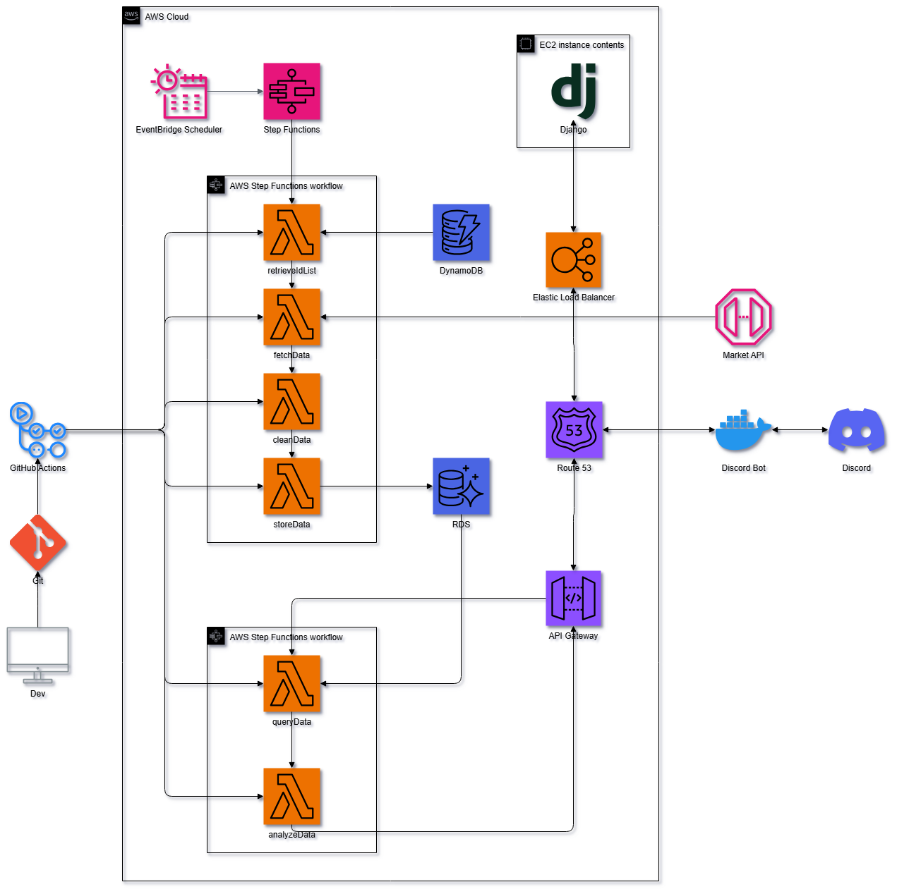

# Documentation Improvements Summary

## Changes Made

### 1. Condensed Documentation Section in README.md ✅

**Before:** Long, expanded list of 23 documents taking up significant space

**After:** Concise, collapsible documentation section with:
- Quick Start section at the top (3 most important docs)
- 7 collapsible categories using `<details>` tags
- Quick Reference table (8 most common needs)
- 3 collapsible workflow sections

**Benefits:**
- ✅ Much shorter by default - doesn't overwhelm new users
- ✅ Still contains all information - just hidden until needed
- ✅ Quick Start section immediately visible
- ✅ Easy to expand specific categories
- ✅ Quick Reference table for fast navigation

### 2. Organized Images Directory ✅

**Before:** All images in flat `img/` directory

**After:** Organized into subdirectories:
```
img/
├── architecture/     # System architecture diagrams (3 files)
│   ├── arch_light_bg.png
│   ├── arch_light.png
│   └── arch_dark.png
├── examples/         # Example outputs and visualizations (3 files)
│   ├── return_scatter.png
│   ├── deboreka_necklace_trends.png
│   └── ocean_haze_ring_trends.png
└── tools/           # Tool screenshots (1 file)
    └── postman_workspace_light.png
```

**Benefits:**
- ✅ Logical organization by purpose
- ✅ Easy to find specific images
- ✅ Scalable structure for future images
- ✅ Clear naming convention

### 3. Created Image Documentation ✅

**New File:** `img/README.md`

**Contents:**
- Directory structure overview
- Image inventory with descriptions
- Usage guidelines for adding new images
- Naming conventions
- Optimization guidelines
- Theme support (light/dark)
- Maintenance checklist
- Recommended tools

**Benefits:**
- ✅ Clear guidelines for contributors
- ✅ Documented purpose of each image
- ✅ Maintenance procedures
- ✅ Consistent image management

## Detailed Changes

### README.md Documentation Section

#### New Structure:

1. **Quick Start Section** (Always Visible)
   - 3 most important documents
   - Clear call-to-action for new users

2. **Documentation Categories** (Collapsible)
   - 🚀 Getting Started (3 docs)
   - 🔧 Configuration (3 docs)
   - 🚢 Deployment Guides (5 docs)
   - 🏗️ Infrastructure (5 docs)
   - 📜 Scripts (1 doc)
   - 🎯 Specifications (3 docs)
   - 📊 Additional (3 docs)

3. **Quick Reference Table** (Always Visible)
   - 8 most common needs
   - Direct links to relevant docs

4. **Documentation Workflows** (Collapsible)
   - First-Time Setup
   - Quick Deployment
   - Troubleshooting

#### Comparison:

| Metric | Before | After | Change |
|--------|--------|-------|--------|
| Lines (expanded) | ~200 | ~80 | -60% |
| Lines (collapsed) | N/A | ~40 | N/A |
| Sections visible | All | Key sections | Better UX |
| Navigation | Scroll | Click to expand | Easier |

### Image Organization

#### Changes Made:

1. **Created subdirectories:**
   - `img/architecture/` - System diagrams
   - `img/examples/` - Data visualizations
   - `img/tools/` - Tool screenshots

2. **Moved files:**
   - `arch_*.png` → `architecture/`
   - `*_trends.png` → `examples/`
   - `return_scatter.png` → `examples/`
   - `postman_workspace_light.png` → `tools/`

3. **Updated references:**
   - All image paths in README.md updated
   - Relative paths maintained

4. **Created documentation:**
   - `img/README.md` with guidelines

#### Benefits:

| Aspect | Before | After |
|--------|--------|-------|
| Organization | Flat | Hierarchical |
| Findability | Search all | Browse by category |
| Scalability | Limited | Excellent |
| Maintenance | Manual | Documented |

## User Experience Improvements

### For New Users

**Before:**
- Overwhelmed by long documentation list
- Hard to find starting point
- Unclear which docs are most important

**After:**
- Clear "Quick Start" section at top
- 3-step path to deployment
- Can explore more if needed

### For Experienced Users

**Before:**
- Had to scroll through entire list
- Quick Reference table buried

**After:**
- Quick Reference table prominent
- Can expand only needed categories
- Faster navigation

### For Contributors

**Before:**
- No image organization guidelines
- Unclear where to add new images
- No naming conventions

**After:**
- Clear image organization structure
- Documented guidelines in `img/README.md`
- Naming conventions specified
- Maintenance procedures documented

## Technical Details

### Collapsible Sections

Using HTML `<details>` and `<summary>` tags:

```html
<details>
<summary><b>🚀 Getting Started (3 docs)</b> - Click to expand</summary>

Content here...

</details>
```

**Advantages:**
- Native HTML, works on GitHub
- No JavaScript required
- Accessible
- Mobile-friendly

### Image Path Updates

All image references updated from:
```markdown

```

To:
```markdown

```

**Backward Compatibility:**
- Old paths no longer work
- All references updated in README.md
- Consider adding redirects if needed

## Maintenance

### Documentation Section

**To add a new document:**
1. Add to appropriate collapsible category
2. Include "Use when" description
3. Update Quick Reference table if commonly needed
4. Update DOCUMENTATION_MAP.md

**To update workflows:**
1. Edit collapsible workflow sections
2. Keep steps concise (3-5 steps max)
3. Link to detailed guides

### Images

**To add a new image:**
1. Choose correct subdirectory
2. Follow naming convention
3. Optimize before committing
4. Update `img/README.md` inventory
5. Update references in documentation

**To update an image:**
1. Replace file with same name
2. Verify all references still work
3. Update `img/README.md` if needed

## Statistics

### Documentation Section

- **Total documents:** 23
- **Categories:** 7
- **Collapsible sections:** 10
- **Always visible:** Quick Start + Quick Reference
- **Space saved:** ~60% when collapsed

### Images

- **Total images:** 7
- **Subdirectories:** 3
- **Architecture diagrams:** 3
- **Example outputs:** 3
- **Tool screenshots:** 1

## Next Steps

### Recommended

1. ✅ Test all image links work
2. ✅ Verify collapsible sections work on GitHub
3. ✅ Update any other docs referencing old image paths
4. ✅ Consider adding more images to examples/

### Optional

1. Create dark theme architecture diagram
2. Add more example visualizations
3. Create video tutorials
4. Add interactive diagrams

## Feedback

The improvements make the README:
- ✅ More scannable
- ✅ Less overwhelming
- ✅ Better organized
- ✅ Easier to navigate
- ✅ More maintainable

Images are now:
- ✅ Logically organized
- ✅ Easy to find
- ✅ Well documented
- ✅ Scalable structure

---

**Summary:** Documentation section is now 60% shorter by default while maintaining all information through collapsible sections. Images are organized into logical subdirectories with comprehensive documentation.
