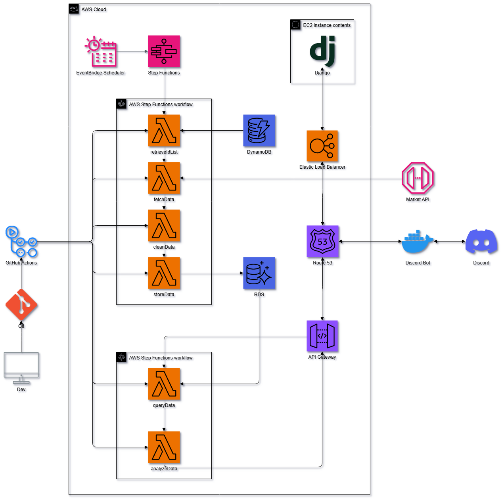
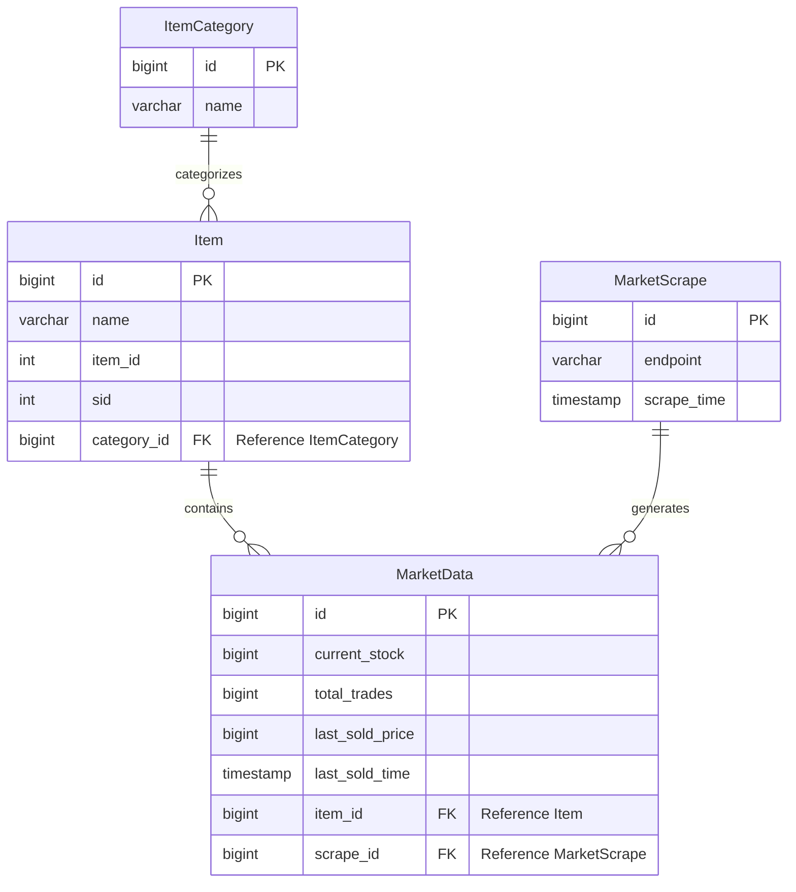
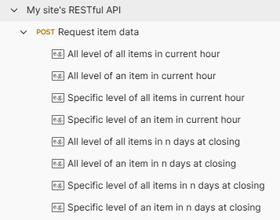
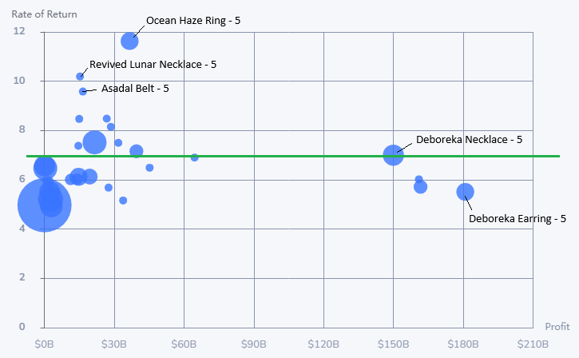
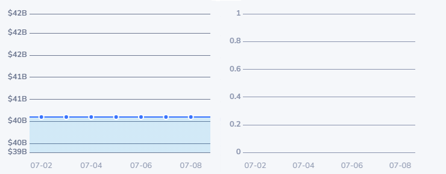
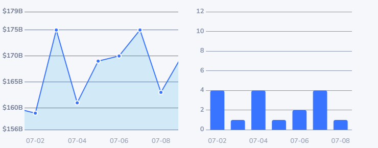

# BDO Market Insights

A serverless data pipeline designed for collecting, analyzing, and serving Black Desert Online Market data. This system integrated with [Discord Bot](https://github.com/RyanYCT/discord-bot) and [ryanyct.com](https://www.ryanyct.com/) to provide insight and report.

## Overview
In Black Desert Online, accessories are crucial equipment. The way to obtain it is to buy it in the market or enhance by yourself. Due to the large number of items, it is difficult to view and track the prices one by one.

The purpose of this application is to provide insights to aid in decision making.

The application is built using AWS Lambda and orchestrated via Step Functions. It replaces the original server based architecture with modular Lambda functions organized around ETL principles.

- **Scraper**: Gather market data from external API
- **Analyzer**: Generate item performance reports
- **Storage**: Persist processed data in a PostgreSQL database
- **Delivery**: Support bot integration and web content rendering

## Features
- **Data Collection**
    1. Retrieve target item ID list from DynamoDB
    2. Fetch item pricing and stock level from market API
    3. Track historical price and volume variation

- **Data Processing**
    1. Data cleaning and format standardize
    2. Calculate of profitability metric and trend

- **Reporting**
    1. Generate structured data for Discord bot response and web content rendering
    2. Identify top performing items, trends and sales anomaly

## Deployment

Deployment is automated via GitHub Actions.

On each push to the `main` branch:
- All Lambda packages are zipped and deployed using AWS CLI.
- The deployment flow is described in [`.github/workflows/deploy.yml`](.github/workflows/deploy.yml)

## Architecture

- **Step Functions** orchestrate the ETL sequence
- **Lambda** encapsulate functionality
- **RDS PostgreSQL** store processed data
- **DynamoDB** hold tracking metadata
- **Discord Bot** act as client, rendering report in community channel
- **Django** act as client, rendering report in dashboard, charts and tables



## Workflow

### Trigger by EventBridge Scheduler
| Step | Function       | Description                            |
|------|----------------|----------------------------------------|
| 1    | retrieveIdList | Load item ID list from DynamoDB        |
| 2    | fetchData      | Pull raw data from external API        |
| 3    | cleanData      | Filter and transform data              |
| 4    | storeData      | Write cleaned data into database       |

### Invoke by client via API Gateway
| Step | Function       | Description                            |
|------|----------------|----------------------------------------|
| 1    | queryData      | Retrieve relevant record from database |
| 2    | analyzeData    | Compute metrics                        |

## Data Model



## API
The delivery feature is integrated with API Gateway.

When API Gateway receive a request, it triggers the Step Function to process the request and return.

It could be test in [Postman](https://www.postman.com/ryanyip-2272909/my-site/collection/z9iztub/my-site-s-restful-api), and there are more examples under POST request.



### POST request body
```json
// Lambda Function: queryData POST request body
{
    "itemCategory": "Accessory",
    "itemID": <int>,
    "itemSID": <int:[0-5]>,
    "intervalDay": <int>
}
```

### Options
1. `itemCategory` (string) (Required)
    > Filter for subset of all items.

2. `itemID` (integer)
    > Filter for specific item

3. `itemSID` (integer) [0-5]
    > Filter for specific level of item

    > If provided, profit stats would not be calculated, as that need to compare with its previous level

4. `intervalDay` (integer)
    > If provided, query for closing data of n-1 days + current data

    > If not provided, query for current data

## Use Case Example
Some use cases are described below.
### 1. Find the best profitable item
- **Request**: price, profit, rate of return, and in stock data for all accessories in current market.
```json
// Lambda Function: queryData POST request body
{
    "itemCategory": "Accessory"
}
```

**Response in Table**
| Name                     | Item ID | Level | Price         | Profit        | Rate of Return | In Stock |
|--------------------------|---------|-------|---------------|---------------|----------------|----------|
| Ocean Haze Ring          | 12091   | 5     | $40100000000  | $36652800000  | 11.63          | 5        |
| Revived Lunar Necklace   | 11663   | 5     | $17000000000  | $15332300000  | 10.19          | 1        |
| Asadal Belt              | 12285   | 5     | $18500000000  | $16568600000  | 9.58           | 1        |
| ...                      | ...     | ...   | ...           | ...           | ...            | ...      |
| Deboreka Necklace        | 11653   | 5     | $175000000000 | $149983000000 | 7.00           | 7        |
| ...                      | ...     | ...   | ...           | ...           | ...            | ...      |
| Deboreka Earring         | 11882   | 5     | $221000000000 | $180870000000 | 5.51           | 5        |
| ...                      | ...     | ...   | ...           | ...           | ...            | ...      |

(Formatted and order by rate of return in descending order, p.s. rate of return = n times of cost)

The return of these end game items seem very attractive.

**Visualize**



(Green line at rate 7 is the balance point of level 5 item, p.s. success rate from level 4 to level 5 is around 15%)

1. Deboreka Earring - level 5
    - highest profit amount
    - rate of return lower than balance point
    - NOT recommend

2. Deboreka Necklace - level 5
    - high profit amount
    - rate of return is at balance point
    - good choice

3. Ocean Haze Ring - level 5
    - highest rate of return
    - low amount of profit

4. Revived Lunar Necklace - level 5
    - high rate of return
    - low amount of profit

Be wary of the volume of transactions on such high return items, as they may be slow moving goods.

---

### 2. Find the on demand item
- **Request**: trading volume and in stock data for specific item in a period of time.

In this case, Ocean Haze Ring vs Deboreka Necklace.
```json
// Lambda Function: queryData POST request body
{
    "itemCategory": "Accessory",
    "itemID": 11653,
    "itemSID": 5,
    "intervalDay": 7
}
```
```json
// Lambda Function: queryData POST request body
{
    "itemCategory": "Accessory",
    "itemID": 12091,
    "itemSID": 5,
    "intervalDay": 7
}
```

**Trends of Ocean Haze Ring**
| Record           | price       | stock | volume |
|------------------|-------------|-------|--------|
| 2025-07-02T23:00 | 40100000000 | 5     | 0      |
| 2025-07-03T23:00 | 40100000000 | 5     | 0      |
| 2025-07-04T23:00 | 40100000000 | 5     | 0      |
| 2025-07-05T23:00 | 40100000000 | 5     | 0      |
| 2025-07-06T23:00 | 40100000000 | 5     | 0      |
| 2025-07-07T23:00 | 40100000000 | 5     | 0      |
| 2025-07-08T23:00 | 40100000000 | 5     | 0      |

**Visualize Price & Volume Trends**



**Trends of Deboreka Necklace**
| Record           | price        | stock | volume |
|------------------|--------------|-------|--------|
| 2025-07-02T23:00 | 159000000000 | 4     | 4      |
| 2025-07-03T23:00 | 175000000000 | 3     | 1      |
| 2025-07-04T23:00 | 161000000000 | 4     | 4      |
| 2025-07-05T23:00 | 169000000000 | 7     | 1      |
| 2025-07-06T23:00 | 170000000000 | 6     | 2      |
| 2025-07-07T23:00 | 175000000000 | 6     | 4      |
| 2025-07-08T23:00 | 163000000000 | 8     | 1      |

**Visualize Price & Volume Trends**



**Conclusion**

Although Ocean Haze Ring has the highest rate of return, its trading volume over 7 days remain 0. This indicate that is no demand in the market.

On the other hand, Deboreka Necklace volume data suggests that the item is more liquid and in higher demand making it a better choice even if the rate of return is lower than Ocean Haze Ring.

## Acknowledgements
Special thanks to:
- BDO API - [veliainn](https://developers.veliainn.com/)
- BDO Market API - [api.arsha.io](https://github.com/guy0090/api.arsha.io)
