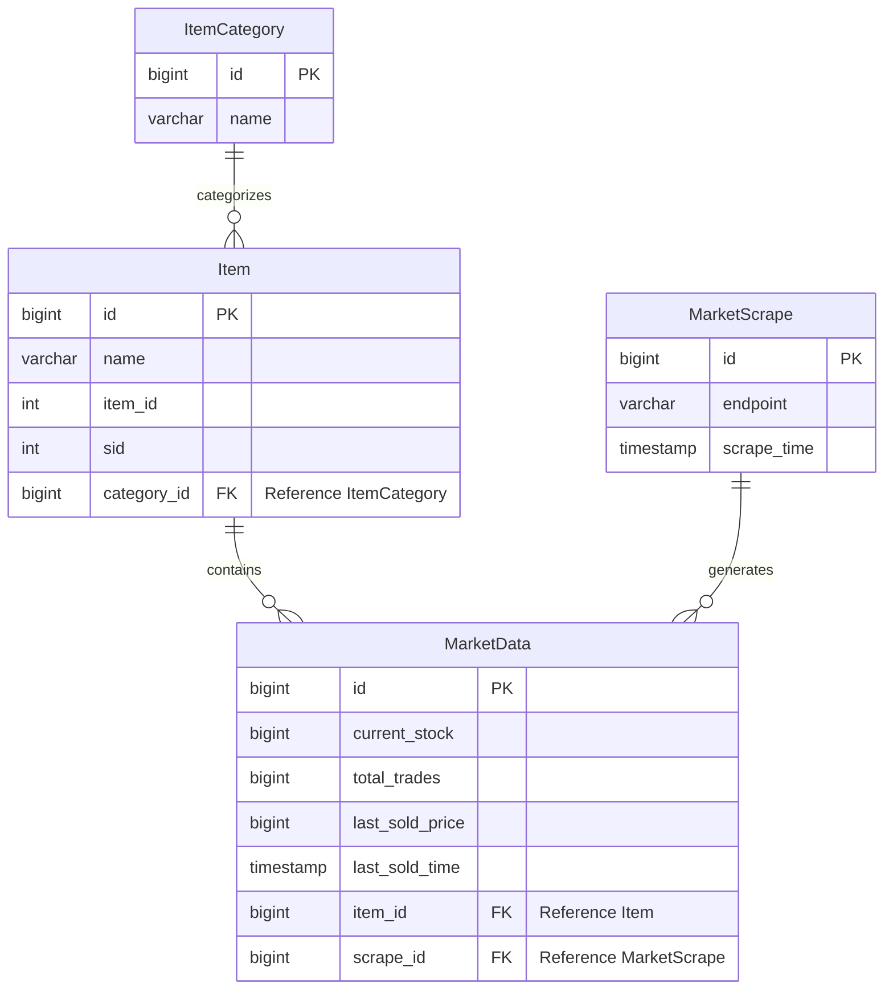
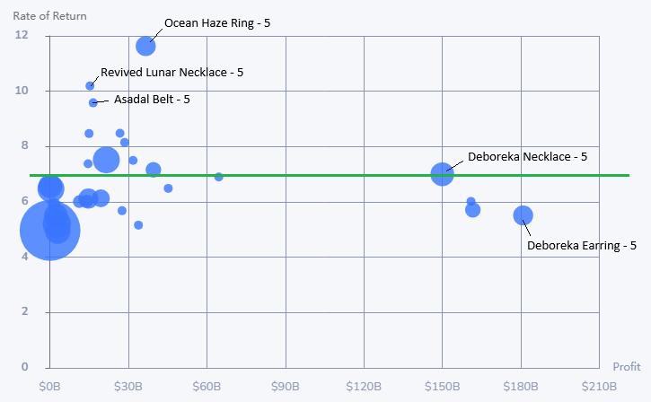
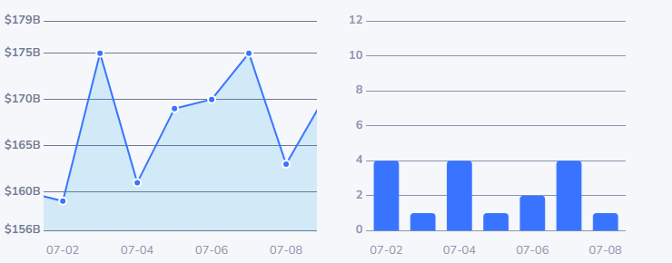

# BDO Market Insights

A serverless data pipeline designed for collecting, analyzing, and serving Black Desert Online Market data. This system integrated with [Discord Bot](https://github.com/RyanYCT/discord-bot) and [ryanyct.com](https://www.ryanyct.com/) to provide insight and report.

## Overview
In Black Desert Online, accessories are crucial equipment. The way to obtain it is to buy it in the market or enhance by yourself. Due to the large number of items, it is difficult to view and track the prices one by one.

The purpose of this application is to provide insights to aid in decision making.

The application is built using AWS Lambda and orchestrated via Step Functions. It replaces the original server based architecture with modular Lambda functions organized around ETL principles.

- **Scraper**: Gather market data from external API
- **Analyzer**: Generate item performance reports
- **Storage**: Persist processed data in a PostgreSQL database
- **Delivery**: Support bot integration and web content rendering

## Features
- **Data Collection**
    1. Retrieve target item ID list from DynamoDB
    2. Fetch item pricing and stock level from market API
    3. Track historical price and volume variation

- **Data Processing**
    1. Data cleaning and format standardize
    2. Calculate of profitability metric and trend

- **Reporting**
    1. Generate structured data for Discord bot response and web content rendering
    2. Identify top performing items, trends and sales anomaly

## Documentation

This project includes comprehensive documentation organized by purpose and workflow. Follow the guides in order for the best experience.

> 📊 **Visual Guide:** See [DOCUMENTATION_MAP.md](DOCUMENTATION_MAP.md) for a visual overview of all documentation with workflows and learning paths.

### 📚 Documentation Index

#### 🚀 Getting Started (Start Here!)

1. **[QUICK_START.md](QUICK_START.md)** - Quick reference for deploying to staging
   - 3-step deployment process
   - Essential commands
   - Troubleshooting tips
   - **Use when:** You want to deploy quickly

2. **[CREDENTIALS_SETUP_GUIDE.md](CREDENTIALS_SETUP_GUIDE.md)** - Complete guide for AWS credentials setup
   - AWS CLI profile configuration
   - AWS SSO setup
   - Security best practices
   - Troubleshooting credentials
   - **Use when:** Setting up AWS credentials for the first time

3. **[DEPLOYMENT_SECURITY_SUMMARY.md](DEPLOYMENT_SECURITY_SUMMARY.md)** - Security overview
   - Configuration management system
   - What's protected vs. what's public
   - Security checklist
   - **Use when:** Understanding security approach

#### 🔧 Configuration

4. **[config/README.md](config/README.md)** - Configuration management guide
   - Configuration file structure
   - Environment-specific configs
   - Using configuration in scripts
   - **Use when:** Managing deployment configuration

5. **[.env.example](.env.example)** - Environment variables template
   - Template for environment variables
   - Copy to `.env` and customize
   - **Use when:** Setting up environment variables

6. **[config/deployment-config.example.sh](config/deployment-config.example.sh)** - Deployment configuration template
   - Complete configuration template
   - Copy to `config/deployment-config.sh` and customize
   - **Use when:** Creating deployment configuration

#### 🚢 Deployment Guides

7. **[infrastructure/STAGING_DEPLOYMENT_GUIDE.md](infrastructure/STAGING_DEPLOYMENT_GUIDE.md)** - Comprehensive deployment guide
   - Step-by-step deployment instructions
   - Prerequisites and setup
   - Verification procedures
   - Testing instructions
   - Monitoring setup
   - Troubleshooting
   - **Use when:** Deploying manually or need detailed instructions

8. **[infrastructure/STAGING_DEPLOYMENT_CHECKLIST.md](infrastructure/STAGING_DEPLOYMENT_CHECKLIST.md)** - Deployment validation checklist
   - Pre-deployment checklist
   - Deployment steps checklist
   - Post-deployment validation
   - Functional testing
   - Security validation
   - **Use when:** Ensuring all deployment steps are completed

9. **[infrastructure/STAGING_DEPLOYMENT_README.md](infrastructure/STAGING_DEPLOYMENT_README.md)** - Deployment overview
   - Quick start guide
   - Component details
   - Verification commands
   - Common issues
   - **Use when:** Quick reference for deployment

10. **[STAGING_DEPLOYMENT_SUMMARY.md](STAGING_DEPLOYMENT_SUMMARY.md)** - Deployment summary
    - What was created
    - Deployment components
    - How to deploy
    - Next steps
    - **Use when:** Understanding what gets deployed

11. **[DEPLOYMENT.md](DEPLOYMENT.md)** - General deployment documentation
    - Automated deployment (CI/CD)
    - Manual deployment
    - Blue-green deployment
    - Rollback procedures
    - **Use when:** Understanding deployment strategies

#### 🏗️ Infrastructure

12. **[infrastructure/README.md](infrastructure/README.md)** - Infrastructure overview
    - API Gateway configuration
    - Rate limiting
    - CORS configuration
    - Monitoring
    - **Use when:** Understanding API Gateway setup

13. **[infrastructure/STEP_FUNCTIONS_README.md](infrastructure/STEP_FUNCTIONS_README.md)** - Step Functions documentation
    - State machine configuration
    - Query pipeline orchestration
    - Error handling
    - **Use when:** Understanding Step Functions workflow

14. **[infrastructure/CLOUDWATCH_ALARMS_README.md](infrastructure/CLOUDWATCH_ALARMS_README.md)** - CloudWatch alarms guide
    - Alarm configuration
    - Monitoring metrics
    - Alert notifications
    - **Use when:** Setting up monitoring and alerts

15. **[infrastructure/API_DOCUMENTATION_README.md](infrastructure/API_DOCUMENTATION_README.md)** - API documentation guide
    - OpenAPI specification
    - Swagger UI setup
    - API endpoints
    - **Use when:** Setting up API documentation

16. **[infrastructure/RETENTION_SCHEDULE_README.md](infrastructure/RETENTION_SCHEDULE_README.md)** - Data retention guide
    - Retention policies
    - Archival process
    - Configuration
    - **Use when:** Setting up data retention

#### 📜 Scripts

17. **[scripts/README.md](scripts/README.md)** - Deployment scripts documentation
    - Script overview
    - Usage instructions
    - Common workflows
    - **Use when:** Understanding deployment scripts

#### 🎯 Specification Documents

18. **[.kiro/specs/bdo-market-insights-rewrite/requirements.md](.kiro/specs/bdo-market-insights-rewrite/requirements.md)** - Requirements specification
    - Functional requirements
    - Acceptance criteria
    - System constraints
    - **Use when:** Understanding system requirements

19. **[.kiro/specs/bdo-market-insights-rewrite/design.md](.kiro/specs/bdo-market-insights-rewrite/design.md)** - Design specification
    - Architecture design
    - Component interfaces
    - Data models
    - Correctness properties
    - **Use when:** Understanding system design

20. **[.kiro/specs/bdo-market-insights-rewrite/tasks.md](.kiro/specs/bdo-market-insights-rewrite/tasks.md)** - Implementation tasks
    - Task breakdown
    - Implementation phases
    - Progress tracking
    - **Use when:** Tracking implementation progress

#### 📊 Additional Documentation

21. **[CHANGELOG.md](CHANGELOG.md)** - Version history and changes
    - Release notes
    - Breaking changes
    - Bug fixes
    - **Use when:** Checking version history

22. **[lambda_layer/README.md](lambda_layer/README.md)** - Lambda Layer documentation
    - Layer structure
    - Dependencies
    - Usage
    - **Use when:** Understanding shared code

23. **[lambda_layer/XRAY_CONFIGURATION.md](lambda_layer/XRAY_CONFIGURATION.md)** - X-Ray tracing setup
    - X-Ray configuration
    - Tracing setup
    - Debugging
    - **Use when:** Setting up distributed tracing

### 📖 Documentation Workflow

#### For First-Time Setup:
1. Start with **QUICK_START.md**
2. Follow **CREDENTIALS_SETUP_GUIDE.md** to configure AWS
3. Review **DEPLOYMENT_SECURITY_SUMMARY.md** for security understanding
4. Use **STAGING_DEPLOYMENT_GUIDE.md** for detailed deployment steps
5. Validate with **STAGING_DEPLOYMENT_CHECKLIST.md**

#### For Deployment:
1. **QUICK_START.md** - Quick reference
2. **scripts/deploy-staging.sh** - Run deployment
3. **STAGING_DEPLOYMENT_CHECKLIST.md** - Validate deployment

#### For Troubleshooting:
1. **STAGING_DEPLOYMENT_GUIDE.md** - Troubleshooting section
2. **CREDENTIALS_SETUP_GUIDE.md** - Credentials issues
3. **infrastructure/README.md** - Infrastructure issues
4. **scripts/README.md** - Script issues

#### For Understanding Architecture:
1. **design.md** - System design
2. **requirements.md** - System requirements
3. **infrastructure/README.md** - Infrastructure overview
4. **STEP_FUNCTIONS_README.md** - Workflow orchestration

### 🔍 Quick Reference

| Need to... | Read this |
|------------|-----------|
| Deploy quickly | [QUICK_START.md](QUICK_START.md) |
| Setup AWS credentials | [CREDENTIALS_SETUP_GUIDE.md](CREDENTIALS_SETUP_GUIDE.md) |
| Deploy step-by-step | [STAGING_DEPLOYMENT_GUIDE.md](infrastructure/STAGING_DEPLOYMENT_GUIDE.md) |
| Validate deployment | [STAGING_DEPLOYMENT_CHECKLIST.md](infrastructure/STAGING_DEPLOYMENT_CHECKLIST.md) |
| Understand security | [DEPLOYMENT_SECURITY_SUMMARY.md](DEPLOYMENT_SECURITY_SUMMARY.md) |
| Configure settings | [config/README.md](config/README.md) |
| Troubleshoot issues | [STAGING_DEPLOYMENT_GUIDE.md](infrastructure/STAGING_DEPLOYMENT_GUIDE.md#troubleshooting) |
| Understand architecture | [design.md](.kiro/specs/bdo-market-insights-rewrite/design.md) |
| Check requirements | [requirements.md](.kiro/specs/bdo-market-insights-rewrite/requirements.md) |
| Track tasks | [tasks.md](.kiro/specs/bdo-market-insights-rewrite/tasks.md) |
| Use deployment scripts | [scripts/README.md](scripts/README.md) |
| Setup monitoring | [CLOUDWATCH_ALARMS_README.md](infrastructure/CLOUDWATCH_ALARMS_README.md) |
| Configure API Gateway | [infrastructure/README.md](infrastructure/README.md) |
| Setup data retention | [RETENTION_SCHEDULE_README.md](infrastructure/RETENTION_SCHEDULE_README.md) |

## Deployment

Deployment is automated via GitHub Actions.

On each push to the `main` branch:
- All Lambda packages are zipped and deployed using AWS CLI.
- The deployment flow is described in [`.github/workflows/deploy.yml`](.github/workflows/deploy.yml)

For manual deployment to staging, see the [Documentation](#documentation) section above, starting with [QUICK_START.md](QUICK_START.md)

## Architecture

- **Step Functions** orchestrate the ETL sequence
- **Lambda** encapsulate functionality
- **RDS PostgreSQL** store processed data
- **DynamoDB** hold tracking metadata
- **Discord Bot** act as client, rendering report in community channel
- **Django** act as client, rendering report in dashboard, charts and tables


## Workflow

### Trigger by EventBridge Scheduler
| Step | Function       | Description                            |
|------|----------------|----------------------------------------|
| 1    | retrieveIdList | Load item ID list from DynamoDB        |
| 2    | fetchData      | Pull raw data from external API        |
| 3    | cleanData      | Filter and transform data              |
| 4    | storeData      | Write cleaned data into database       |

### Invoke by client via API Gateway
| Step | Function       | Description                            |
|------|----------------|----------------------------------------|
| 1    | queryData      | Retrieve relevant record from database |
| 2    | analyzeData    | Compute metrics                        |

## Data Model


```mermaid
erDiagram
    ItemCategory ||--o{ Item : categorizes
    Item ||--o{ MarketData : contains
    MarketScrape ||--o{ MarketData : generates

    ItemCategory {
        bigint id PK
        varchar name
    }

    Item {
        bigint id PK
        varchar name
        int item_id
        int sid
        bigint category_id FK "Reference ItemCategory"
    }

    MarketData {
        bigint id PK
        bigint current_stock
        bigint total_trades
        bigint last_sold_price
        timestamp last_sold_time
        bigint item_id FK "Reference Item"
        bigint scrape_id FK "Reference MarketScrape"
    }

    MarketScrape {
        bigint id PK
        varchar endpoint
        timestamp scrape_time
    }
```

## API
The delivery feature is integrated with API Gateway.

When API Gateway receive a request, it triggers the Step Function to process the request and return.

It could be test in [Postman](https://www.postman.com/ryanyip-2272909/my-site/collection/z9iztub/my-site-s-restful-api), and there are more examples under POST request.


### POST request body
```json
// Lambda Function: queryData POST request body
{
    "itemCategory": "Accessory",
    "itemID": <int>,
    "itemSID": <int:[0-5]>,
    "intervalDay": <int>
}
```

### Options
1. `itemCategory` (string) (Required)
    > Filter for subset of all items.

2. `itemID` (integer)
    > Filter for specific item

3. `itemSID` (integer) [0-5]
    > Filter for specific level of item

    > If provided, profit stats would not be calculated, as that need to compare with its previous level

4. `intervalDay` (integer)
    > If provided, query for closing data of n-1 days + current data

    > If not provided, query for current data

## Use Case Example
Some use cases are described below.
### 1. Find the best profitable item
- **Request**: price, profit, rate of return, and in stock data for all accessories in current market.
```json
// Lambda Function: queryData POST request body
{
    "itemCategory": "Accessory"
}
```

**Response in Table**
| Name                     | Item ID | Level | Price         | Profit        | Rate of Return | In Stock |
|--------------------------|---------|-------|---------------|---------------|----------------|----------|
| Ocean Haze Ring          | 12091   | 5     | $40100000000  | $36652800000  | 11.63          | 5        |
| Revived Lunar Necklace   | 11663   | 5     | $17000000000  | $15332300000  | 10.19          | 1        |
| Asadal Belt              | 12285   | 5     | $18500000000  | $16568600000  | 9.58           | 1        |
| ...                      | ...     | ...   | ...           | ...           | ...            | ...      |
| Deboreka Necklace        | 11653   | 5     | $175000000000 | $149983000000 | 7.00           | 7        |
| ...                      | ...     | ...   | ...           | ...           | ...            | ...      |
| Deboreka Earring         | 11882   | 5     | $221000000000 | $180870000000 | 5.51           | 5        |
| ...                      | ...     | ...   | ...           | ...           | ...            | ...      |

(Formatted and order by rate of return in descending order, p.s. rate of return = n times of cost)

The return of these end game items seem very attractive.

**Visualize**



(Green line at rate 7 is the balance point of level 5 item, p.s. success rate from level 4 to level 5 is around 15%)

1. Deboreka Earring - level 5
    - highest profit amount
    - rate of return lower than balance point
    - NOT recommend

2. Deboreka Necklace - level 5
    - high profit amount
    - rate of return is at balance point
    - good choice

3. Ocean Haze Ring - level 5
    - highest rate of return
    - low amount of profit

4. Revived Lunar Necklace - level 5
    - high rate of return
    - low amount of profit

Be wary of the volume of transactions on such high return items, as they may be slow moving goods.

---

### 2. Find the on demand item
- **Request**: trading volume and in stock data for specific item in a period of time.

In this case, Ocean Haze Ring vs Deboreka Necklace.
```json
// Lambda Function: queryData POST request body
{
    "itemCategory": "Accessory",
    "itemID": 11653,
    "itemSID": 5,
    "intervalDay": 7
}
```
```json
// Lambda Function: queryData POST request body
{
    "itemCategory": "Accessory",
    "itemID": 12091,
    "itemSID": 5,
    "intervalDay": 7
}
```

**Trends of Ocean Haze Ring**
| Record           | price       | stock | volume |
|------------------|-------------|-------|--------|
| 2025-07-02T23:00 | 40100000000 | 5     | 0      |
| 2025-07-03T23:00 | 40100000000 | 5     | 0      |
| 2025-07-04T23:00 | 40100000000 | 5     | 0      |
| 2025-07-05T23:00 | 40100000000 | 5     | 0      |
| 2025-07-06T23:00 | 40100000000 | 5     | 0      |
| 2025-07-07T23:00 | 40100000000 | 5     | 0      |
| 2025-07-08T23:00 | 40100000000 | 5     | 0      |

**Visualize Price & Volume Trends**


**Trends of Deboreka Necklace**
| Record           | price        | stock | volume |
|------------------|--------------|-------|--------|
| 2025-07-02T23:00 | 159000000000 | 4     | 4      |
| 2025-07-03T23:00 | 175000000000 | 3     | 1      |
| 2025-07-04T23:00 | 161000000000 | 4     | 4      |
| 2025-07-05T23:00 | 169000000000 | 7     | 1      |
| 2025-07-06T23:00 | 170000000000 | 6     | 2      |
| 2025-07-07T23:00 | 175000000000 | 6     | 4      |
| 2025-07-08T23:00 | 163000000000 | 8     | 1      |

**Visualize Price & Volume Trends**



**Conclusion**

Although Ocean Haze Ring has the highest rate of return, its trading volume over 7 days remain 0. This indicate that is no demand in the market.

On the other hand, Deboreka Necklace volume data suggests that the item is more liquid and in higher demand making it a better choice even if the rate of return is lower than Ocean Haze Ring.

## Acknowledgements
Special thanks to:
- BDO API - [veliainn](https://developers.veliainn.com/)
- BDO Market API - [api.arsha.io](https://github.com/guy0090/api.arsha.io)
