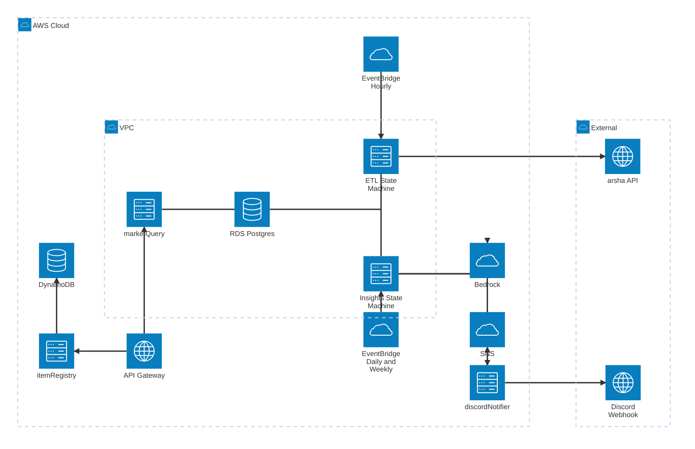

# BDO Market Insights

A **serverless, event-driven market-data platform** for the *Black Desert Online* in-game economy, built on AWS. It ingests hourly price/stock data, stores it as a time series, and exposes it through a REST API with domain-specific analytics — expected item-enhancement cost, price volatility, liquidity, and anomaly detection.

The project is a study in building a **production-grade serverless data pipeline cheaply and safely**: IAM-authenticated database access (no passwords), a no-NAT VPC, single shared Lambda layer, infrastructure-as-code with nested stacks, and a full CI quality gate — all targeted at **under ~US$15/month** of incremental cost.

> **Status:** Live in prod (v3.2.0). 15 Lambdas, two Step Functions pipelines (hourly ETL + daily/weekly market-insights), and a REST API — deployable to `dev`/`prod` via AWS SAM.

---

## Why this project

The data answers real trading questions for players:

- **Buy-vs-enhance** — is it cheaper to buy the PEN item, or enhance one yourself? `analysis` compares market price against expected enhancement cost.
- **Item sniping** — surface mispriced or anomalous listings via the `is_anomalous` flag (z-score) and volatility. (It flags opportunities — it doesn't push real-time alerts.)
- **Timing trades** — read price volatility (σ, CV) and liquidity to decide when to buy or sell.
- **What moved this week** — daily/weekly market-wide digests of the top movers per category.

Underneath, the game economy is a stand-in for any volatile financial/IoT time-series problem, and the engineering is shaped by four constraints:

- **Time-series ingestion** from a third-party API with five polymorphic response shapes normalized into one schema.
- **Cost discipline** — serverless that avoids the usual traps (NAT gateways, idle compute, RDS Proxy unless needed).
- **Security by default** — Lambdas reach Postgres via **IAM database authentication**; no database passwords anywhere.
- **Domain analytics** — turning raw prices into decisions via a probabilistic Markov model over enhancement tiers.

## What it does

| Capability | Detail |
|---|---|
| **Hourly ETL** | EventBridge → Step Functions fans out fetch → clean → store across tracked items; idempotent writes to Postgres. |
| **Time-series storage** | Hourly `market_snapshot` rows, compacted daily into `market_daily` (OHLC-style), with 90-day retention. |
| **Item Registry API** | `/v1/items` — CRUD over a DynamoDB-backed catalog; new items validated against the upstream API before being tracked. |
| **Market Query API** | `/v1/market` — raw snapshots, daily rollups, and a combined **analysis** endpoint (enhancement cost + volatility + liquidity + anomaly flag). |
| **Market Insights** | `/v1/insights` — daily/weekly market-wide digests (top movers per category, with volatility/liquidity). Figures are deterministic; an LLM writes only the headline/overall. |
| **Region-aware** | Defaults to the TW server; KR/NA/EU/… activate by adding one EventBridge rule — **no code or schema change**. |

## Architecture


```mermaid
architecture-beta
    group external(cloud)[External]
        service arsha(internet)[arsha API] in external
        service dweb(internet)[Discord Webhook] in external

    group aws(cloud)[AWS Cloud]
        service cron1(cloud)[EventBridge Hourly] in aws
        service cron2(cloud)[EventBridge Daily and Weekly] in aws
        service apigw(internet)[API Gateway] in aws
        service itemreg(server)[itemRegistry] in aws
        service dynamo(database)[DynamoDB] in aws
        service sns(cloud)[SNS] in aws
        service discord(server)[discordNotifier] in aws
        service bedrock(cloud)[Bedrock] in aws

    group vpc(cloud)[VPC] in aws
        service etl(server)[ETL State Machine] in vpc
        service insights(server)[Insights State Machine] in vpc
        service mq(server)[marketQuery] in vpc
        service rds(database)[RDS Postgres] in vpc
        junction dbhub in vpc

    cron1:B --> T:etl
    cron2:T --> B:insights
    etl:R --> L:arsha
    apigw:T --> B:mq
    apigw:L --> R:itemreg
    itemreg:T --> B:dynamo

    etl:B -- T:dbhub
    insights:T -- B:dbhub
    mq:R -- L:rds
    dbhub:L -- R:rds

    insights:R --> T:bedrock
    insights:R --> B:sns
    sns:B --> T:discord
    discord:R --> L:dweb
```

The database and the Lambdas that touch it (`etl`, `insights`, `marketQuery`)
run inside a VPC and authenticate to Postgres via IAM; the **arsha API** (an
external third-party service) and the Discord webhook are the only external
dependencies.

**Shared Lambda layer (`bdo-common`)** holds all reusable logic — the arsha API client + normalizer, psycopg connection helper, Pydantic models, SQL repositories, the pricing models, and the analytics functions — so the individual handlers stay thin.

See [`docs/architecture.md`](docs/architecture.md) for the full topology — including the `migrator` and `purgeOldSnapshots` Lambdas and the ETL/insights state-machine breakdowns — and [`docs/adr/`](docs/adr/) for the 18 Architecture Decision Records explaining the *why* behind each major choice.

## Tech stack

- **Language:** Python 3.12, fully type-annotated (`mypy --strict`)
- **Compute:** AWS Lambda, Step Functions, EventBridge
  - 8 ETL/API handlers, a 4-step insights pipeline, a weekly catalog-sync, an in-VPC migrator, and a docs API — **15** Lambdas total
- **Data:** Amazon RDS for PostgreSQL (time series), DynamoDB (item registry), Alembic (schema migrations)
- **API:** API Gateway (REST) with API-key usage plans
  - OpenAPI 3.1 spec auto-generated from the handlers and served via interactive Swagger UI
- **IaC:** AWS SAM — one root `template.yaml` with nested stacks (`network`, `data`, `etl`, `api`, `insights`, `observability`, `bastion`)
- **Libraries:** AWS Lambda Powertools (logging, tracing, metrics, validation), Pydantic v2, psycopg 3, PyYAML (spec parsing)
- **Observability:** CloudWatch dashboard + SLO alarms, X-Ray tracing, EMF custom metrics (`BdoMarket/*`)
- **Tooling:** `uv` (deps), `ruff` (lint/format), `pytest` + `moto` (tests)
  - GitHub Actions CI/CD, plus OpenAPI spec generation and drift detection

## Engineering highlights

Notable design decisions:

- **Passwordless database access.** Every Lambda connects to Postgres using **IAM database authentication** — short-lived tokens, no secrets to rotate or leak. A separate `dba` role (Secrets Manager) exists only for human access. *(ADR-0008)*
- **No-NAT private networking.** DB-touching Lambdas run in a VPC; a DynamoDB **Gateway Endpoint** gives in-VPC access with zero NAT cost. Human DBA access goes through an **EC2 Instance Connect Endpoint** + a `t4g.nano` bastion with **no public IP**. *(ADR-0006, ADR-0009)*
- **Resilient ingestion.** The arsha.io client normalizes five polymorphic JSON shapes, caps URL length, auto-splits oversized ID batches, and bounds concurrency/rate; retries, tracing, and structured logging come from AWS Lambda Powertools rather than hand-rolled code *(ADR-0007)*.
- **Idempotent, transactional writes.** `storeData` upserts `item`/`item_sid` and bulk-inserts snapshots in a single transaction, keyed on `(region, item_id, sid, snapshot_at)` — so a missed or re-run ETL execution is always safe. *(NFR-4)*
- **Domain pricing model.** A pluggable model registry computes expected enhancement cost via a Markov chain over enhancement tiers (including the "cron stone" path), validated against worked examples on real in-game data. *(ADR-0012)*
- **Cost-first design.** Single-AZ workload, opt-in RDS Proxy, no NAT, shared layer, 90-day snapshot retention — targeting **≤ US$15/month** incremental. *(ADR-0011)*
- **Quality gate.** Every change runs through `ruff`, `mypy --strict`, `pytest` (unit + an integration suite against ephemeral Postgres), `bandit`, `pip-audit`, `cfn-lint`, and an **OpenAPI drift check** — production deploys are tag-gated with OIDC (no long-lived AWS keys in CI).

## API overview

All `/v1/*` endpoints require an API key. The default usage plan allows 10 RPS burst / 5 sustained, 1000 req/day; a separate **read-only demo key** runs on a tighter plan (see [Try the API](#try-the-api)). The API is served from the generated API Gateway URL, with an optional branded custom domain (`api[.<env>].example.com`) via ACM + Route 53 (ADR-0013).

### Interactive API Documentation

The API publishes auto-generated, interactive documentation via two key-less routes:

- **`GET /v1/docs`** — Swagger UI interface for exploring and testing endpoints
- **`GET /v1/openapi.json`** — The OpenAPI 3.1 specification (generated by `scripts/export_openapi.py`)

The specification is rebuilt on each code change, validated in CI, and serves as the single source of truth for the API contract. Swagger UI automatically repoints to the correct base URL when accessed through different stages or custom domains.

### Try the API

The read-only endpoints are open to explore with live data:

- **Run requests (zero setup)** — open the [Postman workspace](https://www.postman.com/ryanyip-2272909/bdo-market-insights); the read-only demo key is already set in its environment, so you can send the `GET` requests immediately.
- **Use your own Postman** — import [`postman/bdo-market-insights.postman_collection.json`](postman/bdo-market-insights.postman_collection.json) (or `/v1/openapi.json`) and supply an API key of your own.
- **Browse the contract** — Swagger UI at `/v1/docs`.

The demo key is **read-only** (item writes return `403`) and lightly rate-limited, so explore freely.

*(Operator setup — enabling the key, fetching its value, regenerating the collection — is in [`docs/runbook.md`](docs/runbook.md).)*

### Endpoints

```
# API Documentation (key-less, always available)
GET    /v1/docs                       # Swagger UI for interactive exploration
GET    /v1/openapi.json               # OpenAPI 3.1 specification

# Item registry (DynamoDB-backed)
GET    /v1/items?category=&tracked=
GET    /v1/items/{id}
POST   /v1/items                      # validates id against arsha.io before tracking
PATCH  /v1/items/{id}
DELETE /v1/items/{id}                 # soft delete (tracked=false)

# Market data (RDS-backed)
GET    /v1/market/items/{id}/snapshots?region=&sid=&from=&to=&limit=
GET    /v1/market/items/{id}/daily?region=&sid=&from=&to=
GET    /v1/market/items/{id}/analysis?region=&sid=&window_days=14

# Market insights (RDS-backed)
GET    /v1/insights?region=&period=&date=&lang=
```

The `analysis` response combines a per-tier `expected_enhance_cost`, rolling-window volatility (σ, CV), a liquidity measure, and an `is_anomalous` flag (|z-score| > 3 vs the trailing window).

The `insights` endpoint returns a structured market digest plus a narrative summary for a given region and period, produced daily/weekly by a Step Functions pipeline. The narrative's per-item figures are rendered deterministically from the digest; an LLM (Amazon Bedrock) writes only the headline and overall, so no number passes through the model, with a full deterministic fallback (ADR-0016/0017).

#### Query parameters

The query parameters below are part of the generated OpenAPI contract, so the
canonical, always-current reference is **Swagger UI at `/v1/docs`** (or the raw
spec at `/v1/openapi.json`) — try requests there directly.

| Param | Routes | Type / format | Default | Notes |
|---|---|---|---|---|
| `region` | all market routes | enum (`tw`, `na`, `eu`, `sea`, `mena`, `kr`, `ru`, `jp`, `th`, `sa`, `console_eu`, `console_na`, `console_asia`) | `tw` | An unknown region is rejected with `400`. |
| `sid` | all market routes | integer (enhancement sub-id) | snapshots/daily: all sids · analysis: `0` (base item) | — |
| `from` / `to` | `snapshots` | ISO-8601 **datetime** (e.g. `2026-03-01T00:00:00Z`) | unbounded | Inclusive range. |
| `from` / `to` | `daily` | ISO-8601 **date** (`YYYY-MM-DD`) | unbounded | Inclusive range. |
| `limit` | `snapshots` | integer | `1000` | Clamped to `1`–`1000` (out-of-range is clamped, not rejected). |
| `window_days` | `analysis` | integer | `14` | Bounded `1`–`90` (matches snapshot retention); out-of-range is rejected with `400`. Needs ≥ 7 daily points to produce analytics. |
| `region` | `insights` | enum (same as market routes) | `tw` | An unknown region is rejected with `400`. |
| `period` | `insights` | `daily` or `weekly` | `daily` | Summary cadence; invalid values are rejected with `400`. |
| `date` | `insights` | ISO-8601 **date** (`YYYY-MM-DD`) | latest available | Specific summary date; omit to return the most recent summary. |
| `lang` | `insights` | string | `en` | Language code for the narrative text. |

Invalid parameter values return `400` with a `detail` list describing the
offending field.

## Getting started

### Prerequisites
- Python 3.12, [`uv`](https://docs.astral.sh/uv/), [AWS SAM CLI](https://docs.aws.amazon.com/serverless-application-model/latest/developerguide/install-sam-cli.html), and AWS credentials.

### Local development
```bash
uv sync          # install dependencies
make lint        # ruff check + format check
make typecheck   # mypy --strict
make test        # pytest (unit; integration auto-skips without TEST_DATABASE_URL)
```

### Deployment

Dev deploys are manual; prod is a tag-gated CI deploy. Both target the maintainer's AWS account, so deploying your own copy means forking and configuring your own AWS credentials (see the [runbook](docs/runbook.md)).

```bash
make deploy STAGE=dev    # deploy the dev stack (full-state deploy)
git tag v3.x.x && git push origin v3.x.x   # tag-gated CI deploy to prod
```
Database schema is managed by Alembic and applied via an in-VPC migrator Lambda. See the [runbook](docs/runbook.md) for the one-time role bootstrap and bastion/tunnel workflow.

## Documentation

- **[Architecture](docs/architecture.md)** — components, data flow, networking
- **[ADRs](docs/adr/)** — 18 architecture decision records
- **[Runbook](docs/runbook.md)** — operations, DB access, migrations, failure scenarios
- **[SLOs](docs/slo.md)** — availability and latency targets

## Project status & scope

All implementation phases (infrastructure, shared layer, ETL, APIs, observability, production cutover) are complete. Intentionally **out of scope** for this version — each with a documented upgrade path: price-alert eventing, S3 export, a public frontend, Cognito/OAuth, multi-region activation, failstack-aware enhancement modelling, and multi-AZ deployment.

## License

MIT — see [LICENSE](LICENSE).
