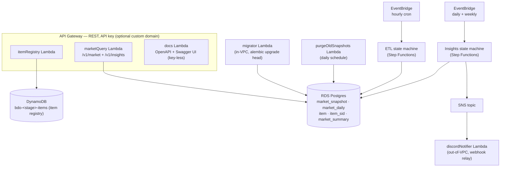
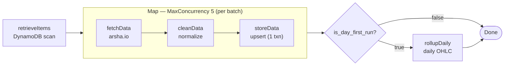
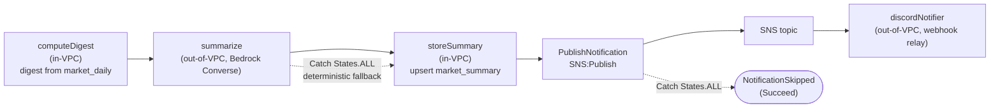

# Architecture

## Overview

Serverless market-data platform for Black Desert Online. Hourly ETL
ingests price and stock data from arsha.io into RDS Postgres; a REST
API exposes snapshots, daily rollups, and BDO-domain analytics.

## System Components

The shared Lambda layer (`bdo-common`) packages the reusable modules —
`arsha_client`, `db`, `models`, `repositories`, `pricing`, `analytics`, and
`insights` — so the individual handlers stay thin.

The system runs 14 Lambdas: the 8 ETL/API handlers, the in-VPC `migrator`, the
`docs` API, and the four insights functions (`computeDigest`, `summarize`,
`storeSummary`, `discordNotifier`). SAM nests them as `network`, `data`, `etl`,
`api`, `insights`, `observability`, and `bastion` stacks.

### ETL state machine

`purgeOldSnapshots` is **not** part of this state machine — it runs on its own
daily schedule to remove snapshots older than 90 days.

### Insights state machine

The VPC boundary splits the pipeline: `computeDigest` and `storeSummary` run
in-VPC (RDS via IAM auth), while `summarize` (Bedrock) and `discordNotifier`
run out-of-VPC. A failed `summarize` is caught and falls back to deterministic
narration; a failed notification ends in `NotificationSkipped` so the run still
succeeds (the summary is already stored and served via `/v1/insights`).

## Key Design Decisions

Architectural decisions live in `docs/adr/` (one ADR per file, Michael
Nygard format). The canonical decision table — kept in lock-step with
the architecture — is in
[`.kiro/specs/v3/design.md`](../.kiro/specs/v3/design.md). This file
intentionally does not duplicate it.

## Data Flow

**Hourly ETL** - EventBridge triggers the ETL state machine.
`retrieveItems` scans DynamoDB for tracked items, then a Map state
fans out: `fetchData` calls arsha.io, `cleanData` normalises the
response, `storeData` upserts rows into Postgres.

**Daily Aggregation** - `rollupDaily` compresses snapshots into
`market_daily` rows. `purgeOldSnapshots` removes data older than 90
days.

**Market insights** - EventBridge triggers the insights state machine daily
(~01:00 UTC) and weekly (Mondays ~01:15 UTC). `computeDigest` builds a
structured, market-wide digest (top movers per category) from `market_daily`;
`summarize` turns it into a natural-language narrative via Bedrock (falling back
to a deterministic renderer on any error); `storeSummary` upserts the result
into `market_summary`; a native `SNS:Publish` fans out to the `discordNotifier`.
Summaries are read back through `GET /v1/insights`.

## Networking

Single VPC with 2 private subnets (AWS requires 2 AZs for a DB
Subnet Group). Only database-touching Lambdas are placed inside the
VPC. A DynamoDB Gateway Endpoint provides in-VPC access without NAT.

EICE (EC2 Instance Connect Endpoint) allows DBA access to RDS through
a bastion host without a public IP or NAT gateway.

## Custom Domain (optional)

The REST API can be fronted by a branded hostname (ADR-0013). It is
**opt-in**: when the `ApiDomainName` parameter is empty (the default), no
domain resources are created and the API is reached via the generated
`execute-api` URL.

When a hostname is supplied, the API stack provisions a regional ACM
certificate (DNS-validated through Route 53), an API Gateway custom
`DomainName`, a base-path mapping to the stage, and a Route 53 A-alias
record. The parent hosted zone (`example.com`) is shared infrastructure
owned elsewhere and is referenced by ID only — this stack never creates or
modifies the zone beyond its own record.

Naming follows `{service}.{env}.example.com`, prod omitting the env label —
e.g. `api.example.com` (prod), `api.dev.example.com` (dev).

## API Documentation (OpenAPI + Swagger UI)

The API publishes its own contract over the same gateway (ADR-0014). The `docs`
Lambda serves two **key-less** routes (the rest of `/v1/*` requires an API key):

- `GET /v1/openapi.json` — the OpenAPI 3.1 document.
- `GET /v1/docs` — Swagger UI (assets from a CDN) for interactive exploration.

The spec is the merged `infra/openapi.yaml` generated by
`scripts/export_openapi.py` (drift-checked in CI) and bundled into the function
at build time, so there is a single source of truth. The served document's
`servers` block is rewritten to the request's live base URL, so Swagger UI
"Try it out" targets the correct stage or custom domain.

## Market Insights (LLM)

A scheduled Step Functions pipeline (`infra/insights.yaml`, ADR-0015/0016)
produces daily and weekly market summaries:

- **Deterministic digest, LLM narration.** `bdo_common.insights` computes all
  numbers (reusing `analytics`/`pricing`). Every per-item figure is rendered
  deterministically and never passes through the model; the LLM writes only the
  headline and overall. Output is schema-validated with a full deterministic
  fallback, and the API returns the structured digest beside the prose — so no
  hallucinated number can reach a consumer (ADR-0016, ADR-0017).
- **VPC split.** `computeDigest`/`storeSummary` run in-VPC (RDS via IAM auth);
  `summarize`/`discordNotifier` run out-of-VPC so Bedrock and the Discord webhook
  are reachable over AWS-managed egress with no NAT (ADR-0006/0015).
- **Storage & retrieval.** Summaries live in `market_summary`
  (`region, period, summary_date, lang` PK; `digest` + `narrative` JSONB) and are
  served at `GET /v1/insights`.
- **Delivery & observability.** A native `SNS:Publish` step fans out to the
  `bdo-<stage>-insights` topic; the `discordNotifier` relays to a webhook (URL in
  SSM SecureString). EMF metrics (`SummariesGenerated`, `InsightFailures`,
  `DiscordDeliveryFailures`) feed a dashboard widget and failure alarms.

Operational setup (Bedrock enablement, the Discord webhook parameter, region
activation, and the dev evaluation procedure) is in the "Market Insights"
section of [`docs/runbook.md`](runbook.md).
