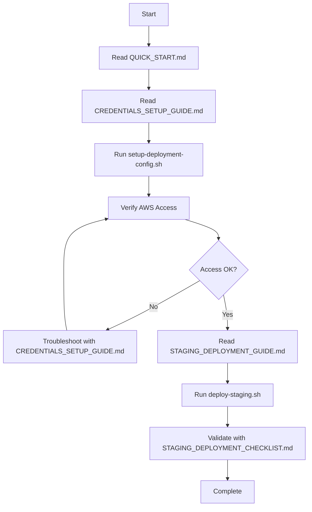
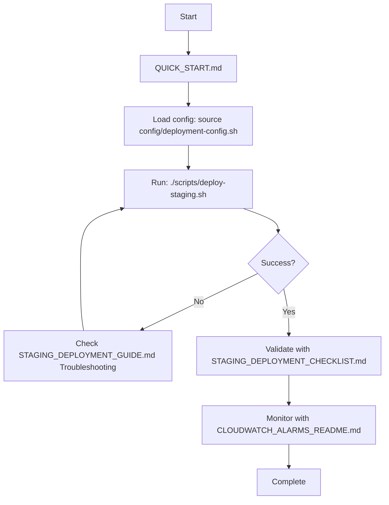
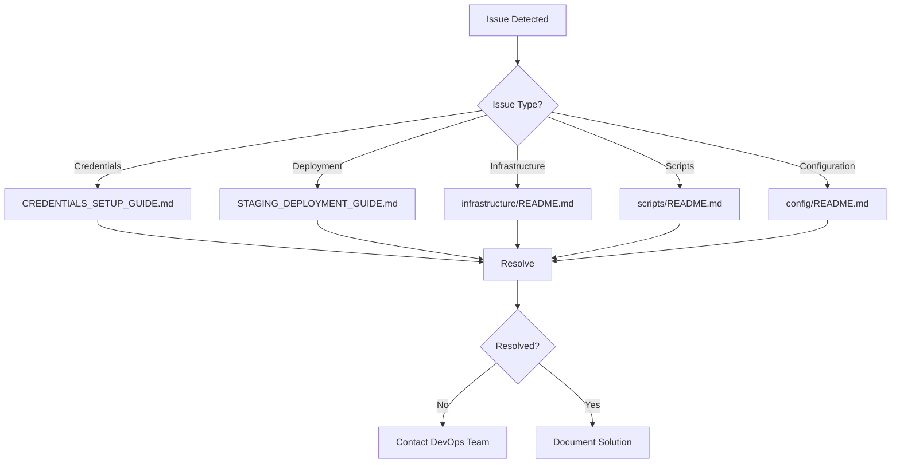

# Documentation Map

Visual guide to all documentation in the BDO Market Insights project.

## 📊 Documentation Structure

```
BDO Market Insights Documentation
│
├── 🚀 Getting Started
│   ├── QUICK_START.md ⭐ START HERE
│   ├── CREDENTIALS_SETUP_GUIDE.md
│   └── DEPLOYMENT_SECURITY_SUMMARY.md
│
├── 🔧 Configuration
│   ├── config/README.md
│   ├── .env.example
│   └── config/deployment-config.example.sh
│
├── 🚢 Deployment
│   ├── infrastructure/STAGING_DEPLOYMENT_GUIDE.md
│   ├── infrastructure/STAGING_DEPLOYMENT_CHECKLIST.md
│   ├── infrastructure/STAGING_DEPLOYMENT_README.md
│   ├── STAGING_DEPLOYMENT_SUMMARY.md
│   └── DEPLOYMENT.md
│
├── 🏗️ Infrastructure
│   ├── infrastructure/README.md (API Gateway)
│   ├── infrastructure/STEP_FUNCTIONS_README.md
│   ├── infrastructure/CLOUDWATCH_ALARMS_README.md
│   ├── infrastructure/API_DOCUMENTATION_README.md
│   └── infrastructure/RETENTION_SCHEDULE_README.md
│
├── 📜 Scripts
│   └── scripts/README.md
│
├── 🎯 Specifications
│   ├── .kiro/specs/bdo-market-insights-rewrite/requirements.md
│   ├── .kiro/specs/bdo-market-insights-rewrite/design.md
│   └── .kiro/specs/bdo-market-insights-rewrite/tasks.md
│
└── 📊 Additional
    ├── README.md (Main)
    ├── CHANGELOG.md
    ├── lambda_layer/README.md
    └── lambda_layer/XRAY_CONFIGURATION.md
```

## 🎯 Documentation by Purpose

### I want to deploy to staging

```
1. QUICK_START.md
   ↓
2. CREDENTIALS_SETUP_GUIDE.md
   ↓
3. Run: ./scripts/setup-deployment-config.sh
   ↓
4. Run: ./scripts/deploy-staging.sh
   ↓
5. STAGING_DEPLOYMENT_CHECKLIST.md (validate)
```

### I want to understand the system

```
1. README.md (overview)
   ↓
2. requirements.md (what it should do)
   ↓
3. design.md (how it works)
   ↓
4. infrastructure/README.md (infrastructure details)
```

### I want to configure AWS credentials

```
1. CREDENTIALS_SETUP_GUIDE.md
   ↓
2. config/README.md
   ↓
3. Run: ./scripts/setup-deployment-config.sh
   ↓
4. Verify: aws sts get-caller-identity
```

### I want to troubleshoot deployment issues

```
1. STAGING_DEPLOYMENT_GUIDE.md (Troubleshooting section)
   ↓
2. CREDENTIALS_SETUP_GUIDE.md (if credentials issue)
   ↓
3. infrastructure/README.md (if infrastructure issue)
   ↓
4. scripts/README.md (if script issue)
```

### I want to understand security

```
1. DEPLOYMENT_SECURITY_SUMMARY.md
   ↓
2. CREDENTIALS_SETUP_GUIDE.md (Security Best Practices)
   ↓
3. config/README.md (Security section)
```

### I want to set up monitoring

```
1. infrastructure/CLOUDWATCH_ALARMS_README.md
   ↓
2. lambda_layer/XRAY_CONFIGURATION.md
   ↓
3. infrastructure/README.md (Monitoring section)
```

## 📖 Documentation by Role

### Developer

**Essential Reading:**
1. README.md - Project overview
2. design.md - System architecture
3. requirements.md - System requirements
4. lambda_layer/README.md - Shared code

**For Development:**
- tasks.md - Implementation tasks
- CHANGELOG.md - Version history

### DevOps Engineer

**Essential Reading:**
1. QUICK_START.md - Quick deployment
2. CREDENTIALS_SETUP_GUIDE.md - AWS setup
3. STAGING_DEPLOYMENT_GUIDE.md - Detailed deployment
4. DEPLOYMENT.md - Deployment strategies

**For Operations:**
- infrastructure/CLOUDWATCH_ALARMS_README.md - Monitoring
- infrastructure/RETENTION_SCHEDULE_README.md - Data retention
- scripts/README.md - Deployment scripts

### System Administrator

**Essential Reading:**
1. infrastructure/README.md - Infrastructure overview
2. infrastructure/STEP_FUNCTIONS_README.md - Workflow
3. infrastructure/CLOUDWATCH_ALARMS_README.md - Monitoring

**For Management:**
- infrastructure/RETENTION_SCHEDULE_README.md - Data lifecycle
- infrastructure/API_DOCUMENTATION_README.md - API docs

### Security Engineer

**Essential Reading:**
1. DEPLOYMENT_SECURITY_SUMMARY.md - Security overview
2. CREDENTIALS_SETUP_GUIDE.md - Credentials management
3. config/README.md - Configuration security

**For Auditing:**
- requirements.md - Security requirements
- design.md - Security design

## 🔄 Documentation Workflow

### First-Time Setup Flow



### Deployment Flow



### Troubleshooting Flow



## 📝 Documentation Maintenance

### When to Update Documentation

| Trigger | Update These Docs |
|---------|-------------------|
| New feature added | requirements.md, design.md, tasks.md, README.md |
| Deployment process changed | DEPLOYMENT.md, STAGING_DEPLOYMENT_GUIDE.md |
| Infrastructure changed | infrastructure/README.md, design.md |
| Security policy changed | DEPLOYMENT_SECURITY_SUMMARY.md, CREDENTIALS_SETUP_GUIDE.md |
| Configuration changed | config/README.md, deployment-config.example.sh |
| Scripts changed | scripts/README.md |
| API changed | infrastructure/API_DOCUMENTATION_README.md |
| Monitoring changed | infrastructure/CLOUDWATCH_ALARMS_README.md |

### Documentation Review Checklist

- [ ] All links work
- [ ] Code examples are correct
- [ ] Screenshots are up-to-date
- [ ] Version numbers are current
- [ ] Commands are tested
- [ ] Troubleshooting steps are accurate
- [ ] Security information is current
- [ ] Contact information is correct

## 🔗 External Resources

### AWS Documentation
- [AWS Lambda](https://docs.aws.amazon.com/lambda/)
- [AWS Step Functions](https://docs.aws.amazon.com/step-functions/)
- [AWS API Gateway](https://docs.aws.amazon.com/apigateway/)
- [AWS Secrets Manager](https://docs.aws.amazon.com/secretsmanager/)
- [AWS CloudWatch](https://docs.aws.amazon.com/cloudwatch/)
- [AWS X-Ray](https://docs.aws.amazon.com/xray/)

### Tools Documentation
- [AWS CLI](https://docs.aws.amazon.com/cli/)
- [Python 3.14](https://docs.python.org/3.14/)
- [Pydantic](https://docs.pydantic.dev/)
- [Hypothesis](https://hypothesis.readthedocs.io/)

## 📞 Getting Help

### Documentation Issues

If you find issues with documentation:
1. Check if there's a newer version
2. Search for similar issues
3. Create an issue with:
   - Document name
   - Section with issue
   - What's wrong
   - Suggested fix

### Where to Get Help

| Issue Type | Resource |
|------------|----------|
| Deployment | STAGING_DEPLOYMENT_GUIDE.md → Troubleshooting |
| Credentials | CREDENTIALS_SETUP_GUIDE.md → Troubleshooting |
| Configuration | config/README.md → Troubleshooting |
| Infrastructure | infrastructure/README.md → Troubleshooting |
| Scripts | scripts/README.md → Troubleshooting |
| General | README.md → Contact |

## 🎓 Learning Path

### Beginner Path

1. **Week 1: Understanding**
   - Read README.md
   - Read QUICK_START.md
   - Read requirements.md

2. **Week 2: Setup**
   - Read CREDENTIALS_SETUP_GUIDE.md
   - Setup AWS credentials
   - Read config/README.md

3. **Week 3: Deployment**
   - Read STAGING_DEPLOYMENT_GUIDE.md
   - Deploy to staging
   - Validate with checklist

4. **Week 4: Operations**
   - Read infrastructure docs
   - Setup monitoring
   - Practice troubleshooting

### Advanced Path

1. **Architecture Deep Dive**
   - design.md
   - infrastructure/STEP_FUNCTIONS_README.md
   - lambda_layer/README.md

2. **Security Mastery**
   - DEPLOYMENT_SECURITY_SUMMARY.md
   - CREDENTIALS_SETUP_GUIDE.md
   - AWS IAM best practices

3. **Operations Excellence**
   - infrastructure/CLOUDWATCH_ALARMS_README.md
   - infrastructure/RETENTION_SCHEDULE_README.md
   - DEPLOYMENT.md (Blue-green deployment)

4. **Automation**
   - scripts/README.md
   - .github/workflows/deploy.yml
   - CI/CD setup

## 📊 Documentation Statistics

| Category | Count | Status |
|----------|-------|--------|
| Getting Started | 3 | ✅ Complete |
| Configuration | 3 | ✅ Complete |
| Deployment | 5 | ✅ Complete |
| Infrastructure | 5 | ✅ Complete |
| Scripts | 1 | ✅ Complete |
| Specifications | 3 | ✅ Complete |
| Additional | 4 | ✅ Complete |
| **Total** | **24** | **✅ Complete** |

## 🔄 Documentation Updates

Last updated: 2024-03-06

Recent changes:
- Added comprehensive deployment documentation
- Created security and credentials guides
- Added quick start guide
- Created documentation map
- Updated README with documentation index

---

**Need help navigating the documentation?** Start with [QUICK_START.md](QUICK_START.md) or [README.md](README.md)!
