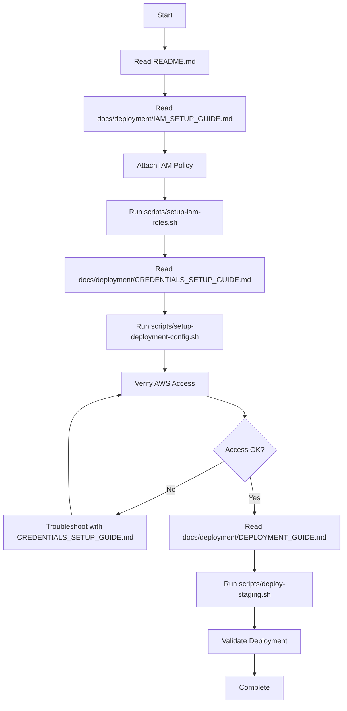
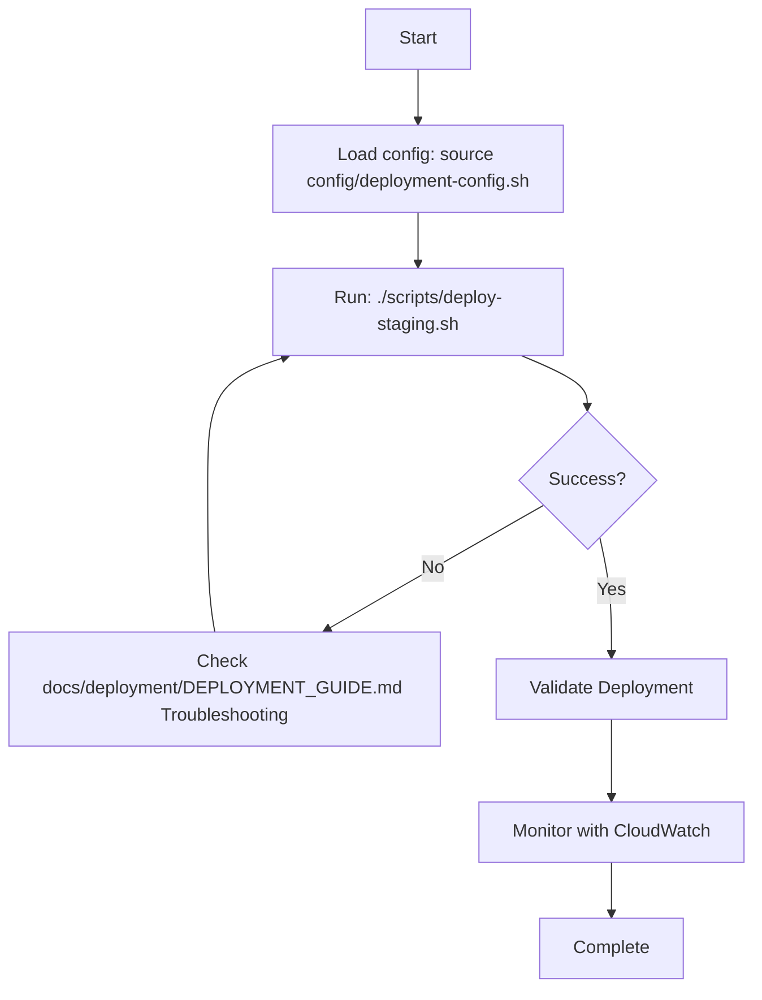
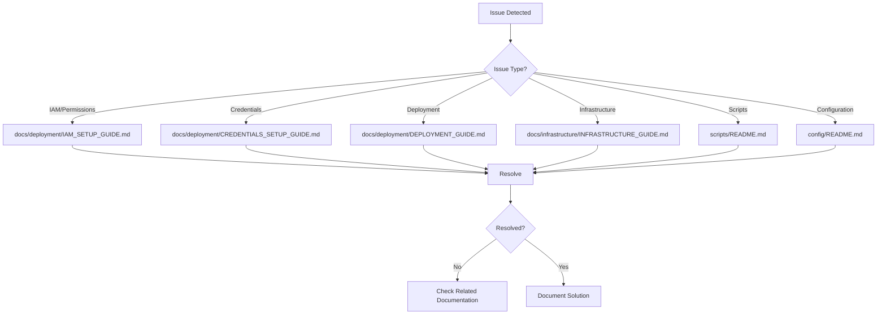

# Documentation Map

Visual guide to all documentation in the BDO Market Insights project.

## 📊 Documentation Structure

```
BDO Market Insights Documentation
│
├── 🚀 Getting Started
│   ├── README.md ⭐ START HERE
│   ├── docs/deployment/IAM_SETUP_GUIDE.md
│   ├── docs/deployment/DEPLOYMENT_GUIDE.md
│   └── docs/deployment/CREDENTIALS_SETUP_GUIDE.md
│
├── 🔧 Configuration
│   ├── config/README.md
│   ├── .env.example
│   ├── config/deployment-config.example.sh
│   └── iam-policy-template.json
│
├── 🚢 Deployment
│   ├── docs/deployment/DEPLOYMENT_GUIDE.md
│   ├── docs/deployment/IAM_SETUP_GUIDE.md
│   ├── docs/deployment/CREDENTIALS_SETUP_GUIDE.md
│   └── docs/deployment/DEPLOYMENT_SECURITY_SUMMARY.md
│
├── 🏗️ Infrastructure
│   ├── docs/infrastructure/INFRASTRUCTURE_GUIDE.md
│   ├── infrastructure/README.md (API Gateway)
│   ├── infrastructure/STEP_FUNCTIONS_README.md
│   ├── infrastructure/CLOUDWATCH_ALARMS_README.md
│   ├── infrastructure/API_DOCUMENTATION_README.md
│   └── infrastructure/RETENTION_SCHEDULE_README.md
│
├── 📜 Scripts
│   ├── scripts/README.md
│   └── scripts/setup-iam-roles.sh
│
├── 🎯 Specifications
│   ├── .kiro/specs/bdo-market-insights-rewrite/requirements.md
│   ├── .kiro/specs/bdo-market-insights-rewrite/design.md
│   └── .kiro/specs/bdo-market-insights-rewrite/tasks.md
│
└── 📊 Additional
    ├── README.md (Main)
    ├── docs/CHANGELOG.md
    ├── lambda_layer/README.md
    ├── lambda_layer/XRAY_CONFIGURATION.md
    └── src/retrieveIdList/USAGE_EXAMPLES.md
```

## 🎯 Documentation by Purpose

### I want to deploy to staging

```
1. README.md (overview)
   ↓
2. docs/deployment/IAM_SETUP_GUIDE.md (setup IAM permissions)
   ↓
3. docs/deployment/CREDENTIALS_SETUP_GUIDE.md (setup AWS credentials)
   ↓
4. Run: ./scripts/setup-deployment-config.sh
   ↓
5. Run: ./scripts/setup-iam-roles.sh
   ↓
6. Run: ./scripts/deploy-staging.sh
   ↓
7. docs/deployment/DEPLOYMENT_GUIDE.md (validate)
```

### I want to understand the system

```
1. README.md (overview)
   ↓
2. .kiro/specs/bdo-market-insights-rewrite/requirements.md (what it should do)
   ↓
3. .kiro/specs/bdo-market-insights-rewrite/design.md (how it works)
   ↓
4. docs/infrastructure/INFRASTRUCTURE_GUIDE.md (infrastructure details)
```

### I want to configure IAM permissions

```
1. docs/deployment/IAM_SETUP_GUIDE.md
   ↓
2. Prepare: iam-policy-template.json (replace YOUR_ACCOUNT_ID)
   ↓
3. Attach policy to your IAM user
   ↓
4. Run: ./scripts/setup-iam-roles.sh
   ↓
5. Verify: aws iam get-user-policy --user-name YOUR_USERNAME --policy-name BDOMarketInsightsFullAccess
```

### I want to configure AWS credentials

```
1. docs/deployment/CREDENTIALS_SETUP_GUIDE.md
   ↓
2. config/README.md
   ↓
3. Run: ./scripts/setup-deployment-config.sh
   ↓
4. Verify: aws sts get-caller-identity
```

### I want to troubleshoot deployment issues

```
1. docs/deployment/DEPLOYMENT_GUIDE.md (Troubleshooting section)
   ↓
2. docs/deployment/IAM_SETUP_GUIDE.md (if IAM/permission issue)
   ↓
3. docs/deployment/CREDENTIALS_SETUP_GUIDE.md (if credentials issue)
   ↓
4. docs/infrastructure/INFRASTRUCTURE_GUIDE.md (if infrastructure issue)
   ↓
5. scripts/README.md (if script issue)
```

### I want to understand security

```
1. docs/deployment/DEPLOYMENT_SECURITY_SUMMARY.md
   ↓
2. docs/deployment/IAM_SETUP_GUIDE.md (Security Notes)
   ↓
3. docs/deployment/CREDENTIALS_SETUP_GUIDE.md (Security Best Practices)
   ↓
4. config/README.md (Security section)
```

### I want to set up monitoring

```
1. infrastructure/CLOUDWATCH_ALARMS_README.md
   ↓
2. lambda_layer/XRAY_CONFIGURATION.md
   ↓
3. docs/infrastructure/INFRASTRUCTURE_GUIDE.md (Monitoring section)
```

## 📖 Documentation by Role

### Developer

**Essential Reading:**
1. README.md - Project overview
2. .kiro/specs/bdo-market-insights-rewrite/design.md - System architecture
3. .kiro/specs/bdo-market-insights-rewrite/requirements.md - System requirements
4. lambda_layer/README.md - Shared code

**For Development:**
- .kiro/specs/bdo-market-insights-rewrite/tasks.md - Implementation tasks
- docs/CHANGELOG.md - Version history
- src/retrieveIdList/USAGE_EXAMPLES.md - Function usage examples

### DevOps Engineer / Solo Developer

**Essential Reading:**
1. README.md - Project overview
2. docs/deployment/IAM_SETUP_GUIDE.md - IAM permissions setup
3. docs/deployment/CREDENTIALS_SETUP_GUIDE.md - AWS credentials setup
4. docs/deployment/DEPLOYMENT_GUIDE.md - Complete deployment guide

**For Operations:**
- infrastructure/CLOUDWATCH_ALARMS_README.md - Monitoring
- infrastructure/RETENTION_SCHEDULE_README.md - Data retention
- scripts/README.md - Deployment scripts
- docs/infrastructure/INFRASTRUCTURE_GUIDE.md - Infrastructure overview

### System Administrator

**Essential Reading:**
1. docs/infrastructure/INFRASTRUCTURE_GUIDE.md - Infrastructure overview
2. infrastructure/STEP_FUNCTIONS_README.md - Workflow
3. infrastructure/CLOUDWATCH_ALARMS_README.md - Monitoring

**For Management:**
- infrastructure/RETENTION_SCHEDULE_README.md - Data lifecycle
- infrastructure/API_DOCUMENTATION_README.md - API docs

### Security Engineer

**Essential Reading:**
1. docs/deployment/DEPLOYMENT_SECURITY_SUMMARY.md - Security overview
2. docs/deployment/IAM_SETUP_GUIDE.md - IAM permissions and security
3. docs/deployment/CREDENTIALS_SETUP_GUIDE.md - Credentials management
4. config/README.md - Configuration security

**For Auditing:**
- .kiro/specs/bdo-market-insights-rewrite/requirements.md - Security requirements
- .kiro/specs/bdo-market-insights-rewrite/design.md - Security design
- iam-policy-template.json - IAM policy template

## 🔄 Documentation Workflow

### First-Time Setup Flow



### Deployment Flow



### Troubleshooting Flow



## 📝 Documentation Maintenance

### When to Update Documentation

| Trigger | Update These Docs |
|---------|-------------------|
| New feature added | requirements.md, design.md, tasks.md, README.md |
| Deployment process changed | docs/deployment/DEPLOYMENT_GUIDE.md |
| IAM permissions changed | docs/deployment/IAM_SETUP_GUIDE.md, iam-policy-template.json |
| Infrastructure changed | docs/infrastructure/INFRASTRUCTURE_GUIDE.md, design.md |
| Security policy changed | docs/deployment/DEPLOYMENT_SECURITY_SUMMARY.md |
| Configuration changed | config/README.md, deployment-config.example.sh |
| Scripts changed | scripts/README.md |
| API changed | infrastructure/API_DOCUMENTATION_README.md |
| Monitoring changed | infrastructure/CLOUDWATCH_ALARMS_README.md |

### Documentation Review Checklist

- [ ] All links work
- [ ] Code examples are correct
- [ ] Commands are tested
- [ ] Troubleshooting steps are accurate
- [ ] Security information is current
- [ ] No sensitive information (AWS account IDs, credentials)
- [ ] .gitignore is updated for generated files

## 🔗 External Resources

### AWS Documentation
- [AWS Lambda](https://docs.aws.amazon.com/lambda/)
- [AWS Step Functions](https://docs.aws.amazon.com/step-functions/)
- [AWS API Gateway](https://docs.aws.amazon.com/apigateway/)
- [AWS Secrets Manager](https://docs.aws.amazon.com/secretsmanager/)
- [AWS CloudWatch](https://docs.aws.amazon.com/cloudwatch/)
- [AWS X-Ray](https://docs.aws.amazon.com/xray/)
- [AWS IAM](https://docs.aws.amazon.com/iam/)

### Tools Documentation
- [AWS CLI](https://docs.aws.amazon.com/cli/)
- [Python 3.14](https://docs.python.org/3.14/)
- [Pydantic](https://docs.pydantic.dev/)
- [Hypothesis](https://hypothesis.readthedocs.io/)

## 📞 Getting Help

### Documentation Issues

If you find issues with documentation:
1. Check if there's a newer version
2. Search for similar issues
3. Create an issue with:
   - Document name
   - Section with issue
   - What's wrong
   - Suggested fix

### Where to Get Help

| Issue Type | Resource |
|------------|----------|
| IAM/Permissions | docs/deployment/IAM_SETUP_GUIDE.md → Troubleshooting |
| Deployment | docs/deployment/DEPLOYMENT_GUIDE.md → Troubleshooting |
| Credentials | docs/deployment/CREDENTIALS_SETUP_GUIDE.md → Troubleshooting |
| Configuration | config/README.md → Troubleshooting |
| Infrastructure | docs/infrastructure/INFRASTRUCTURE_GUIDE.md → Troubleshooting |
| Scripts | scripts/README.md → Troubleshooting |
| General | README.md → Contact |

## 🎓 Learning Path

### Beginner Path (Solo Developer)

1. **Week 1: Understanding**
   - Read README.md
   - Read .kiro/specs/bdo-market-insights-rewrite/requirements.md
   - Read .kiro/specs/bdo-market-insights-rewrite/design.md

2. **Week 2: Setup**
   - Read docs/deployment/IAM_SETUP_GUIDE.md
   - Setup IAM permissions
   - Read docs/deployment/CREDENTIALS_SETUP_GUIDE.md
   - Setup AWS credentials

3. **Week 3: Deployment**
   - Read docs/deployment/DEPLOYMENT_GUIDE.md
   - Deploy to staging
   - Validate deployment

4. **Week 4: Operations**
   - Read docs/infrastructure/INFRASTRUCTURE_GUIDE.md
   - Setup monitoring
   - Practice troubleshooting

### Advanced Path

1. **Architecture Deep Dive**
   - .kiro/specs/bdo-market-insights-rewrite/design.md
   - infrastructure/STEP_FUNCTIONS_README.md
   - lambda_layer/README.md
   - lambda_layer/XRAY_CONFIGURATION.md

2. **Security Mastery**
   - docs/deployment/DEPLOYMENT_SECURITY_SUMMARY.md
   - docs/deployment/IAM_SETUP_GUIDE.md (Security Notes)
   - docs/deployment/CREDENTIALS_SETUP_GUIDE.md
   - AWS IAM best practices

3. **Operations Excellence**
   - infrastructure/CLOUDWATCH_ALARMS_README.md
   - infrastructure/RETENTION_SCHEDULE_README.md
   - docs/deployment/DEPLOYMENT_GUIDE.md (Production deployment)

4. **Automation**
   - scripts/README.md
   - .github/workflows/ci-cd.yml
   - CI/CD setup

## 📊 Documentation Statistics

| Category | Count | Status |
|----------|-------|--------|
| Getting Started | 4 | ✅ Complete |
| Configuration | 4 | ✅ Complete |
| Deployment | 4 | ✅ Complete |
| Infrastructure | 6 | ✅ Complete |
| Scripts | 4 | ✅ Complete |
| Specifications | 3 | ✅ Complete |
| Additional | 5 | ✅ Complete |
| **Total** | **30** | **✅ Complete** |

## 🔄 Recent Documentation Changes

Last updated: 2024-03-08

Recent changes:
- ✅ Consolidated IAM and CloudWatch metrics documentation
- ✅ Created comprehensive IAM_SETUP_GUIDE.md
- ✅ Removed 8 redundant documentation files
- ✅ Updated all documentation links
- ✅ Added iam-policy-configured.json to .gitignore
- ✅ Streamlined for solo developer/admin use case
- ✅ Fixed PassRole permission security issue

### Files Removed (Consolidated)
- README_IAM_SETUP.md → docs/deployment/IAM_SETUP_GUIDE.md
- SETUP_SUMMARY.md → Integrated into IAM_SETUP_GUIDE.md
- SECURITY_IMPROVEMENTS.md → Integrated into IAM_SETUP_GUIDE.md
- CLOUDWATCH_METRICS_FIX.md → Integrated into IAM_SETUP_GUIDE.md
- iam-policy-README.md → Integrated into IAM_SETUP_GUIDE.md
- docs/guides/iam-permissions-required.md → Consolidated
- docs/guides/add-cloudwatch-permissions-console.md → Consolidated
- docs/guides/fix-cloudwatch-metrics-permissions.md → Consolidated

### Files Added
- docs/deployment/IAM_SETUP_GUIDE.md - Comprehensive IAM setup guide
- DOCUMENTATION_CONSOLIDATION.md - Summary of consolidation work

---

**Need help navigating the documentation?** Start with [README.md](../../README.md) or [docs/deployment/IAM_SETUP_GUIDE.md](../deployment/IAM_SETUP_GUIDE.md)!
