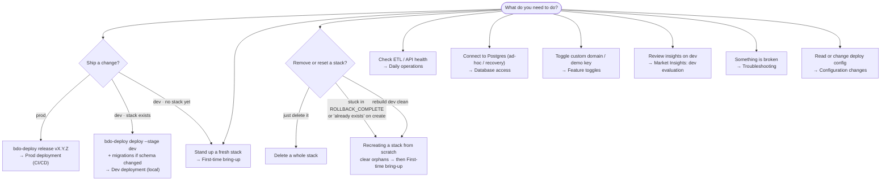
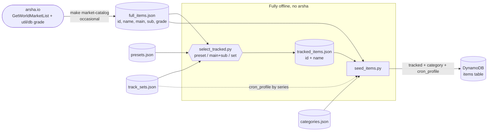

# Runbook

Operational guide for the live v3 stacks (`bdo-market-dev` / `bdo-market-prod`):
first-time bring-up, daily operations, deployment, feature toggles, database
access, insights evaluation, recovery/teardown, and troubleshooting.

## Contents

- [Conventions](#conventions)
- [Decision flow](#decision-flow)
- [The deploy control plane](#the-deploy-control-plane)
  - [Command reference](#command-reference)
  - [Flags, output, exit codes](#flags-output-exit-codes)
  - [Control plane vs Makefile](#control-plane-vs-makefile)
- [First-time bring-up](#first-time-bring-up)
  - [First-time role bootstrap](#first-time-role-bootstrap)
  - [Backfill the item catalog (one-time)](#backfill-the-item-catalog-one-time)
  - [Seed the tracked set (one-time)](#seed-the-tracked-set-one-time)
  - [Item icons](#item-icons)
  - [Pipeline bootstrap](#pipeline-bootstrap)
- [Daily operations](#daily-operations)
  - [Adding or removing tracked items & series](#adding-or-removing-tracked-items--series)
- [Deployment](#deployment)
  - [Quick reference](#quick-reference)
  - [Deployment notes](#deployment-notes)
  - [Dev deployment (local)](#dev-deployment-local)
  - [Configuration changes](#configuration-changes)
  - [Running migrations](#running-migrations)
  - [Prod deployment (CI/CD)](#prod-deployment-cicd)
  - [Rollback](#rollback)
  - [Breaking changes](#breaking-changes)
- [Feature toggles](#feature-toggles)
  - [Custom API domain](#custom-api-domain)
  - [Custom icons domain](#custom-icons-domain)
  - [Public demo API key](#public-demo-api-key)
  - [Region activation (multi-region readiness)](#region-activation-multi-region-readiness)
- [Database access](#database-access)
- [Market Insights: dev evaluation](#market-insights-dev-evaluation)
- [Recovery & teardown](#recovery--teardown)
  - [Quick reference](#quick-reference-teardown)
  - [Revert a test setup (non-destructive)](#revert-a-test-setup-non-destructive)
  - [Delete a whole stack (destructive)](#delete-a-whole-stack-destructive)
  - [Recreating a stack from scratch](#recreating-a-stack-from-scratch)
- [Troubleshooting](#troubleshooting)

## Conventions

Each procedure follows the same shape so it can be skimmed under time pressure:

- **Purpose / When / Preconditions** — what it does, when to reach for it, what
  must already be true. Major procedures also tag **Risk** and **Reversible**.
- **Steps** — numbered, one action each; the command sits in its own block. An
  `Expected:` line follows any command whose output you should check.
- **Verify** — how to confirm success.
- **Notes** — rationale, ADR links, and edge cases. Skippable on the happy path.

Commands are parametrized on `STAGE` (`dev` / `prod`); set it once (`STAGE=dev`)
or substitute inline. All commands assume region `us-east-1`.

Two command families appear throughout, and which one owns a job is stated
explicitly — see [Control plane vs Makefile](#control-plane-vs-makefile):

- `bdo-deploy …` — the deploy control plane (ADR-0039), the front door for
  deploy, release, config and pipeline bootstrap. Shown as `uv run bdo-deploy`
  (the console entry point is installed by `uv sync`; plain `bdo-deploy` works in
  an activated environment).
- `make …` — the domain and database operations the control plane does not cover.

## Decision flow

Start here: pick what you are doing and follow the arrows to the section that
covers it. Every box names a section in this runbook (see [Contents](#contents)).



## The deploy control plane

`bdo-deploy` is a **thin control plane** (ADR-0039): it translates intent into a
typed command and dispatches to the SAM CLI, GitHub Actions (`gh`) and `git`. It
reimplements no deploy logic and never composes a CloudFormation parameter set —
`samconfig.toml` environments own that; the tool only selects `--config-env`.

**Two front-ends, one core.** A subcommand runs non-interactive **CLI mode**;
`uv run bdo-deploy --tui` (or no subcommand on a terminal) launches the **TUI**.
Both build the same command and route it through the same dispatcher, so they
behave identically (ADR-0041). Nothing is ever prompted for.

### Command reference

| Intent | Command |
|---|---|
| Deploy dev locally | `uv run bdo-deploy deploy --stage dev --yes` |
| Dev fast-loop (code only) | `uv run bdo-deploy deploy --stage dev --sync --yes` |
| Deploy a stage via CI | `uv run bdo-deploy deploy --stage <env> --target ci --yes` |
| Cut a release (tag + push) | `uv run bdo-deploy release vX.Y.Z --yes` |
| Re-deploy an existing version | `uv run bdo-deploy release vX.Y.Z --stage prod --dispatch --yes` |
| Show merged config | `uv run bdo-deploy config show --stage <env>` |
| Change one config value | `uv run bdo-deploy config set <key> <value> --stage <env> --yes` |
| One-time pipeline bootstrap | `uv run bdo-deploy bootstrap --stage <env> --reviewer User:<id> --yes` |

What each capability dispatches to:

- **deploy** — `--target local` (the default) runs `sam build` then
  `sam deploy --config-env <stage>`; `--sync` runs `sam sync --config-env <stage>`
  instead, the dev fast-loop. `--target ci` dispatches `deploy.yml` rather than
  deploying locally (and refuses `--sync`, which is local-only). **A local prod
  deploy is unconstructable**: `deploy --stage prod` (local) exits `2` and points
  at `release`. The stack self-bootstraps during the deploy — migrations
  (ADR-0025) and the first-create data bootstrap (ADR-0028) — so a routine deploy
  is one declarative step.
- **release** — verifies the preconditions (clean working tree, on `main`, the tag
  absent both locally and on the origin), then creates `vX.Y.Z` and pushes it, and
  the pushed tag triggers `deploy.yml`. `--dispatch` skips tagging and dispatches
  `deploy.yml` for an existing version instead. `--stage` is ignored on the tagging
  path: a tag run's scope is `deploy.yml`'s to decide.
- **config** — `config show` renders the merged `samconfig.toml` + SSM view for a
  stage with secret-shaped values masked, and mutates nothing. `config set` routes
  by key: a repo-scoped `/bdo-market-insights/<stage>/<category>/<key>` path
  becomes an audited SSM write; any other key is a `samconfig.toml` parameter (e.g.
  `BdoRegions`) and is changed by **opening a pull request**, never edited in
  place. A secret-shaped key (containing `secret`, `password`, `token` or `key`)
  bound for `samconfig.toml` is refused with exit `2` — that value would be
  rendered into the PR title and committed; put it at a repo-scoped SSM path.
- **bootstrap** — the one-time, out-of-band pipeline bootstrap; see
  [Pipeline bootstrap](#pipeline-bootstrap). Not part of the routine deploy path.

### Flags, output, exit codes

The contract an agent or automation relies on:

- `--yes` confirms a mutating command. Nothing is prompted for: without it a
  mutating command exits `3` and returns the plan it refused to run, which is the
  cue to inspect the effects and re-invoke with `--yes`.
- `--dry-run` stops after planning and changes nothing anywhere.
- `--json` emits **exactly one** serialized `Result` as the sole content of stdout;
  every human-readable line goes to stderr. Secret values are absent from it.
- `--watch` follows a dispatched CI run to completion and reports the run's own
  pass/fail. Implied for human output; **required under `--json`**, where a
  blocking watch would otherwise sit in front of the single `Result`. The run URL
  is in the `Result` either way, and the run — not the dispatch — is authoritative.
- `--stage` must name an environment defined in `samconfig.toml` (`dev` / `prod`).

| Exit | Meaning |
|------|---------|
| `0` | success |
| `1` | an executor (`sam` / `gh` / `git`) or the action failed; its output is surfaced verbatim, never a traceback |
| `2` | usage/validation error **before any executor call** — nothing mutated |
| `3` | confirmation required: re-invoke with `--yes` |

A machine-readable preview is the exit-`3` path (invoke without `--yes` and read
`Result.plan`), not `--dry-run`, whose plan is rendered for a human.

### Control plane vs Makefile

Both still exist, and neither has been removed. The split:

| Job | Canonical | Notes |
|---|---|---|
| Deploy a stage, release, read/change config, bootstrap the pipeline | **`bdo-deploy`** | The front door; dispatches to SAM / `gh` / `git`. |
| Full-state deploy with a non-samconfig parameter (`AUTO_MIGRATE=false`, `AutoBootstrap`, `ApiVersion`, `MigrationsFingerprint`) | **`make deploy`** | `DEPLOY_PARAMS` assembles the complete set; the control plane deliberately passes no `--parameter-overrides`. Required for [First-time bring-up](#first-time-bring-up). |
| Post-deploy smoke test | **`make verify`** | ADR-0029. Not a control-plane capability; run it after a `bdo-deploy deploy`. |
| Seed a stage's deploy config for the first time | **`make seed-config`** | Writes all four SSM keys at once. Thereafter change one key with `bdo-deploy config set` (audited, path-validated). |
| DB roles, migrations, break-glass, admin SQL | **`make`** (`db-bootstrap`, `migrate-lambda`, `migrate`, `db-admin`, `break-glass-*`) | Database operations; no control-plane equivalent. |
| Catalog, tracked set, data bootstrap | **`make`** (`market-catalog`, `track`, `seed*`, `bootstrap`) | Domain operations. Note `make bootstrap` (data seeding, ADR-0028) is **not** `bdo-deploy bootstrap` (pipeline plumbing). |
| Lint / typecheck / test / openapi / postman / build / clean | **`make`** | Developer tooling. |

`bdo-deploy deploy --stage dev` is the recommended dev deploy: the same
`sam build` + `sam deploy --config-env dev`, with a previewable plan, a
machine-readable result and a deterministic exit code. Two things `make deploy`
does that it does not:

- **No layer guard.** `make deploy` runs `make build` (`sam build` +
  `verify-layer`) first, so a source-only `CommonLayer` can never reach
  `sam deploy`. `bdo-deploy` runs a plain `sam build`. On a native Linux
  filesystem this is a non-issue; on a Windows-mounted `/mnt/*` path it is the
  failure the guard exists for (see [Deployment notes](#deployment-notes)).
- **No full parameter set and no verify.** `sam deploy --config-env dev` passes
  only `samconfig.toml`'s `[dev.deploy.parameters]` set (`Stage`, `BdoRegions`,
  `UseRdsProxy`); the rest take their template defaults — notably
  `MigrationsFingerprint=unset` and `ApiVersion=unknown`. So a dev change that
  **adds migrations** should go out with `make deploy STAGE=dev` (which computes
  the fingerprint that re-triggers the auto-migrate resource) or be applied with
  `make migrate-lambda STAGE=dev`. And run `make verify STAGE=dev` afterwards.

> `samconfig.toml` sets `confirm_changeset = true`, and the control plane captures
> its executors' output, so a SAM changeset prompt is not visible when deploying
> through `bdo-deploy`. If a local deploy appears to hang with no output, that is
> the likely cause — deploy that change with `make deploy STAGE=dev` (where the
> prompt is answerable) or use `--sync` for a code-only fast-loop.

## First-time bring-up

- **Purpose:** Stand up a stack from empty (a new account, or after a full
teardown).
- **When:** New environment, or after [Recreating a stack from scratch](#recreating-a-stack-from-scratch) (do the orphan-clearing there first).
- **Preconditions:** deploy config seeded (step 1); for prod, the [pipeline bootstrap](#pipeline-bootstrap) has run.
- **Risk:** low
- **Reversible:** yes (see [Delete a whole stack](#delete-a-whole-stack-destructive))

### Steps
1. Seed deploy config (once) — writes the SSM parameters the deploy resolves
   (custom domain / demo key / hosted zone; dev defaults to `none`). See
   [Deployment notes](#deployment-notes).
   ```sh
   make seed-config STAGE=<env>
   ```
2. Bootstrap the DB roles (once) — two-phase because introducing the auto-migrate
   custom resource requires the migrator Lambda to exist first (ADR-0025).
   `VERIFY=false` because the `verify` DB-role check (`lambda_rds_user`) doesn't
   pass until `db-bootstrap` runs. Full detail in
   [First-time role bootstrap](#first-time-role-bootstrap).
   ```sh
   make deploy STAGE=<env> AUTO_MIGRATE=false VERIFY=false
   make db-bootstrap STAGE=<env>
   ```
   Expected: `db-bootstrap` prints `status: ok`.
3. Converge + verify — one command applies routine migrations (auto-migrate
   custom resource, ADR-0025), runs the first-create data bootstrap
   (catalog → tracked set → icons, ADR-0028), and ends with `make verify`
   (liveness + RDS path + waits on the async bootstrap to populate data,
   ADR-0029).
   ```sh
   make deploy STAGE=<env>
   ```

### Notes
- The catalog backfill, tracked-set seed, and icon materialization run
  **automatically** inside the bootstrap orchestrator — there are no manual seed
  steps. Re-run anytime with `make bootstrap STAGE=<env>` (idempotent); the
  offline `make seed*` scripts below are local alternatives.
- The first `make deploy` may wait several minutes on the initial
  ~tens-of-thousands-item catalog sync. Raise `VERIFY_WAIT`, or pass
  `VERIFY=false` and run `make verify` separately, if you'd rather not block.
- For **prod**, also run the one-time [pipeline bootstrap](#pipeline-bootstrap)
  so tagged releases can deploy.
- These three steps use `make deploy` deliberately: `AUTO_MIGRATE=false` and
  `VERIFY=false` are Makefile parameters, and the control plane passes no
  `--parameter-overrides` (see [Control plane vs Makefile](#control-plane-vs-makefile)).
  Once the stack exists, routine deploys go through `bdo-deploy deploy`.

### First-time role bootstrap

- **Purpose:** Create the cluster-level Postgres roles the runtime and migrations authenticate as.
- **When:** Once per environment, before the first normal deploy (step 2 of bring-up).
- **Preconditions:** none — runs via the migrator Lambda in bootstrap mode; no tunnel or bastion.
- **Risk:** low
- **Reversible:** idempotent (re-runnable)

#### Steps
1. Deploy infra with auto-migrate off (provisions the migrator Lambda without
   invoking it; skip verify — the roles don't exist yet).
   ```sh
   make deploy STAGE=<env> AUTO_MIGRATE=false VERIFY=false
   ```
2. Create the roles + schema as the RDS master (applies migrations `0001`–`0003`).
   ```sh
   make db-bootstrap STAGE=<env>
   ```
   Expected: `status: ok`.
3. Deploy normally — the auto-migrate custom resource now applies routine
   migrations (`0004`+) and re-runs verify.
   ```sh
   make deploy STAGE=<env>
   ```

#### Notes
- The roles are created by:
  - `0002_bootstrap_roles` — `lambda_rds_user` (runtime, IAM auth).
  - `0003_migrator_role` — `lambda_migrator` (IAM auth, used by the migrator
    Lambda; also grants it DML on `alembic_version`).
- `make db-bootstrap` applies `0001`–`0003` as the RDS **master** by invoking the
  migrator Lambda in bootstrap mode: it reads the RDS-managed master secret
  locally and passes it in a one-time invocation, so there is no tunnel/bastion
  (ADR-0025). All later schema changes then run automatically on deploy.
- **Lockout recovery:** `0002`/`0003` end with `REVOKE … FROM CURRENT_USER` so
  the master keeps password login; without it the master becomes a transitive
  `rds_iam` member and RDS routes it to PAM auth (`FATAL: PAM authentication
  failed for user "postgres"`). If locked out this way, connect once with an IAM
  token (the master now holds `rds_iam`) and run
  `REVOKE lambda_rds_user FROM postgres; REVOKE lambda_migrator FROM postgres;`.
  Mechanism: [ADR-0008](adr/0008-iam-database-authentication.md).

### Backfill the item catalog (one-time)

- **Purpose:** Load the full BDO item catalog (~tens of thousands of items) from arsha.io `util/db`.
- **When:** Offline/local alternative to the automatic bootstrap, or a targeted re-run.
- **Preconditions:** target DynamoDB table exists.
- **Risk:** low
- **Reversible:** idempotent (partial-upsert; never clobbers tracked items' ETL-owned fields)

> The bootstrap orchestrator (ADR-0028) runs the catalog sync automatically on a
> fresh environment's first deploy and on every `make bootstrap`. Use this only
> for an offline load or a targeted re-run.

#### Steps
1. Preview, then run the backfill script.
   ```bash
   uv run python scripts/seed_catalog.py --target-table bdo-<env>-items --dry-run
   uv run python scripts/seed_catalog.py --target-table bdo-<env>-items
   ```
2. (Alternative) invoke the Lambda instead — **asynchronously**, because the
   first run writes the whole catalog and exceeds the AWS CLI's 60s read timeout.
   ```bash
   aws lambda invoke --function-name bdo-<env>-catalog-sync \
     --invocation-type Event --payload '{}' /tmp/catalog-sync.json   # 202; empty payload
   aws logs tail /aws/lambda/bdo-<env>-catalog-sync --since 10m --follow
   ```
   Expected: a `catalogSync complete` log line with `total` / `written` / `new`.

#### Notes
- Thereafter the weekly `catalogSync` Lambda keeps the catalog current (default
  Thu 08:00 UTC / 16:00 UTC+8 — a buffer after the Thu 03:00–07:00 UTC+8
  maintenance window; adjust via the `CatalogSyncSchedule` parameter).
- The Lambda stores a content checksum of the catalog in a **metadata row in the
  items table** (co-located with the data it describes, ADR-0034) and skips all
  writes on weeks where `util/db` is unchanged; when it changes, only new/changed
  items are written. (The former SSM checksum parameter is retired.)

### Seed the tracked set (one-time)

- **Purpose:** Decide and record **which items the ETL polls** (the tracked set).
- **When:** Offline alternative to the automatic bootstrap, or to change what's tracked.
- **Preconditions:** catalog backfilled first (so names are present).
- **Risk:** low
- **Reversible:** additive by default; `--reconcile` untracks removed items

> The bootstrap orchestrator (ADR-0028) applies the committed tracked set
> automatically (the `seedTracked` Lambda) on first deploy and on
> `make bootstrap`. Use the flow below to **change** what's tracked, then
> `make bootstrap STAGE=<env>` (or a redeploy) applies the new set.

A curated default tracked set ships in `scripts/data/tracked_items.json`. The
selection pipeline is fully offline — only `make market-catalog` (regenerating
the snapshot) touches arsha:



#### Steps
1. (Optional) change what's tracked. The toggle **adds** to the current set by
   default (`--replace` overwrites); multiple presets union (comma-separated).
   ```bash
   make track                                   # interactive menu (accepts e.g. 9,10)
   # ...or scripted (adds by default; --replace to overwrite, --force for broad sets):
   uv run python scripts/select_tracked.py --preset deboreka,buffs --out scripts/data/tracked_items.json
   uv run python scripts/select_tracked.py --preset ring --out scripts/data/tracked_items.json
   # grade filter (grade codes: 0 White, 1 Green, 2 Blue, 3 Gold, 4 Orange, 5 Violet)
   uv run python scripts/select_tracked.py --main 20 --min-grade 3 --out scripts/data/tracked_items.json
   ```
2. Seed the markers to DynamoDB (category from the snapshot + `categories.json`;
   `cron_profile` from series membership — no arsha).
   ```bash
   uv run python scripts/seed_items.py --target-table bdo-<env>-items --dry-run
   uv run python scripts/seed_items.py --target-table bdo-<env>-items
   # ...or run the catalog backfill + tracked seed together, in the correct order:
   make seed-data STAGE=<env>
   ```

#### Notes
- Presets (`scripts/data/presets.json` + `track_sets.json`): `all` (guarded),
  `high-value` (guarded; every item grade ≥ 3), `accessories`, `ring`,
  `necklace`, `earring`, `belt`, `pearl`, `functional`, `deboreka`, `apeiron`,
  `buffs`.
- **Grade filter:** the accessory presets and `high-value` default to grade ≥ 3
  (this project targets valuable items); `--min-grade`/`--max-grade` override
  (pass `--min-grade 0` to re-include every grade). Items with unknown grade are
  dropped whenever a grade bound applies.
- Seeding is **additive** by default; `--reconcile` (or `RECONCILE=1` with make)
  also untracks items no longer in the list. It stamps the sparse tracked-index
  marker, so no separate index backfill is needed. An item whose `(main:sub)` is
  absent from `categories.json` is still tracked but left ungrouped — extend the
  map to classify it.

### Item icons

- **Purpose:** Materialize item icons into the delivery bucket.
- **When:** Almost never manually — icons materialize **read-through** on first request (ADR-0033). Use this only to pre-warm the tracked subset immediately.
- **Preconditions:** none.
- **Risk:** low
- **Reversible:** icons are re-fetchable from the Pearl Abyss CDN

#### Steps
1. Invoke the warm-prefetch **asynchronously** and read the result from the logs.
   ```bash
   aws lambda invoke --function-name bdo-<env>-icon-sync \
     --invocation-type Event --payload '{}' /tmp/icon-sync.json   # 202; empty payload
   aws logs tail /aws/lambda/bdo-<env>-icon-sync --since 5m --follow
   ```
   Expected: an `iconSync complete` log line with `stored` / `missing` / `errors`.

#### Notes
- Icons are self-hosted in the delivery bucket and materialized from the Pearl
  Abyss CDN read-through: CloudFront fetches and stores any icon on first request
  (ADR-0033), so coverage is the whole catalog with no manual step. `iconSync` is
  only a warm-prefetch for the tracked subset (run by the bootstrap orchestrator
  on a fresh environment, or by hand right after registering items).
- The materializer fetches from the Pearl Abyss CDN, not arsha, so it is
  unaffected by arsha outages.

### Pipeline bootstrap

- **Purpose:** Stand up a stage's deploy plumbing: the OIDC deploy role GitHub Actions assumes (no long-lived keys in CI), the SAM artifact bucket, and the stage's GitHub Environment with its protection rules and role-ARN secret.
- **When:** Once per stage, before its first CI deploy (for prod, before the first tagged release).
- **Preconditions:** IAM permissions to create OIDC providers, roles and policies; `gh` authenticated with repo admin rights; `BDO_DEPLOY_SECRET_AWS_DEPLOY_ROLE_ARN` exported.
- **Risk:** medium (IAM + environment protection)
- **Reversible:** yes (delete the role/provider/environment)

This replaces the hand-rolled OIDC-role procedure. One command runs all three
steps; it is a **one-time, out-of-band** step, not part of the routine deploy path.
Until it has run, a CI deploy fails at `configure-aws-credentials` with *"Could not
load credentials from any providers"*.

#### Steps
1. Preview the plan (nothing is executed, and the role ARN value never appears in
   it — only the name of the variable it is read from).
   ```sh
   uv run bdo-deploy bootstrap --stage prod --reviewer User:<id> --dry-run
   ```
2. Export the role ARN the Environment secret is set from, then run it. The value
   is read from `BDO_DEPLOY_SECRET_AWS_DEPLOY_ROLE_ARN` in the environment — never
   from a flag (it would be visible in the process list) and never from a tracked
   file. `sam pipeline bootstrap` prints the role it creates.
   ```sh
   export BDO_DEPLOY_SECRET_AWS_DEPLOY_ROLE_ARN="<the OIDC deploy role ARN>"
   uv run bdo-deploy bootstrap --stage prod --reviewer User:<id> --yes
   ```
   `--reviewer` takes `<Type>:<id>` (`User:1234`, `Team:56`) and is repeatable. A
   **prod bootstrap with no reviewer is refused** (exit `2`, nothing created), so
   production cannot be bootstrapped into an unprotected state.
3. Repeat for `dev` (no reviewer required).
   ```sh
   uv run bdo-deploy bootstrap --stage dev --yes
   ```

#### What it does, in order
1. `sam pipeline bootstrap --stage <stage>` — the OIDC deploy role and the
   artifact bucket.
2. Creates or updates the `<stage>` GitHub Environment **with its required
   reviewers and, for prod, its deployment branch/tag policy** — `tag:v*` +
   `branch:main`. That policy is the real boundary on which refs may deploy prod:
   GitHub enforces it from outside the repository, so no commit, rebase or force
   push can remove it (ADR-0040).
3. Sets the `AWS_DEPLOY_ROLE_ARN` **Environment** secret (not a repo secret), so a
   job that has not passed prod's reviewers cannot read prod's credentials path.

#### Verify
```sh
gh api repos/RyanYCT/bdo-market-insights/environments/prod \
  --jq '{name, reviewers: .protection_rules, policy: .deployment_branch_policy}'
gh api repos/RyanYCT/bdo-market-insights/environments/prod/deployment-branch-policies \
  --jq '.branch_policies[] | {name, type}'
```
Expected: the reviewers you passed, `custom_branch_policies: true`, and the two
patterns `v*` (tag) and `main` (branch).

#### Notes
- **Fail-forward, not transactional:** on a failure the helper stops at the first
  failing step and reports which steps completed; completed effects are **not**
  rolled back. Fix the cause and re-run — the steps are create-or-update.
- The bootstrapped role is the CloudFormation actor (`sam deploy` provisions every
  resource the stacks manage), so it needs permissions for them. If a deploy hits
  `AccessDenied` on `iam:CreateRole`, widen that one action against the `bdo-*`
  name rather than opening IAM up; CloudFormation-generated resource roles are
  prefixed with the stack name (`bdo-market-<stage>-…`).
- **First prod deploy only:** the RDS roles must be bootstrapped
  ([First-time role bootstrap](#first-time-role-bootstrap)) before the auto-migrate
  custom resource can run as `lambda_migrator`.
- If prod serves a custom domain, seed its config into SSM once (ADR-0024) — see
  [Configuration changes](#configuration-changes). Skip if not using a domain
  (keys default to `none`).

## Daily operations

ETL runs hourly via EventBridge (one execution per active region). Monitor
health from the CloudWatch dashboard:

- **BdoMarket/EtlSuccessfulItems** — items processed without error.
- **BdoMarket/EtlFailedItems** — items that failed in the current run.

The Step Functions console shows full execution history, per-state input/output,
and retry behaviour.

### Adding or removing tracked items & series

- **Purpose:** Change what the ETL polls after a BDO patch or curation change.
- **When:** Ongoing maintenance. The committed `scripts/data/` files are the source of truth — edit via PR, then apply.
- **Preconditions:** for brand-new game items, refresh the snapshot first (step 1).
- **Risk:** low
- **Reversible:** yes (`--reconcile` / re-seed)

#### Steps
1. If the items are new to the game, refresh the snapshot first — `select_tracked`
   drops ids absent from `full_items.json`. Run when arsha is healthy (a failed
   category fetch silently drops items).
   ```bash
   make market-catalog   # re-crawl the arsha taxonomy -> full_items.json (the only arsha call)
   ```
   (For a single item you can instead hand-add one `{id, name, main, sub, grade}`
   entry to `full_items.json`.)
2a. Add an existing item — select it and regenerate the tracked list.
   ```bash
   uv run python scripts/select_tracked.py --preset ring --out scripts/data/tracked_items.json
   ```
2b. Add a whole series — give it a named set (plus a `cron_profile` if it
   enhances with cron stones), expose it as a preset, then select it.
   ```jsonc
   // scripts/data/track_sets.json
   "apeiron": { "cron_profile": "apeiron", "ids": [12144, 11898, 12298, 11733] }
   // scripts/data/presets.json
   "apeiron": { "set": "apeiron" }
   ```
   ```bash
   uv run python scripts/select_tracked.py --preset apeiron --out scripts/data/tracked_items.json
   ```
3. Regenerate `tracked_items.json`. `select_tracked` writes a flat `json.dumps`
   list; the committed file is hand-formatted, so either accept the reflow or
   hand-add entries and confirm with a preview run (omit `--out`) — expect
   `+ 0 added`.
   ```bash
   uv run python scripts/select_tracked.py --preset apeiron   # preview: expect "+ 0 added"
   ```
4. Remove an item or series — rebuild the list without it, then seed with
   reconcile so DynamoDB untracks it.
   ```bash
   uv run python scripts/select_tracked.py --preset <keep…> --replace --out scripts/data/tracked_items.json
   make seed-tracked STAGE=<env> RECONCILE=1   # --reconcile untracks items no longer in the list
   ```
5. Apply to an environment (after the data-file change is merged and deployed).
   ```bash
   make seed-data STAGE=<env>     # catalog backfill + tracked seed, in order
   # ...or, on a running stack: make bootstrap STAGE=<env>
   ```

#### Notes
- `cron_profile` is currently **metadata** — a series' cron-stone cost profile
  for a future calibrated enhancement model, not yet consumed by pricing. Set it
  now so the series carries the right profile when that model lands.
- The ETL starts snapshotting new items on its next run; icons materialize
  read-through on first request (ADR-0033).

## Deployment

### Quick reference

| Environment | Method |
|-------------|--------|
| Dev | `uv run bdo-deploy deploy --stage dev --yes` — or `make deploy STAGE=dev` for the full parameter set |
| Prod | `uv run bdo-deploy release vX.Y.Z --yes` (tag → `deploy.yml`, gated) |
| Rollback | Re-dispatch the previous tag |

Full command list: [Command reference](#command-reference). There is **no local
prod deploy** — the control plane cannot construct one (exit `2`), and prod is
reached only through the environment-gated `deploy.yml` run (ADR-0040). Either
deploy path converges the environment: `sam deploy` applies migrations (ADR-0025)
and starts the first-create data bootstrap (ADR-0028). Other one-command
operations:

- `make verify STAGE=<env>` — post-deploy smoke test (ADR-0029); also runs at the
  end of `make deploy` (`VERIFY=false` to skip). Run it yourself after a
  `bdo-deploy deploy`, which does not.
- `make bootstrap STAGE=<env>` — re-run the **data** seeding (catalog → tracked set
  → icons); idempotent. Unrelated to `bdo-deploy bootstrap`.
- `make db-admin STAGE=<env> SQL='…'` — ad-hoc read-only SQL (ADR-0026).

#### Workflows

- **`ci.yml`** is the authoritative **validation** gate and the branch-protection
  check set: 8 jobs (`lint`, `typecheck`, `test`, `integration`, `audit`, `scan`,
  `validate`, `openapi`), each consuming the shared `./.github/actions/setup`
  composite action so they cannot drift (ADR-0038). It carries **no** deploy job.
- **`deploy.yml`** is the CD workflow: triggered on `push` of a `v*` tag and on
  `workflow_dispatch` with typed `stage` / `version` inputs (a superset of what the
  control plane sends, so the Actions UI and `bdo-deploy` reach the identical job).
  A `check-prod-ref` pre-gate job — declaring no `environment:`, so it runs *before*
  any approval wait — fails a prod run whose ref is neither a `v*` tag nor `main`;
  the `deploy` job `needs:` it, is gated on the stage's GitHub Environment, and
  assumes AWS credentials keylessly via OIDC.
- The deploy is **deliberately not gated on the full validation suite** (ADR-0040):
  Actions has no cross-workflow `needs`, and a tagged commit reached `main` under
  branch protection and is therefore already validated. The one check that
  genuinely protects a deploy runs inside `deploy.yml` itself —
  `scripts/validate_regions.py`, scoped to the target stage, a second call site of
  one authoritative script rather than duplicated logic.

### Deployment notes

Four things apply to every deploy:

- **SAM CLI >= 1.160.0 is required.** The per-region schedule fan-out uses
  `Fn::ForEach` (`AWS::LanguageExtensions`, ADR-0036), and SAM only expands that
  locally when language-extension processing is enabled — which `samconfig.toml`
  already sets (`language_extensions = true`), so no flag is needed. On an older
  SAM CLI, `sam build` fails with `'list' object has no attribute 'get'`; upgrade
  rather than editing templates. Check with `sam --version`.

- **Build on a native Linux filesystem, not a Windows-mounted `/mnt/*` path.**
  `make deploy` runs `make build` (including the verify-layer guard) first, so a
  deploy can never republish a source-only `CommonLayer` (which would break every
  function at init with `No module named 'aws_lambda_powertools'`). On `/mnt/*`,
  `pip --target` can silently vendor nothing.
- **Deploy config (domains, hosted zone, demo key) lives in SSM** (ADR-0024).
  Seed it once per stage before the first deploy (`make seed-config STAGE=<env>`);
  `make deploy` and the CI deploy pass the SSM **key paths** and CloudFormation
  resolves them at deploy — a full-state deploy can no longer drop the custom
  domain by forgetting a flag. Inspect and change them afterwards with
  [`bdo-deploy config`](#configuration-changes).
  ```bash
  # no custom domain (dev):
  make seed-config STAGE=dev
  # with custom domains + zone lookup (prod):
  make seed-config STAGE=prod API_DOMAIN_NAME=api.example.com \
      ICON_DOMAIN_NAME=cdn.example.com PARENT_DOMAIN=example.com ENABLE_DEMO_KEY=true
  ```
- **A deploy re-declares the full stack state.** Non-SSM parameters not passed
  revert to their template default. `DEPLOY_PARAMS` in the Makefile (and the
  `--parameter-overrides` line in `deploy.yml`) assembles the complete set;
  `bdo-deploy` deliberately passes none, so a local control-plane deploy uses only
  `samconfig.toml`'s `[<stage>.deploy.parameters]` — see
  [Control plane vs Makefile](#control-plane-vs-makefile).

> **Deployment artifacts are isolated per stage.** `samconfig.toml` gives each
> stage its own `s3_prefix` (`bdo-market-insights/dev` vs `…/prod`), so their
> content-addressed artifacts never share object keys. A `sam delete` (or purge)
> on one stage therefore cannot orphan another stage's artifacts. The shared SAM
> deployment bucket itself is not part of any stack and is not deleted with it.

### Dev deployment (local)

- **Purpose:** Test changes on dev before promoting to prod.
- **When:** The dev stack already exists (setting up from empty? see [First-time bring-up](#first-time-bring-up)).
- **Preconditions:** see the checklist below.
- **Risk:** low
- **Reversible:** yes (redeploy previous state / rollback)

#### Pre-deploy checklist
- [ ] Code review complete (PR merged to `main`).
- [ ] All CI checks passed (lint, typecheck, tests, audit, scan, OpenAPI drift).
- [ ] Schema changes? Migrations are in `migrations/versions/` with sequential numbers.
- [ ] Local `make test` passes (including integration if `TEST_DATABASE_URL` is set).

#### Steps
1. Preview what the deploy will do (optional; nothing is executed).
   ```sh
   uv run bdo-deploy deploy --stage dev --dry-run
   ```
2. Deploy the dev stack — `sam build` then `sam deploy --config-env dev`
   (blocks until CloudFormation settles).
   ```sh
   uv run bdo-deploy deploy --stage dev --yes
   ```
   Expected: exit `0`; the stack settles on `CREATE_COMPLETE` /
   `UPDATE_COMPLETE`. Without `--yes` it exits `3` and prints the plan instead.
   For a code-only iteration, `--sync` runs the `sam sync` fast-loop instead of a
   full CloudFormation deploy.
3. If the change touches `migrations/versions/*` (or needs `AUTO_MIGRATE=false` or
   a stamped `ApiVersion`), use the full-parameter-set deploy — the control plane
   passes no `--parameter-overrides`, so `MigrationsFingerprint` stays `unset` and
   the auto-migrate custom resource is not re-triggered — or apply the migrations
   directly.
   ```bash
   make deploy STAGE=dev            # computes the fingerprint; auto-migrates
   make migrate-lambda STAGE=dev    # ...or the manual migration trigger
   ```
   See [Running migrations](#running-migrations). First time on a fresh database?
   Do the [First-time role bootstrap](#first-time-role-bootstrap) instead — the
   `lambda_migrator` role doesn't exist yet.

#### Verify (dev)
The one-command check is `make verify STAGE=<env>` (ADR-0029) — liveness
(`/v1/openapi.json` → 200), the RDS path (admin-query `select 1`), and that the
items table is populated (waiting on the async bootstrap up to `VERIFY_WAIT`):
```sh
make verify STAGE=dev
```

Optional deeper, key-authenticated spot-check (resolve a private API key and hit
`/v1/items`). This block is parametrized on `STAGE`; the
[prod section](#prod-deployment-cicd) reuses it with `STAGE=prod`:
```bash
STAGE=dev

# API base URL — the root stack exposes no outputs, so query across the nested stacks.
API_URL=$(aws cloudformation describe-stacks \
  --query "Stacks[?starts_with(StackName,'bdo-market-${STAGE}')].Outputs[] | [?OutputKey=='ApiUrl'].OutputValue | [0]" \
  --output text)

# API key: an API Gateway key from the usage plan (NOT Secrets Manager). Resolve
# via the REST API id so dev/prod keys in the same account are never confused.
API_ID=$(aws cloudformation describe-stacks \
  --query "Stacks[?starts_with(StackName,'bdo-market-${STAGE}')].Outputs[] | [?OutputKey=='ApiId'].OutputValue | [0]" \
  --output text)
# Exclude the read-only demo plan (if enabled) so this resolves the PRIVATE key.
USAGE_PLAN_ID=$(aws apigateway get-usage-plans \
  --query "items[?apiStages[?apiId=='${API_ID}'] && name!='bdo-${STAGE}-demo-plan'].id | [0]" --output text)
API_KEY_ID=$(aws apigateway get-usage-plan-keys --usage-plan-id "${USAGE_PLAN_ID}" \
  --query 'items[0].id' --output text)
API_KEY=$(aws apigateway get-api-key --api-key "${API_KEY_ID}" --include-value \
  --query 'value' --output text)

# Swagger UI + spec are key-less; use their dedicated output.
DOCS_URL=$(aws cloudformation describe-stacks \
  --query "Stacks[?starts_with(StackName,'bdo-market-${STAGE}')].Outputs[] | [?OutputKey=='DocsUrl'].OutputValue | [0]" \
  --output text)

# Test the key-required API (ApiUrl already includes the stage path).
curl -H "x-api-key: ${API_KEY}" "${API_URL}/v1/items" | head -20
curl -s "${DOCS_URL}" | grep -q "swagger-ui" && echo "Swagger UI OK"

# Recent errors, if any:
aws logs tail /aws/lambda/bdo-${STAGE}-market-query --since 10m --follow
```

Optional (dev / fresh-table only) tracked-index Query smoke test — skip on prod,
it registers a real tracked item:
```bash
# Registering an item validates the id against arsha.io and writes it via
# put_item, stamping the sparse marker (t="1") so it appears in the tracked-index
# the ETL's retrieveItems queries.
curl -s -X POST "${API_URL}/v1/items" -H "x-api-key: ${API_KEY}" \
  -H "Content-Type: application/json" -d '{"id": 12094}' | head -20
aws dynamodb query --table-name bdo-${STAGE}-items --index-name tracked-index \
  --key-condition-expression "t = :t" \
  --expression-attribute-values '{":t": {"S": "1"}}' \
  --query 'Count'
```
Expected: `Count >= 1`.

### Configuration changes

- **Purpose:** Read the merged config for a stage, and change one value in its sanctioned location.
- **When:** Inspecting what a stage is configured with; flipping an operational key (domain, demo key); changing a deploy-time parameter (`BdoRegions`).
- **Preconditions:** for an SSM write, IAM for `ssm:PutParameter`; for a `samconfig.toml` change, `gh` authenticated.
- **Risk:** low (SSM) / low (PR — nothing changes until merged and deployed)
- **Reversible:** yes (set the previous value / close the PR)

Config has exactly two sanctioned homes and no third: **`samconfig.toml`** for
deploy-time parameters (version-controlled, changed through review) and **SSM
Parameter Store** for operational config (ADR-0024, audited writes).

#### Steps
1. Read the merged view for a stage. Secret-shaped values (a SecureString, or a
   key containing `secret` / `password` / `token` / `key`) are masked, and nothing
   is mutated.
   ```sh
   uv run bdo-deploy config show --stage prod
   ```
2. Change an operational value — a repo-scoped
   `/bdo-market-insights/<stage>/<category>/<key>` path becomes an audited
   `PutParameter`. A path that is not repo-scoped (or whose stage segment is not a
   `samconfig.toml` environment) is refused with exit `2` before any write.
   ```sh
   uv run bdo-deploy config set /bdo-market-insights/prod/domain/api-domain-name \
     api.example.com --stage prod --yes
   ```
   Then redeploy the stage for CloudFormation to resolve the new value.
3. Change a deploy-time parameter — any non-path key is a `samconfig.toml`
   parameter and is changed by **opening a pull request**, never edited in place.
   Nothing changes in the deployed stack until it is merged and deployed.
   ```sh
   uv run bdo-deploy config set BdoRegions tw,na --stage prod --yes
   ```

#### Notes
- A **secret-shaped key bound for `samconfig.toml` is refused** (exit `2`, no
  branch, no PR): `key=value` would be rendered into the PR title and committed.
  Put the value at a repo-scoped SSM path instead.
- `make seed-config STAGE=<env>` remains canonical for the **first-time** seed of a
  stage: it writes all four keys at once (and looks the hosted zone up from
  `PARENT_DOMAIN`). Because it overwrites *all* of them, use `config set` — or the
  targeted `aws ssm put-parameter` invocations shown under
  [Feature toggles](#feature-toggles) — to change one key thereafter.

### Running migrations

- **Purpose:** Apply schema migrations from inside the VPC — no bastion or tunnel.
- **When:** After a deploy that adds `migrations/versions/*` (the CI deploy job does this automatically after `sam deploy`).
- **Preconditions:** the `lambda_migrator` role exists ([First-time role bootstrap](#first-time-role-bootstrap)).
- **Risk:** medium (schema)
- **Reversible:** depends on the migration

#### Steps
1. Trigger the migrator Lambda (connects to RDS as `lambda_migrator` via IAM auth
   and runs `alembic upgrade head`).
   ```sh
   make migrate-lambda STAGE=dev
   ```

#### Notes
- A GitHub runner cannot reach the private RDS directly, so it drives migration
  through this Lambda (a control-plane invoke).
- The very first migration on a fresh database is different — the roles don't
  exist yet; see [First-time role bootstrap](#first-time-role-bootstrap).

### Prod deployment (CI/CD)

- **Purpose:** Release to production. All CI checks run automatically before merge; the deploy job runs only on a `v*` tag.
- **When:** Changes are merged to `main` and validated on dev.
- **Preconditions:** the [pipeline bootstrap](#pipeline-bootstrap) has run for prod; RDS roles bootstrapped; you are on a clean `main`.
- **Risk:** medium
- **Reversible:** [Rollback](#rollback) (release the previous tag)

#### Pre-release checklist
- [ ] Changes merged to `main` and all CI checks passed.
- [ ] Schema migrations sequenced correctly and tested on dev.
- [ ] No breaking API changes (or clearly communicated if intentional).
- [ ] ADRs / architecture docs updated if architecture changed.
- [ ] Final diff reviewed: `git diff main~1 main`.

#### Steps
1. Cut the release. `release` verifies the preconditions — clean working tree, on
   `main`, and the tag absent both locally and on the origin — then creates
   `vX.Y.Z` and pushes it; the pushed tag triggers `deploy.yml`. The tag is also
   the source of `ApiVersion` (ADR-0037). A malformed version, or a failed
   precondition, exits before any tag is created and names what failed.
   ```sh
   uv run bdo-deploy release v1.2.0 --yes
   ```
   The dispatched run's URL is reported, and the run is followed to completion
   (add `--watch` if you are also passing `--json`). The prod `deploy` job waits on
   the `prod` Environment's required reviewers before anything is applied.
2. To re-deploy a version whose tag already exists, dispatch `deploy.yml` instead
   of tagging.
   ```sh
   uv run bdo-deploy release v1.2.0 --stage prod --dispatch --yes
   ```
3. Monitor in GitHub Actions if you did not follow the run.
   ```bash
   # https://github.com/RyanYCT/bdo-market-insights/actions  (or via CLI:)
   gh run list --workflow deploy.yml --limit 1
   gh run view <RUN_ID> --log
   ```

Approving the run in the Actions UI, and dispatching `deploy.yml` from its own
`workflow_dispatch` form, remain equally sanctioned — the form's typed inputs are
a superset of what the control plane sends, so both reach the identical job.

#### Verify (prod)
Resolve `API_URL` / `API_KEY` / `DOCS_URL` and run the API + Swagger checks
exactly as in [Verify (dev)](#dev-deployment-local) with `STAGE=prod` (skip the
item-registration smoke test). Then the two prod-only checks:
```bash
STAGE=prod
# (resolve API_URL / API_KEY / DOCS_URL and test the API per the dev block)

# Custom domain (ADR-0013), if enabled:
CUSTOM_URL=$(aws cloudformation describe-stacks \
  --query "Stacks[?starts_with(StackName,'bdo-market-${STAGE}')].Outputs[] | [?OutputKey=='CustomApiUrl'].OutputValue | [0]" \
  --output text)
[ -n "$CUSTOM_URL" ] && curl -H "x-api-key: ${API_KEY}" "${CUSTOM_URL}/v1/items?limit=1" | head -20

# Recent ETL runs succeeded:
ETL_ARN=$(aws cloudformation describe-stacks \
  --query "Stacks[?starts_with(StackName,'bdo-market-${STAGE}')].Outputs[] | [?OutputKey=='EtlStateMachineArn'].OutputValue | [0]" \
  --output text)
aws stepfunctions list-executions --state-machine-arn "${ETL_ARN}" \
  --query 'executions[:3].[name, status, stopDate]' --output table
```

Then confirm migrations ran:
```bash
aws logs tail /aws/lambda/bdo-prod-migrator --since 5m --follow
# Or invoke the migrator to check status:
aws lambda invoke --function-name bdo-prod-migrator \
  --cli-binary-format raw-in-base64-out --payload '{}' /tmp/migrate.json
cat /tmp/migrate.json
```

### Rollback

- **Purpose:** Revert prod to the previous stable release.
- **When:** A prod deploy introduced a critical issue.
- **Preconditions:** a previous stable `v*` tag exists.
- **Risk:** medium
- **Reversible:** roll forward again

#### Steps
1. Identify the previous stable tag.
   ```bash
   git tag --list 'v*' | sort -V | tail -5
   ```
2. Deploy it. The tag already exists, so `release` would fail its "tag absent"
   precondition — dispatch `deploy.yml` for that version instead (example version
   shown).
   ```sh
   uv run bdo-deploy release v1.1.9 --stage prod --dispatch --yes
   ```
   The prod Environment's required reviewers still gate the run.
3. Re-run [Verify (prod)](#prod-deployment-cicd).

#### Notes
- **Data-safe:** ETL writes are idempotent on `(region, item_id, sid,
  snapshot_at)`.
- If you rolled back past a schema migration, you may need to manually run
  `REVOKE` on the RDS roles — see [First-time role bootstrap](#first-time-role-bootstrap).

### Breaking changes

For a breaking change (new required field, schema incompatibility, etc.): test on
dev first, communicate it in the PR and release notes, release with a major bump
(`v2.0.0`), soak on dev before prod, and update API consumers before removing the
old behaviour.

## Feature toggles

Optional, opt-in capabilities, off by default. Each is an SSM key plus a deploy;
remember the full-state rule in [Deployment notes](#deployment-notes). The
`aws ssm put-parameter` invocations below are still correct;
`uv run bdo-deploy config set <path> <value> --stage <env> --yes` is the audited,
path-validated equivalent ([Configuration changes](#configuration-changes)).

> **Applying a prod toggle.** The `make deploy STAGE=prod` lines below mean "apply
> the change to prod". They still work if you hold prod credentials locally, but
> they bypass the `prod` Environment's reviewers. The recommended path is to
> re-deploy the current release through CI —
> `uv run bdo-deploy release <current version> --stage prod --dispatch --yes` — which
> goes through the gate. The control plane has no local prod deploy at all
> (ADR-0040).

### Custom API domain

- **Purpose:** Serve the API on a custom hostname (opt-in, off by default; ADR-0013).
- **When:** You want `api.example.com` instead of the `execute-api` URL.
- **Preconditions:** the parent domain's Route 53 hosted zone exists (shared infra, not created here); IAM for ACM / API Gateway domains / Route 53.
- **Risk:** medium
- **Reversible:** set the key to `none` and redeploy

The hostname and zone are account-specific, so they live in SSM (ADR-0024),
resolved at deploy — the tag-gated CI deploy resolves them too, so once seeded
every release keeps the domain:
- `/bdo-market-insights/<stage>/domain/api-domain-name` — hostname, or `none`.
- `/bdo-market-insights/<stage>/domain/hosted-zone-id` — Route 53 zone id, or `none`.

#### Steps (enable)
1. (Prereq) get the parent zone's bare id.
   ```sh
   aws route53 list-hosted-zones-by-name --dns-name example.com \
     --query 'HostedZones[0].Id' --output text   # e.g. /hostedzone/ZXXXXXXXXXXXXX
   ```
2. Seed the keys, then deploy. For a fresh stage, `make seed-config` writes the
   domain/demo-key keys together (it looks up the zone id from `PARENT_DOMAIN`).
   ```sh
   make seed-config STAGE=prod API_DOMAIN_NAME=api.example.com \
       PARENT_DOMAIN=example.com ENABLE_DEMO_KEY=true
   make deploy STAGE=prod
   ```
   To change **only** the hostname on an existing stage, set that one key
   directly (`make seed-config` overwrites *all* keys, including
   `hosted-zone-id`):
   ```sh
   aws ssm put-parameter --region us-east-1 --overwrite --type String \
     --name /bdo-market-insights/prod/domain/api-domain-name --value "api.example.com"
   make deploy STAGE=prod
   ```

#### Verify
```sh
aws cloudformation describe-stacks --stack-name bdo-market-prod \
  --query "Stacks[0].Outputs[?ends_with(OutputKey,'CustomApiUrl')].OutputValue | [0]" \
  --output text
curl -H "x-api-key: <KEY>" https://api.example.com/v1/items
```

#### Disable
Set the hostname key to `none` and redeploy — the cert, domain, base-path
mapping, and DNS record are removed; the API reverts to the `execute-api` URL.
```sh
aws ssm put-parameter --region us-east-1 --overwrite --type String \
  --name /bdo-market-insights/prod/domain/api-domain-name --value "none"
make deploy STAGE=prod
```

#### Notes
- Use `{service}.example.com` (e.g. `api.example.com`). The first deploy that
  sets a domain blocks a few minutes while ACM validates via the DNS record
  CloudFormation writes into the zone — expected; do not cancel. Subsequent
  deploys are fast.

### Custom icons domain

- **Purpose:** Serve the icon CDN (CloudFront) on a custom hostname (opt-in, off by default; same SSM/ADR-0024 mechanism, reusing `hosted-zone-id`).
- **When:** You want icons on `cdn.example.com` instead of `*.cloudfront.net`.
- **Preconditions:** as [Custom API domain](#custom-api-domain).
- **Risk:** medium
- **Reversible:** set the key to `none` and redeploy

- `/bdo-market-insights/<stage>/domain/icon-domain-name` — icons hostname, or `none`.

#### Steps (enable)
1. Set the key and deploy.
   ```sh
   aws ssm put-parameter --region us-east-1 --overwrite --type String \
     --name /bdo-market-insights/prod/domain/icon-domain-name --value "cdn.example.com"
   make deploy STAGE=prod
   ```

#### Verify
```sh
curl -sI https://cdn.example.com/icons/<item-id>.png | head -1        # expect HTTP/2 200
curl -s -H "x-api-key: <KEY>" "https://api.example.com/v1/items?limit=1" \
  | grep -o '"icon_url":"[^"]*"' | head
```

#### Disable
```sh
aws ssm put-parameter --region us-east-1 --overwrite --type String \
  --name /bdo-market-insights/prod/domain/icon-domain-name --value "none"
make deploy STAGE=prod
```
Icons revert to the default CloudFront domain; the cert, alias, and DNS record
are removed.

#### Notes
- **Host naming:** the API appends `/icons/<id>.png` to the base, so a broad host
  (`cdn.example.com`) reads better than `icons.` (which yields
  `.../icons/icons/<id>.png`).
- Setting a hostname makes CloudFormation create the ACM cert, Route 53 alias,
  and CloudFront alias; `IconBaseUrl` (and the `icon_url` in `/v1/items`) switches
  to it on the next deploy. Icons already live in the distribution, so nothing is
  re-materialized. **This deploy is slow:** it waits on ACM validation **and** a
  CloudFront alias propagation (~5–15 min). Do not cancel it.

### Public demo API key

- **Purpose:** A public, **read-only** API key for "try the API" links (opt-in, off by default).
- **When:** Publishing a demo (e.g. a Postman workspace).
- **Preconditions:** none.
- **Risk:** low
- **Reversible:** set the key to `false` and redeploy

Tight usage plan (2 req/s sustained, 5 burst, 500/day); read-only — writes to
`/v1/items` (`POST`/`PATCH`/`DELETE`) return `403`, enforced in the `itemRegistry`
handler. Never publish the privileged stage key — only this demo key.

#### Steps (enable)
1. Set `enable-demo-key=true` (targeted `put-parameter`; `make seed-config` would
   rewrite the domain keys too), then deploy. It persists across releases (the
   CI deploy resolves the SSM key).
   ```sh
   # prod
   aws ssm put-parameter --region us-east-1 --overwrite --type String \
     --name /bdo-market-insights/prod/api-gateway/enable-demo-key --value "true"
   make deploy STAGE=prod
   # dev (for testing): swap prod -> dev above.
   ```

#### Retrieve the key value
Generated by API Gateway, never stored in the repo. Fetch by name (`bdo-<stage>-demo`):
```sh
aws apigateway get-api-keys --name-query "bdo-prod-demo" --include-values \
  --query 'items[0].value' --output text
```
Put it into the published Postman environment's `apiKey` variable. To rotate,
disable then re-enable (a new key is created).

#### Verify (read-only)
```sh
API_ID=$(aws apigateway get-rest-apis --query "items[?name=='bdo-dev-api'].id | [0]" --output text)
BASE="https://${API_ID}.execute-api.us-east-1.amazonaws.com/dev"
KEY=$(aws apigateway get-api-keys --name-query "bdo-dev-demo" --include-values \
  --query 'items[0].value' --output text)
curl -s -o /dev/null -w "GET  items -> %{http_code}\n" -H "x-api-key: ${KEY}" "${BASE}/v1/items"
curl -s -o /dev/null -w "POST items -> %{http_code}\n" -X POST -H "x-api-key: ${KEY}" \
  -H 'content-type: application/json' -d '{"id":12094}' "${BASE}/v1/items"
```
Expected: `GET items -> 200` and `POST items -> 403`. (A fresh stack returns an
empty item list on the read — fine; only the status codes matter.)

#### Disable
```sh
aws ssm put-parameter --region us-east-1 --overwrite --type String \
  --name /bdo-market-insights/prod/api-gateway/enable-demo-key --value "false"
make deploy STAGE=prod
```
Removes the demo key, its usage plan, and the association. `false` in SSM sticks
across tagged releases — no workflow edit needed.

#### Notes
- The demo usage plan is ordered after the API stage (`DependsOn: BdoApiStage`),
  so the "API Stage not found" race on a fresh-create deploy is handled; enabling
  on an existing stack (the usual prod case) is a plain update.

### Region activation (multi-region readiness)

- **Purpose:** Activate an additional server region's full pipeline set — one
  hourly ETL schedule and one daily + one weekly insights schedule — declaratively
  (ADR-0036).
- **When:** You want to start ingesting and serving a second region (e.g. `na`).
- **Preconditions:** the region is a member of the marketQuery `Region` enum
  (`src/functions/market_query/app.py`); the stage is already bootstrapped.
- **Risk:** medium (adds recurring cost and instantaneous upstream load)
- **Reversible:** remove the region from `BdoRegions` and redeploy

`BdoRegions` in `samconfig.toml` is the single active-region toggle. Deploying
fans out per-region schedules via `Fn::ForEach`; the default `[tw]` adds zero new
cost. Activation is a gated, explicit step (readiness is delivered without it).

#### Steps (activate)
1. Add the region to `BdoRegions` for the stage in `samconfig.toml` (the single
   source of truth — do not hardcode it in `deploy.yml` or the Makefile). Edit
   only the `BdoRegions=` entry inside that stage's `parameter_overrides`; the
   rest of the set (`AutoMigrate`, the SSM key paths, …) stays as committed.
   ```text
   # [prod.deploy.parameters].parameter_overrides
   BdoRegions=tw   ->   BdoRegions=tw,na
   ```
   Or let the control plane open that PR for you:
   ```sh
   uv run bdo-deploy config set BdoRegions tw,na --stage prod --yes
   ```
2. Deploy. CI first validates the list (unique + every entry in the enum) via
   `scripts/validate_regions.py`, then a full-state deploy creates the
   per-region rules — no manual EventBridge edits.
   ```sh
   make deploy STAGE=prod          # or release/re-dispatch for the gated CI prod deploy
   ```

#### Verify
```sh
# The three generated rules exist and are ENABLED (bdo-<stage>-*-<region>):
for r in etl-na insights-daily-na insights-weekly-na; do
  aws events list-rules --region us-east-1 --name-prefix "bdo-prod-$r" \
    --query 'Rules[].[Name,State]' --output text
done

# After the next :07 window, /v1/meta shows the region active with fresh data:
curl -s -H "x-api-key: <KEY>" https://api.example.com/v1/meta | python3 -m json.tool
#   expect the "na" entry with "active": true and a non-null "latest_snapshot_at"

# The region-aware read returns rows:
curl -s -H "x-api-key: <KEY>" \
  "https://api.example.com/v1/market/items/<item-id>/snapshots?region=na" | head
```
- After ~24h confirm `rollup_daily` produced `market_daily` (`/v1/meta`
  `latest_daily_date` non-null); after the daily insights window confirm
  `has_insights: true`.
- Check the region's ETL run for sustained `MarketItemsSkipped` (many items
  blocked upstream in that region).

#### Reconcile spend
- Per activated region ≈ **US$1–2/month**, dominated by ETL Step Functions state
  transitions (~720 runs/month); ETL Lambda, insights compute, Bedrock Nova Lite,
  and RDS row growth (bounded by the 90-day purge) are each sub-$0.30; arsha calls
  carry no AWS cost. Activating a handful of regions (2–4) stays inside the
  ≤ ~US$15/month incremental cap; the default `[tw]` adds zero.
- After the region has run a few days, reconcile the actual incremental cost in
  Cost Explorer against that estimate and investigate if it materially exceeds
  ~$2/region.

#### Rollback (deactivate)
```text
# [prod.deploy.parameters].parameter_overrides — drop the region
BdoRegions=tw,na   ->   BdoRegions=tw
```
```sh
make deploy STAGE=prod
```
CloudFormation deletes only that region's rules; other regions are untouched.
Historical rows remain queryable (and show `active: false` in `/v1/meta`) until
the 90-day purge ages them out.

#### Notes
- All per-region rules for a pipeline fire on the same cron minute (`:07` for
  ETL), so activation multiplies instantaneous upstream load; fine at the target
  region count (ADR-0036).
- The CI region guard runs on every push, so an out-of-enum or duplicate region
  fails the build before any deploy.

## Database access

There is **no standing bastion** (ADR-0027). Reach Postgres by escalating scope.

### Routine: the admin-query Lambda (ADR-0026)

- **Purpose:** Ad-hoc inspection / occasional row fixes via the in-VPC, IAM-authenticated `admin-query` Lambda — no tunnel, no host.
- **When:** Read-only inspection, or a targeted DML fix.
- **Risk:** low (read) / medium (`WRITE=1`)
- **Reversible:** depends on the SQL

#### Steps
1. Run read-only SQL (statements run in a Postgres `READ ONLY` transaction).
   ```sh
   make db-admin STAGE=dev SQL='select count(*) from item'
   ```
2. For a committing DML transaction, add `WRITE=1`.
   ```sh
   make db-admin STAGE=dev SQL="delete from market_snapshot where id = 42" WRITE=1
   ```

#### Notes
- It cannot run DDL — schema changes go through [migrations](#running-migrations).

### Rare: on-demand break-glass (ADR-0027)

- **Purpose:** DDL outside migrations, bulk work, or master-level recovery via an ephemeral t4g.nano + EICE tunnel as the RDS master.
- **When:** Nothing else can do it. Nothing is left standing afterward.
- **Preconditions:** AWS CLI v2 with local `ssh`; IAM for EICE (`ec2-instance-connect:OpenTunnel`, `…:SendSSHPublicKey`, `ec2:DescribeInstances`, `ec2:DescribeInstanceConnectEndpoints`) + `cloudformation:*` on the `bdo-market-<stage>-break-glass` stack.
- **Risk:** high (master access)
- **Reversible:** tear down when done

#### Steps
1. Stand up the break-glass host and open the tunnel (leave running).
   ```sh
   make break-glass-up STAGE=<dev|prod>       # localhost:5432 -> RDS via EICE
   ```
2. In a second terminal, connect as the RDS master (resolve the master secret).
   ```sh
   MASTER_ARN=$(aws cloudformation describe-stacks \
     --query "Stacks[?starts_with(StackName,'bdo-market-<dev|prod>')].Outputs[] \
              | [?OutputKey=='MasterSecretArn'].OutputValue | [0]" --output text)
   aws secretsmanager get-secret-value --secret-id "$MASTER_ARN" \
     --query SecretString --output text        # -> {"username":"postgres","password":...}
   # psql "host=localhost port=5432 dbname=bdo user=postgres" (password from above)
   ```
3. Tear it down when finished (Ctrl-C the tunnel first).
   ```sh
   make break-glass-down STAGE=<dev|prod>
   ```

## Market Insights: dev evaluation

- **Purpose:** Exercise the insights narration on dev without waiting days for real ETL history.
- **When:** Reviewing insights output on a fresh dev stack.
- **Preconditions:** break-glass tunnel (there is no standing bastion, ADR-0027).
- **Risk:** low (dev only)
- **Reversible:** `--clean` removes the synthetic rows

The insights pipeline reads RDS `market_daily` and targets **yesterday**
(`top_movers` needs a prior day; volatility/anomaly ~7–14 days). A fresh dev
stack produces an empty digest, so backfill a small synthetic dataset.

> `scripts/seed_market_dev.py` is **dev-only**. It writes synthetic items
> (IDs ≥ 90,000,000, no collision with real arsha.io IDs) over a 14-day window
> ending yesterday, shaped to produce a gainer, a loser, an anomalous spike, and
> an accessory whose enhancement-cost ladder moves.

#### Steps
1. Backfill synthetic market data into dev RDS (over a break-glass tunnel).
   ```sh
   make break-glass-up STAGE=dev      # ephemeral EICE + host + tunnel; leave running
   ```
   In the second terminal (DB URL with write access, as the RDS master — see
   [First-time role bootstrap](#first-time-role-bootstrap); the `+psycopg` form
   works too):
   ```sh
   export DATABASE_URL="postgresql://postgres:<MASTER_PW>@localhost:5432/bdo"
   uv run python scripts/seed_market_dev.py --dry-run   # preview
   uv run python scripts/seed_market_dev.py             # seeds region tw, 14 days
   ```
2. Trigger the insights state machine for daily and weekly.
   ```sh
   SM_ARN=$(aws cloudformation describe-stacks \
     --query "Stacks[?starts_with(StackName,'bdo-market-dev')].Outputs[] | [?OutputKey=='InsightsStateMachineArn'].OutputValue | [0]" \
     --output text)
   aws stepfunctions start-execution --state-machine-arn "$SM_ARN" --input '{"region":"tw","period":"daily"}'
   aws stepfunctions start-execution --state-machine-arn "$SM_ARN" --input '{"region":"tw","period":"weekly"}'
   ```
3. Read the narration back (resolve `API_URL` + `API_KEY` as in
   [Verify (dev)](#dev-deployment-local)).
   ```sh
   curl -s -H "x-api-key: ${API_KEY}" "${API_URL}/v1/insights?region=tw&period=daily"  | jq .
   curl -s -H "x-api-key: ${API_KEY}" "${API_URL}/v1/insights?region=tw&period=weekly" | jq .
   ```
4. Clean up the synthetic rows, then tear down the break-glass host.
   ```sh
   uv run python scripts/seed_market_dev.py --clean
   make break-glass-down STAGE=dev
   ```

#### Notes
- The `Summarize` step calls Bedrock. If the dev account/region has **no Bedrock
  model access**, the step catches the error and stores the deterministic
  narrative (`model_id` = `deterministic-v1`) — still populated, just not
  LLM-written. Check `model_id` in the response to tell which path produced it.

## Recovery & teardown

<a id="quick-reference-teardown"></a>
### Quick reference

| Task | Command / section |
|------|-------------------|
| Undo a dev test setup (non-destructive) | [Revert a test setup](#revert-a-test-setup-non-destructive) |
| Delete dev | `sam delete --stack-name bdo-market-dev --region us-east-1` |
| Delete prod | Disable RDS deletion protection first → [Delete a whole stack](#delete-a-whole-stack-destructive) |
| Stuck in `ROLLBACK_COMPLETE` / "already exists" | [Recreating a stack from scratch](#recreating-a-stack-from-scratch) |
| Orphaned nested stacks after `sam delete` | [Remove orphaned nested stacks](#remove-orphaned-nested-stacks) |

The legacy pre-v3 decommission is a separate one-time exercise — see
`docs/cleanup-tasks.md`.

### Revert a test setup (non-destructive)

- **Purpose:** Undo the opt-in pieces of a dev evaluation without touching the stack.
- **When:** After a dev insights evaluation.
- **Risk:** low
- **Reversible:** n/a

#### Steps
1. Remove synthetic insights rows (needs an open break-glass tunnel — see
   [Market Insights: dev evaluation](#market-insights-dev-evaluation)).
   ```sh
   uv run python scripts/seed_market_dev.py --clean
   make break-glass-down STAGE=dev
   ```
2. (If a custom domain was enabled) disable it — see
   [Custom API domain → Disable](#custom-api-domain).
3. Remove local build artifacts.
   ```sh
   make clean       # .aws-sam/, etc.
   ```

### Delete a whole stack (destructive)

- **Purpose:** Tear down `bdo-market-<stage>` and the nested stacks it owns.
- **When:** Decommissioning an environment, or a clean rebuild.
- **Preconditions:** for prod, disable RDS deletion protection first (below).
- **Risk:** destructive
- **Reversible:** no (snapshot RDS / export DynamoDB first)

`sam delete` removes the root and the nested stacks (network, data, platform,
etl, insights, api, catalog, cdn, icons, bootstrap, observability). Stacks
orphaned by an earlier failed deploy are **not** removed — verify afterward
([Remove orphaned nested stacks](#remove-orphaned-nested-stacks)).

**What goes with it:**
- **RDS is destroyed** — nothing sets `DeletionPolicy: Retain`. CloudFormation
  takes a **final snapshot by default** (standalone RDS default is `Snapshot`);
  that snapshot persists and bills until deleted (`aws rds delete-db-snapshot`).
- **The `bdo-<stage>-items` DynamoDB table is deleted** — the tracked-items list
  is lost. Export first if needed.
- The RDS-managed master secret is removed with the DB. (An up break-glass stack
  is separate — `make break-glass-down`.)
- Lambda-created CloudWatch log groups can remain orphaned — delete separately.
  The shared SAM deploy bucket is not part of the stack and stays.
- **The `bdo-<stage>-cdn-<account>-<region>` delivery bucket** (owned by
  `CdnStack`, ADR-0032; account/region-qualified name) — fate depends on stage
  (ADR-0019):
  - **Prod** *retains* it (`DeletionPolicy: Retain`), so it and its objects
    survive. Its deterministic name makes a later fresh deploy fail to re-create
    it (`CdnStack` → `CREATE_FAILED`, bucket already exists) until you purge and
    delete it by hand (icons re-materialize read-through from the Pearl Abyss
    CDN, ADR-0033). Resolve the name (don't hardcode the account id):
    ```sh
    BUCKET=$(aws s3api list-buckets --region us-east-1 \
      --query "Buckets[?starts_with(Name,'bdo-prod-cdn-')].Name | [0]" --output text)
    aws s3 rm "s3://$BUCKET" --recursive       # purge objects first
    aws s3api delete-bucket --bucket "$BUCKET"
    ```
  - **Dev** deletes it automatically: `DeliveryBucketJanitor` (a non-prod
    CloudFormation custom resource) empties it during the delete, then
    CloudFormation deletes the (non-retaining) bucket. No manual step, no
    later re-create collision.

#### Steps — dev
Dev RDS has no deletion protection, so the stack deletes directly.
```sh
sam delete --stack-name bdo-market-dev --region us-east-1
# add --no-prompts to skip the confirmation
```

#### Steps — prod
Prod RDS sets `DeletionProtection: true`, so `sam delete` FAILS (DB lands in
`DELETE_FAILED`) until you disable it. Irreversible — snapshot first.
```sh
# Resolve the (CFN-generated) DB instance id via its Name tag.
RDS_ID=$(aws rds describe-db-instances --region us-east-1 \
  --query "DBInstances[?TagList[?Key=='Name' && Value=='bdo-prod-postgres']].DBInstanceIdentifier | [0]" \
  --output text)

# 1. Take a manual final snapshot you control.
aws rds create-db-snapshot --region us-east-1 \
  --db-instance-identifier "$RDS_ID" \
  --db-snapshot-identifier "bdo-prod-final-$(date +%Y%m%d)"

# 2. Disable deletion protection.
aws rds modify-db-instance --region us-east-1 \
  --db-instance-identifier "$RDS_ID" \
  --no-deletion-protection --apply-immediately

# 3. Delete the stack.
sam delete --stack-name bdo-market-prod --region us-east-1
```

<a id="remove-orphaned-nested-stacks"></a>
#### Remove orphaned nested stacks
`sam delete` cascades only to the nested stacks the root **currently owns**;
stacks detached by an earlier failed/rolled-back deploy survive. A parent can't
reach `DELETE_COMPLETE` while it owns live children, so any leftover is an orphan
— verify, then delete directly (a nested stack can be deleted on its own only
once its root is gone):
```sh
# What's still around?
aws cloudformation list-stacks --region us-east-1 \
  --query "StackSummaries[?contains(StackName,'bdo-market-dev') && StackStatus!='DELETE_COMPLETE'].[StackName,StackStatus,ParentId]" \
  --output table

# Delete leftovers in reverse-dependency order (dependents first). Network LAST:
# its subnets/SGs can't delete while another stack's RDS or Lambda ENIs remain.
for S in Observability Bootstrap Etl Insights Api Catalog Icons Cdn Platform Data Network; do
  NAME=$(aws cloudformation list-stacks --region us-east-1 \
    --query "StackSummaries[?contains(StackName,'bdo-market-dev-${S}Stack') && StackStatus!='DELETE_COMPLETE'].StackName | [0]" \
    --output text)
  if [ -n "$NAME" ] && [ "$NAME" != "None" ]; then
    echo "Deleting $NAME ..."
    aws cloudformation delete-stack --region us-east-1 --stack-name "$NAME"
    aws cloudformation wait stack-delete-complete --region us-east-1 --stack-name "$NAME"
  fi
done
```
For prod, swap `dev` → `prod` and disable RDS deletion protection first. A
`DELETE_FAILED` is usually Network going before another stack released its ENIs —
delete the remaining compute/data stacks, then retry Network.

> Irreversible. If others may depend on the stack, prefer the staged
> disable → observe → delete approach in `docs/cleanup-tasks.md`.

### Recreating a stack from scratch

- **Purpose:** Rebuild after a delete, or after a first-time create failed into `ROLLBACK_COMPLETE` (that state can only be deleted, not updated).
- **When:** Clean rebuild, or clearing "already exists" collisions on create.
- **Risk:** destructive (data)
- **Reversible:** rebuild via bring-up

A few fixed-name resources survive a delete/rollback and fail the fresh CREATE
with "already exists"; clear them first, then rebuild the data. Commands show
`dev`; swap `dev` → `prod` as needed.

#### Steps
1. Clear orphaned Lambda log groups (ObservabilityStack declares each Lambda's log
   group, so any group a prior invocation auto-created blocks its CREATE).
   ```sh
   for lg in $(aws logs describe-log-groups \
     --log-group-name-prefix /aws/lambda/bdo-dev- \
     --query 'logGroups[].logGroupName' --output text); do
     aws logs delete-log-group --log-group-name "$lg"
   done
   # confirm nothing lingers:
   aws logs describe-log-groups --log-group-name-prefix /aws/lambda/bdo-dev- \
     --query 'logGroups[].logGroupName'
   ```
2. (Prod only) clear the retained delivery bucket — on **dev**,
   `DeliveryBucketJanitor` already removed it with the stack, so nothing to do.
   On **prod** it is `Retain` with a deterministic name, so purge + delete it (see
   the bucket resolution in [Delete a whole stack](#delete-a-whole-stack-destructive)).
3. Deploy the empty stack.
   ```sh
   make deploy STAGE=dev
   ```
   If it still fails with "already exists", that named resource needs the same
   delete-then-retry — see [Troubleshooting](#troubleshooting).
4. Rebuild the data — RDS and DynamoDB come back empty (neither is retained), so
   follow [First-time bring-up](#first-time-bring-up) (role bootstrap → catalog →
   tracked set → icons → verify). The two DynamoDB steps run together via
   `make seed-data STAGE=<env>`.

## Troubleshooting

### General

| Symptom | Investigation |
|---------|---------------|
| ETL timeout | Check arsha.io status; verify Lambda timeout config in `template.yaml`. |
| RDS connection failures | Check security group rules; verify IAM auth token generation; confirm RDS instance status. |
| `make break-glass-up`: "Unable to connect to target" | EICE can't reach the break-glass host on :22. Confirm the self-referencing port-22 egress rule (`BreakGlassSshEgress`) and that the EICE is `available`. |
| Master login: "PAM authentication failed for user postgres" | Master became a (transitive) member of `rds_iam`. See [First-time role bootstrap](#first-time-role-bootstrap) — IAM-auth in and `REVOKE` the memberships. |
| `make migrate-lambda`: "permission denied for table alembic_version" | `lambda_migrator` lacks DML on `alembic_version`. Re-run the `0003` grant, or as master: `GRANT SELECT, INSERT, UPDATE, DELETE ON alembic_version TO lambda_migrator;`. |
| API 5xx spike | Filter CloudWatch logs by `correlation_id`; look for connection pool exhaustion or query timeouts. |
| Deploy fails: `GetObject ... NoSuchKey` on a Lambda | A stage's deployment artifacts were purged from the SAM bucket. Re-run the deploy to re-upload them (fresh `sam build` + `sam deploy` uploads any missing object). Artifacts are now isolated per stage via `s3_prefix` (see [Deployment notes](#deployment-notes)), so a `sam delete` on one stage no longer affects another; if a forward deploy fails, `--disable-rollback` keeps it recoverable forward rather than trapping it in a rollback that needs the missing old artifact. |
| Custom-domain deploy hangs at `CREATE_IN_PROGRESS` on the certificate | ACM is waiting for DNS validation. Confirm the hosted-zone id matches the domain and the zone is authoritative (registrar NS records point to it). Usually minutes. |
| Custom domain returns 403 "Forbidden" | Base-path mapping / DNS not resolved yet, or the request omits `x-api-key`. Confirm the A-alias resolves and include the key. |
| Missed ETL runs | Safe to re-execute — writes are idempotent on `(region, item_id, sid, snapshot_at)`. |
| CI deploy: "Could not load credentials from any providers" | The `AWS_DEPLOY_ROLE_ARN` Environment secret (and its OIDC role) is not set up for that stage. See [Pipeline bootstrap](#pipeline-bootstrap). |
| `bdo-deploy` exits `3` and prints a plan | Confirmation required: nothing ran. Inspect the effects and re-invoke with `--yes`. |
| `bdo-deploy deploy --stage prod` exits `2` | A LOCAL prod deploy is unconstructable by design (ADR-0040). Use `bdo-deploy release vX.Y.Z`, or `--target ci`. |
| `bdo-deploy bootstrap`: "BDO_DEPLOY_SECRET_AWS_DEPLOY_ROLE_ARN" not set | The Environment secret's value is read from that variable, never a flag. Export it and re-run; completed steps are create-or-update, so a re-run is safe. |
| `deploy.yml` fails in `check-prod-ref` | A prod run was started from a ref other than a `v*` tag or `main`. Release from a `v*` tag on `main`; the prod Environment's branch/tag policy is the real control (ADR-0040). |
| Prod deploy waits indefinitely at "Review pending" | Expected: the `prod` Environment's required reviewers must approve. Approve in the Actions UI. |
| `bdo-deploy config set` exits `2` on a secret-shaped key | A key containing `secret`/`password`/`token`/`key` cannot go to `samconfig.toml` (it would be committed). Write it to a repo-scoped `/bdo-market-insights/<stage>/<category>/<key>` SSM path. |
| `CdnStack` `CREATE_FAILED` (bucket "already exists") on deploy | Only on **prod** (dev's delivery bucket is non-retaining and `DeliveryBucketJanitor` empties it on teardown). The retained `bdo-<stage>-cdn-<account>-<region>` bucket survives an earlier teardown/rollback, so a fresh CREATE collides. Purge + delete it (see [Delete a whole stack](#delete-a-whole-stack-destructive)), then redeploy. |

### Insights

| Symptom | Investigation |
|---------|---------------|
| Summaries always `model_id=deterministic-v1` | Bedrock not enabled, or IAM denies the model/profile. Check `bdo-<stage>-insights-summarize` logs for `AccessDeniedException`; verify model access + `BedrockModelId`/`BedrockFoundationModelId`. |
| `bdo-<stage>-insight-failures` alarm | `StoreSummary` failed (RDS/IAM). Check its logs + execution history. Writes are idempotent; re-run via `start-execution`. |
| `bdo-<stage>-insights-execution-failure` alarm | A non-`StoreSummary` state failed (usually `ComputeDigest` — RDS unreachable, or `market_daily` empty for the date). Inspect the Step Functions execution. |
| No Discord message | Check `DiscordDeliveryFailures`; verify the SSM param exists, is `https`, and the webhook is valid. Delivery is best-effort — the summary is still stored and served via the API. |
| `/v1/insights?period=weekly` returns 404 | No weekly run has completed yet (first lands the Monday after deploy), or the requested `date` predates the first weekly summary. |
